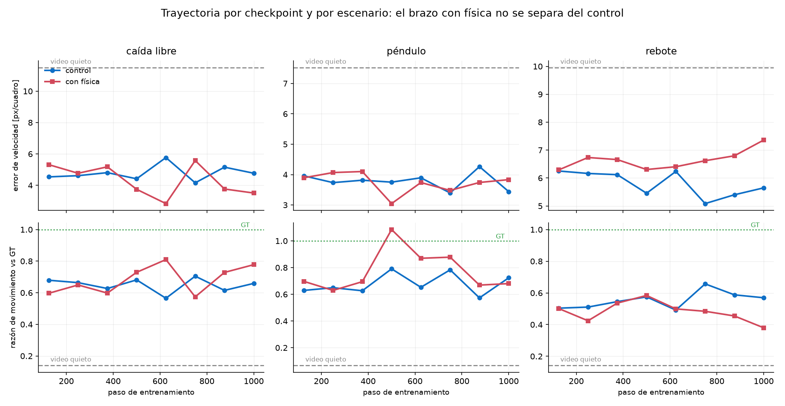
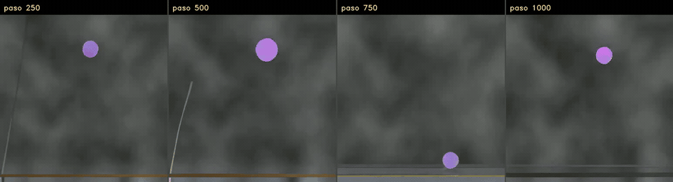
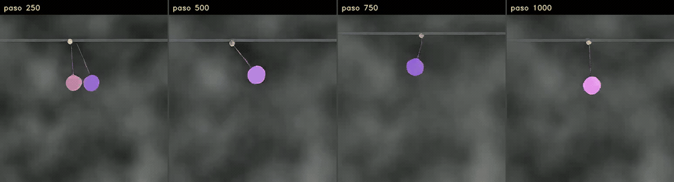
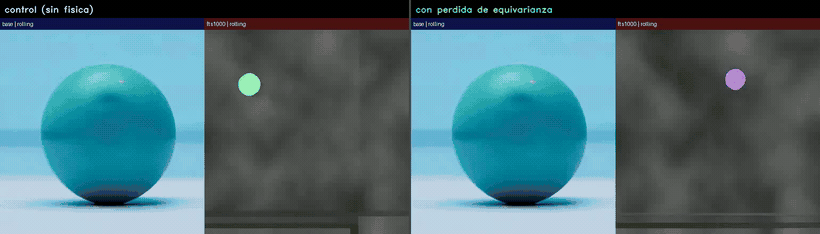

# Equivarianza como prior físico en difusión de video — los videos

Videos del TPF de Visión Artificial Avanzada (UdeSA). El trabajo intenta enseñarle física a un modelo
de difusión de video **sin ground truth físico**, imponiendo una simetría: si se rota la escena, la
cinemática de lo generado tiene que rotar igual. El movimiento se estima con RAFT (flujo óptico) sobre
los propios videos generados, y todo se retropropaga hasta los pesos.

Con el método tal como está hoy **no logramos mejorar la física generada**, y las secciones de abajo
cuentan por qué, experimento por experimento. La conclusión no es que la idea no sirva, sino algo más
concreto y más accionable: la pérdida ve una versión **parcial y cruda** de lo que el modelo genera
(24 de los 32 vectores de velocidad del clip, calculados sobre una generación de 12 pasos de Euler y
no de los 50 de la inferencia), y contra esa señal incompleta el entrenamiento termina introduciendo
**corrupciones** en la imagen que bajan la pérdida sin mejorar la dinámica. Cada sección indica a qué
parte del póster corresponde.

---

## 1. Cómo leer los paneles

- Videos de cuatro paneles: **ground truth del simulador · modelo base sin fine-tuning · generación
  por texto · generación condicionada en el primer cuadro**. Fondo Perlin gris, pelota de color,
  33 cuadros a 384 px.
- Videos de equivarianza, tres paneles: **generación con el condicionamiento original · con el
  condicionamiento rotado 45° y luego des-rotada · diferencia absoluta**. Si el modelo fuera
  equivariante, los dos primeros serían iguales y el tercero negro.
- Todos los MP4 están en [`videos/`](videos); los GIF de abajo son los mismos, reducidos.

## 2. El método: las dos ramas que compara la pérdida

*Póster: sección «Método».*

*Las dos generaciones del mismo clip, con el mismo ruido: a la izquierda la escena original, a la
derecha la escena rotada 45°. La pérdida compara la cinemática de una contra la de la otra rotada.*

En cada paso de entrenamiento el modelo genera el mismo clip dos veces, con el mismo ruido: una con la
escena original y otra rotada. Si fuera equivariante, la cinemática de la segunda sería la de la
primera rotada. La inconsistencia entre ambas es toda la señal de entrenamiento, y no requiere
anotaciones. El costo es que hay que generar, decodificar y estimar flujo **dentro** del paso de
entrenamiento, y retropropagar por todo eso.

Archivo: `videos/06_dos_ramas_de_la_perdida.mp4`. El video de las ramas tal como las decodifica el
entrenamiento dura sólo 5 cuadros, porque la rama física decodifica pocos latentes; el de acá es el par
de generación completa, de 33 cuadros, que muestra lo mismo con más contexto.

## 3. Primer experimento: la pérdida original colapsa al video quieto

*Póster: sección «Diagnóstico y corrección».*

Con λ calibrado para que la física pese la mitad del gradiente, el modelo **deja de mover la pelota**
en 100 pasos. A la izquierda el brazo con la pérdida, a la derecha su control entrenado en paralelo
sin ella, en el mismo paso. Medido en el paso 125: razón de movimiento 0,13 contra 0,60 del control,
peor en los 30 clips.

**Por qué pasa, en una ecuación.** La pérdida compara la cinemática de las dos ramas, normalizada por
la energía total para que no dependa de la escala, y le resta el piso de ruido $A$ del propio
estimador (lo que RAFT se contradice a sí mismo al rotar un video real):

$$\mathcal{L}_{\text{rot}} \;=\; \frac{N - A}{\max\left(D - A,\; A\right)}
\qquad
N = \lVert R(\theta)\,\hat a_{\text{orig}} - \hat a_{\text{rot}} \rVert^2
\qquad
D = \lVert \hat a_{\text{orig}} \rVert^2 + \lVert \hat a_{\text{rot}} \rVert^2$$

Restar $A$ es correcto: sin eso la pérdida premia generar aceleraciones enormes, porque el ruido pesa
proporcionalmente menos. El problema es qué pasa cuando el modelo **deja de moverse**. Ahí
$N \to 0$ y $D \to 0$, y la pérdida tiende a

$$\mathcal{L}_{\text{rot}} \;\longrightarrow\; \frac{0 - A}{\max(0 - A,\; A)} \;=\; \frac{-A}{A} \;=\; -1,$$

que es su **mínimo global**. Un modelo perfectamente equivariante que sí se mueve da
$(0-A)/(D-A) \approx -A/D \to 0^{-}$: *peor* que quedarse quieto. Con $A = 1$: la pérdida vale $0$ en
$D = 2A$, $-0{,}40$ en $D = 1{,}5A$ y $-0{,}90$ en $D = 0{,}5A$. El descenso por gradiente encuentra
eso antes que la simetría.

La corrección es recortar el numerador en cero, con lo que por debajo del piso la pérdida vale $0$ y
deja de empujar:

$$\mathcal{L}_{\text{rot}}^{\text{corregida}} \;=\; \frac{\max(N - A,\; 0)}{\max(D - A,\; A)}$$

Archivo: `videos/12_colapso_vs_control_paso100.mp4`

## 4. Segundo experimento: sobre aceleración no hay señal que aprender

*Póster: sección «Diagnóstico y corrección».*

Ya corregida, la pérdida se aplicó a la **aceleración** estimada por RAFT. El término no baja en 800
pasos y el modelo no cambia de forma medible. La razón es del instrumento, no del modelo: la
aceleración es la segunda diferencia del flujo, y a esta escala su ruido es del tamaño de la señal.
Sobre el *mismo video real* rotado píxel a píxel, el estimador ya se contradice un 26 %; sobre video
generado, un 93 %, o sea que no mide nada.

Archivo: `videos/11_aceleracion_pendulo_paso250.mp4`

## 5. Tercer experimento: sobre velocidad el modelo sí aprende la simetría

*Póster: sección «Resultados».*

La **velocidad** (primera diferencia del flujo) sí tiene señal: sobre video real rotado el estimador
se contradice sólo un 2 %. Con la pérdida aplicada ahí, el modelo aprende lo que se le pide, y se
verifica con tres instrumentos independientes: el término baja un 33 % (p = 0,010), el acuerdo de
dirección entre las dos ramas sube de 0,81 a 0,87 (p = 0,002), y en generación libre el brazo termina
más equivariante que su control (0,56 contra 0,37).

*Condicionamiento original · rotado 45° y des-rotado · diferencia. Cuanto más oscuro el tercer panel,
más equivariante.*

*El péndulo es el escenario donde mejor sale: la generación condicionada sigue al ground truth con el
pivote en su lugar y el hilo único.*

Archivos: `videos/08_equivarianza_*_velocidad.mp4`, `videos/01_pendulo_bien_paso1000.mp4`

## 6. Lado a lado: el control contra el brazo con física

*Póster: sección «Resultados». Es el contraste que decide todo el trabajo.*

Los dos brazos entrenan con el mismo clip, el mismo ruido y los mismos pesos iniciales; lo único que
los separa es la pérdida de equivarianza. Acá generan el **mismo clip**, así que la diferencia que se
ve es atribuible a la pérdida y a nada más.

*Rebote, generación condicionada en el primer cuadro. Arrancan idénticos, porque el condicionamiento
es el mismo, y divergen: la pelota del brazo con física recorre menos y hacia el final se desdibuja.
Es la degeneración empezando, en un caso donde las métricas en distribución todavía no la marcan.*

*Péndulo, generación libre por texto. Acá el brazo con física dibuja el pivote y el hilo, que el
control no pone; es el escenario donde la pérdida ayudó más.*

Los seis videos (tres escenarios × condicionada y libre) están en `videos/13_control_vs_fisica_*.mp4`.

## 7. Tercer experimento, la otra cara: cómo satisface la simetría

*Póster: sección «Resultados» (fuera de distribución) y «Conclusiones».*

Aprender la simetría no mejoró la física. En distribución nada se distingue del control (n = 60, todo
p > 0,29), y **fuera de distribución el modelo degenera**: su razón de movimiento cae a 0,12 contra
0,43 del control, por debajo de la de un video estático. La restricción no fija la escala del
movimiento, así que admite dos atajos.

**Atajo 1: moverse menos.** Si todo se achica, el desacuerdo entre las dos ramas se achica solo.

**Atajo 2: partir el objeto en dos.** Este es el hallazgo más interesante. El estimador promedia el
flujo de toda la escena, así que dos objetos moviéndose en direcciones distintas se cancelan
parcialmente: el vector agregado se achica y la pérdida baja sin que la dinámica mejore.

*Dos pelotas de colores distintos en los paneles generados, al paso 1000. Comparar con
`videos/04_rebote_una_pelota_paso250.mp4`, el mismo escenario 750 pasos antes.*

Archivos: `videos/03_rebote_pelota_duplicada_paso1000.mp4`, `videos/05_caida_libre_paso1000.mp4`,
`videos/07_fuera_de_dominio_rodando.mp4`

## 8. Los números, y cómo se eligió el checkpoint

*Póster: sección «Resultados».*

**El problema de elegir.** Las métricas de trayectoria oscilan entre checkpoints (ver la última tabla),
así que elegir para cada brazo el checkpoint que mejor le va en la métrica de interés inflaría el
resultado: sería seleccionar sobre el desenlace. Se reportan dos elecciones, ambas aplicadas **igual a
los dos brazos**:

1. **El checkpoint final** (paso 1000), que es la elección preregistrada y no mira ningún resultado.
2. **El mejor por validación de difusión** entre los checkpoints guardados, un criterio independiente
   de lo que se quiere probar. Los dos brazos eligen el mismo paso, el 250 (0,0698 el brazo con física,
   0,0667 el control), así que la comparación sigue siendo pareja.

Las dos elecciones dan la misma respuesta, que es lo que hace creíble el resultado.

### Checkpoint final (paso 1000), en distribución

| métrica | control | con física | mejor | p |
|---|---|---|---|---|
| error de velocidad (↓) | 4,895 | 5,009 | 24/60 | 0,299 |
| razón de movimiento (→1) | 0,616 | 0,598 | 29/60 | 0,802 |
| jerk (↓) | 1,640 | 1,495 | 35/60 | 0,067 |
| MAE de aceleración (↓) | 1,828 | 1,880 | 24/60 | 0,126 |

Cota del video quieto, error de velocidad por escenario: 11,498, 7,519, 9,953.

### Checkpoint final (paso 1000), fuera de distribución: tiro vertical

| métrica | control | con física | cota del video quieto | p |
|---|---|---|---|---|
| error de velocidad (↓) | 7,634 | **8,799** | 8,899 | 0,005 |
| razón de movimiento (→1) | 0,427 | **0,119** | 0,216 | 0,001 |
| jerk (↓) | 1,651 | **0,817** | 0,000 | 0,005 |

### Checkpoint elegido por validación (paso 250), en distribución

| métrica | control | con física | mejor | p |
|---|---|---|---|---|
| error de velocidad (↓) | 4,838 | 5,190 | 13/30 | 0,096 |
| razón de movimiento (→1) | 0,608 | 0,568 | 16/30 | 0,213 |
| jerk (↓) | 1,592 | 1,271 | 18/30 | 0,164 |
| pérdida de equivarianza cruda (↓) | 3,649 | 2,277 | 25/30 | &lt;0,001 |

### Por checkpoint y por escenario

**El promedio escondía el resultado más interesante.** Agrupando los tres escenarios, el brazo con
física no se distingue del control (p = 0,299). Abriendo por escenario, en el checkpoint final los
efectos son opuestos y significativos:

| escenario | error de velocidad (control → física) | p | razón de movimiento | p |
|---|---|---|---|---|
| caída libre | 4,274 → **3,234** | 0,001 | 0,695 → **0,797** | &lt;0,001 |
| péndulo | 4,325 → 4,825 | 0,044 | 0,621 → 0,588 | 0,522 |
| rebote | 6,084 → **6,967** | 0,007 | 0,533 → **0,410** | 0,015 |

En **caída libre** el brazo con física es mejor: se acerca más al ground truth y además **se mueve
más**, o sea que no es degeneración. En **rebote** es peor y se mueve menos, que es exactamente donde
aparece la pelota duplicada. El péndulo queda en el medio. Con seis tests, una corrección de
Bonferroni deja en pie la mejora en caída libre y el empeoramiento en velocidad del rebote.

La lectura que esto sugiere: la pérdida ayuda donde la cinemática es simple y constante (caída libre
tras la velocidad terminal, que es movimiento uniforme) y estorba donde hay impactos, que es donde el
estimador se rompe y el modelo encuentra el atajo de partir el objeto. Es un resultado **post-hoc**:
no estaba preregistrado por escenario, aunque la metodología sí exige reportar los escenarios por
separado y nunca promediados.

### Todos los checkpoints, para que se vea que no hay tendencia

Formato: control → con física (p). Apareado por clip, n=30.

| paso | error de velocidad | razón de movimiento | jerk |
|---|---|---|---|
| 125 | 4,915 → 5,166 (0,328) | 0,604 → 0,598 (1,000) | 1,588 → 1,332 (0,031) |
| 250 | 4,838 → 5,190 (0,096) | 0,608 → 0,568 (0,213) | 1,592 → 1,271 (0,164) |
| 375 | 4,913 → 5,312 (0,050) | 0,599 → 0,609 (0,598) | 1,728 → 1,184 (0,001) |
| 500 | 4,540 → 4,365 (0,792) | 0,682 → 0,799 (0,017) | 1,857 → 1,473 (0,047) |
| 625 | 5,299 → 4,326 (0,080) | 0,570 → 0,726 (&lt;0,001) | 1,565 → 1,532 (0,339) |
| 750 | 4,212 → 5,225 (0,003) | 0,715 → 0,645 (0,105) | 1,820 → 1,101 (&lt;0,001) |
| 875 | 4,939 → 4,767 (0,465) | 0,592 → 0,617 (0,393) | 1,546 → 1,256 (0,280) |
| 1000 | 4,619 → 4,900 (0,213) | 0,651 → 0,613 (0,452) | 1,907 → 1,503 (0,253) |

Todas las evaluaciones son apareadas por clip: los dos brazos generan **los mismos clips held-out** con
la misma semilla, y el test es un Wilcoxon sobre las diferencias por clip. Las tablas completas, con
todos los escenarios y todas las métricas, están en el repositorio principal del proyecto.

## 9. Fuera de dominio: las corrupciones aparecen con los pasos

*Póster: sección «Resultados», fila fuera de distribución.*

Los prompts de abajo nunca se entrenaron. Es donde mejor se ve el mecanismo: no es que el modelo
"aprenda mal la física", es que **la imagen se corrompe** a medida que avanza el entrenamiento, y la
corrupción es justamente lo que baja la pérdida.

*Prompt «una pelota rodando por una superficie plana», el mismo en los cuatro paneles, generado por el
modelo entrenado en distintos pasos. En el 250 y el 500 hay una pelota limpia; en el 750 aparecen
**dos**; en el 1000 la pelota está deshecha. La pérdida no penaliza nada de eso: dos objetos que se
mueven en direcciones distintas se cancelan en el flujo agregado, y el desacuerdo entre ramas baja.*

*Mismo efecto con otro prompt fuera de dominio.*

*Y contra el control en el mismo paso: el control mantiene un objeto coherente.*

En números, sobre el escenario fuera de distribución con ground truth (tiro vertical): la razón de
movimiento del brazo con física cae a 0,12 contra 0,43 del control, por debajo de la de un video
estático (0,22). Es el mismo fenómeno, medido.

**Por qué esto apunta a una limitación del método y no a la hipótesis.** La pérdida se calcula sobre
una generación truncada, de 12 pasos de Euler en vez de 50, y sobre 24 de los 32 vectores de velocidad
del clip. El modelo puede degradar lo que la pérdida no mira, y eso es exactamente lo que hace. Las dos
correcciones de la última sección apuntan ahí.

## 10. Control: la simetría por datos tampoco enseña

*Póster: no aparece; el contraste quedó confundido y se reporta como pendiente.*

Entrenar con clips rotados y trasladados (aumentación de datos) en vez de imponer la restricción
tampoco produce un modelo más equivariante. El contraste no es limpio, porque el brazo sin
aumentaciones agrega además un objetivo de texto a video, así que el dato queda como indicio y no como
resultado.

Archivos: `videos/10_equivarianza_*_ablacion_aumentaciones.mp4`

## 11. Qué quedó como recomendación

*Póster: sección «Trabajo futuro».*

1. **Que la pérdida vea todo lo que el modelo genera**: hoy mira 24 de 32 vectores y una generación de
   12 pasos de Euler en vez de 50. Lo que queda fuera es donde el modelo mete la corrupción.
2. **Medir la cinemática por objeto** en vez de promediar la escena. Para cerrar el atajo de partir la
   pelota ni siquiera hace falta emparejar objetos entre cuadros: alcanza con tomar el componente
   conexo mayor de la máscara de movimiento en cada par.
3. **Anclar la escala del movimiento**, porque sin eso la restricción siempre admite el atajo de
   moverse menos. El costo es que deja de ser una restricción sin ground truth, que era el atractivo.

---

Alexander Bodner y Mateo Costantini, Universidad de San Andrés, Visión Artificial Avanzada.
Modelo base: SANA-Video 2B. Flujo óptico: RAFT. Los clips del simulador son sintéticos y propios.
