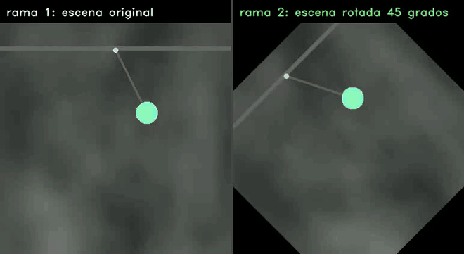
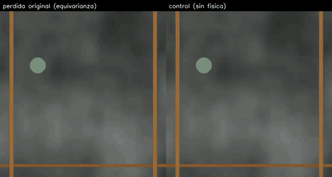
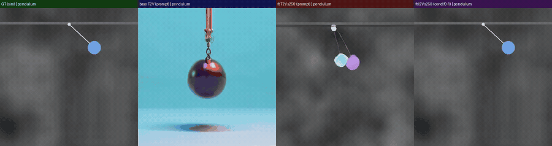
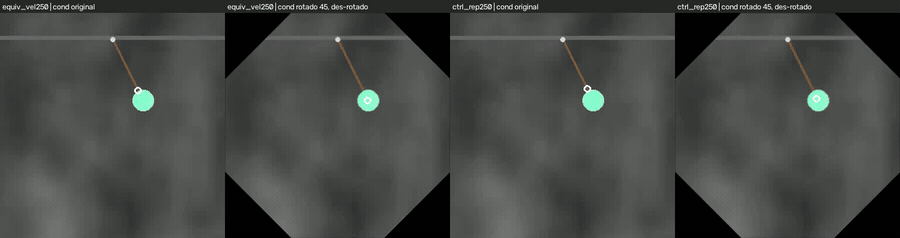
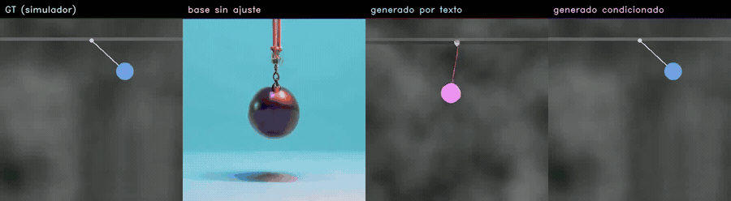
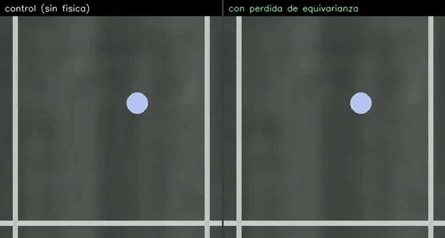
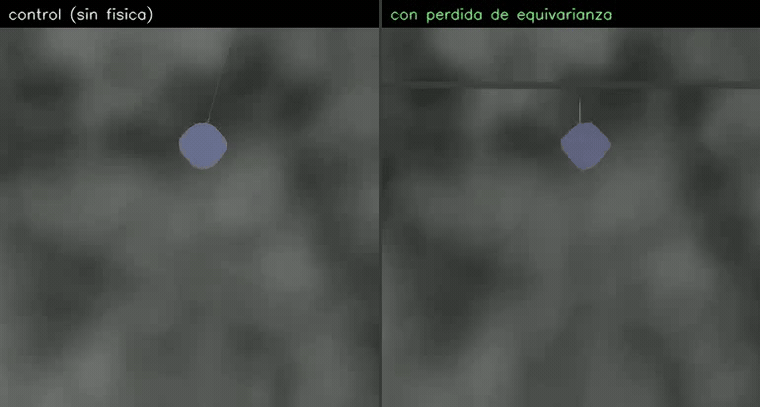
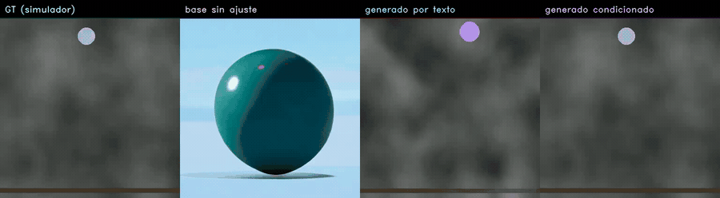
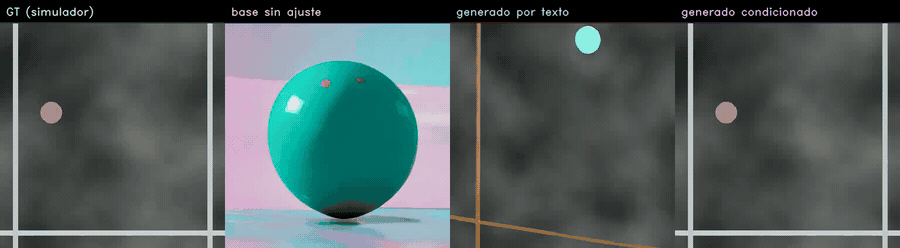

# Equivarianza como prior físico en difusión de video — los videos

Videos del TPF de Visión Artificial Avanzada (UdeSA). El trabajo intenta enseñarle física a un modelo
de difusión de video **sin ground truth físico**, imponiendo una simetría: si se rota la escena, la
cinemática de lo generado tiene que rotar igual. El movimiento se estima con RAFT (flujo óptico) sobre
los propios videos generados, y todo se retropropaga hasta los pesos.

El resultado global es **negativo**, y las secciones de abajo cuentan por qué, experimento por
experimento. Cada una indica a qué parte del póster corresponde.

---

## 1. Cómo leer los paneles

- Videos de cuatro paneles: **ground truth del simulador · modelo base sin fine-tuning · generación
  por texto · generación condicionada en el primer cuadro**. Fondo Perlin gris, pelota de color,
  33 cuadros a 384 px.
- Videos de equivarianza, tres paneles: **generación con el condicionamiento original · con el
  condicionamiento rotado 45° y luego des-rotada · diferencia absoluta**. Si el modelo fuera
  equivariante, los dos primeros serían iguales y el tercero negro.
- Todos los MP4 están en [`videos/`](videos); los GIF de abajo son los mismos, reducidos.

## 2. El método: las dos ramas que compara la pérdida

*Póster: sección «Método».*

En cada paso de entrenamiento el modelo genera el mismo clip dos veces, con el mismo ruido: una con la
escena original y otra rotada. Si fuera equivariante, la cinemática de la segunda sería la de la
primera rotada. La inconsistencia entre ambas es toda la señal de entrenamiento, y no requiere
anotaciones. El costo es que hay que generar, decodificar y estimar flujo **dentro** del paso de
entrenamiento, y retropropagar por todo eso.

Archivo: `videos/06_dos_ramas_de_la_perdida.mp4`

## 3. Primer experimento: la pérdida original colapsa al video quieto

*Póster: sección «Diagnóstico y corrección».*

Con λ calibrado para que la física pese la mitad del gradiente, el modelo **deja de mover la pelota**
en 100 pasos. A la izquierda el brazo con la pérdida, a la derecha su control entrenado en paralelo
sin ella, en el mismo paso. Medido en el paso 125: razón de movimiento 0,13 contra 0,60 del control,
peor en los 30 clips.

La causa está en la fórmula. La pérdida resta el piso de ruido del propio estimador, y cuando el
desacuerdo cae por debajo de ese piso el numerador se vuelve negativo: el mínimo global pasa a ser un
video estático. Se corrigió recortando el numerador en cero.

Archivo: `videos/12_colapso_vs_control_paso100.mp4`

## 4. Segundo experimento: sobre aceleración no hay señal que aprender

*Póster: sección «Diagnóstico y corrección».*

Ya corregida, la pérdida se aplicó a la **aceleración** estimada por RAFT. El término no baja en 800
pasos y el modelo no cambia de forma medible. La razón es del instrumento, no del modelo: la
aceleración es la segunda diferencia del flujo, y a esta escala su ruido es del tamaño de la señal.
Sobre el *mismo video real* rotado píxel a píxel, el estimador ya se contradice un 26 %; sobre video
generado, un 93 %, o sea que no mide nada.

Archivo: `videos/11_aceleracion_pendulo_paso250.mp4`

## 5. Tercer experimento: sobre velocidad el modelo sí aprende la simetría

*Póster: sección «Resultados».*

La **velocidad** (primera diferencia del flujo) sí tiene señal: sobre video real rotado el estimador
se contradice sólo un 2 %. Con la pérdida aplicada ahí, el modelo aprende lo que se le pide, y se
verifica con tres instrumentos independientes: el término baja un 33 % (p = 0,010), el acuerdo de
dirección entre las dos ramas sube de 0,81 a 0,87 (p = 0,002), y en generación libre el brazo termina
más equivariante que su control (0,56 contra 0,37).

*Condicionamiento original · rotado 45° y des-rotado · diferencia. Cuanto más oscuro el tercer panel,
más equivariante.*

*El péndulo es el escenario donde mejor sale: la generación condicionada sigue al ground truth con el
pivote en su lugar y el hilo único.*

Archivos: `videos/08_equivarianza_*_velocidad.mp4`, `videos/01_pendulo_bien_paso1000.mp4`

## 6. Lado a lado: el control contra el brazo con física

*Póster: sección «Resultados». Es el contraste que decide todo el trabajo.*

Los dos brazos entrenan con el mismo clip, el mismo ruido y los mismos pesos iniciales; lo único que
los separa es la pérdida de equivarianza. Acá generan el **mismo clip**, así que la diferencia que se
ve es atribuible a la pérdida y a nada más.

*Rebote, generación condicionada en el primer cuadro. Arrancan idénticos, porque el condicionamiento
es el mismo, y divergen: la pelota del brazo con física recorre menos y hacia el final se desdibuja.
Es la degeneración empezando, en un caso donde las métricas en distribución todavía no la marcan.*

*Péndulo, generación libre por texto. Acá el brazo con física dibuja el pivote y el hilo, que el
control no pone; es el escenario donde la pérdida ayudó más.*

Los seis videos (tres escenarios × condicionada y libre) están en `videos/13_control_vs_fisica_*.mp4`.

## 7. Tercer experimento, la otra cara: cómo satisface la simetría

*Póster: sección «Resultados» (fuera de distribución) y «Conclusiones».*

Aprender la simetría no mejoró la física. En distribución nada se distingue del control (n = 60, todo
p > 0,29), y **fuera de distribución el modelo degenera**: su razón de movimiento cae a 0,12 contra
0,43 del control, por debajo de la de un video estático. La restricción no fija la escala del
movimiento, así que admite dos atajos.

**Atajo 1: moverse menos.** Si todo se achica, el desacuerdo entre las dos ramas se achica solo.

**Atajo 2: partir el objeto en dos.** Este es el hallazgo más interesante. El estimador promedia el
flujo de toda la escena, así que dos objetos moviéndose en direcciones distintas se cancelan
parcialmente: el vector agregado se achica y la pérdida baja sin que la dinámica mejore.

*Dos pelotas de colores distintos en los paneles generados, al paso 1000. Comparar con
`videos/04_rebote_una_pelota_paso250.mp4`, el mismo escenario 750 pasos antes.*

Archivos: `videos/03_rebote_pelota_duplicada_paso1000.mp4`, `videos/05_caida_libre_paso1000.mp4`,
`videos/07_fuera_de_dominio_rodando.mp4`

## 8. Control: la simetría por datos tampoco enseña

*Póster: no aparece; el contraste quedó confundido y se reporta como pendiente.*

Entrenar con clips rotados y trasladados (aumentación de datos) en vez de imponer la restricción
tampoco produce un modelo más equivariante. El contraste no es limpio, porque el brazo sin
aumentaciones agrega además un objetivo de texto a video, así que el dato queda como indicio y no como
resultado.

Archivos: `videos/10_equivarianza_*_ablacion_aumentaciones.mp4`

## 9. Qué quedó como recomendación

*Póster: sección «Trabajo futuro».*

1. **Medir la cinemática por objeto** en vez de promediar la escena. Para cerrar el atajo de partir la
   pelota ni siquiera hace falta emparejar objetos entre cuadros: alcanza con tomar el componente
   conexo mayor de la máscara de movimiento en cada par.
2. **Anclar la escala del movimiento**, porque sin eso la restricción siempre admite el atajo de
   moverse menos. El costo es que deja de ser una restricción sin ground truth, que era el atractivo.

---

Alexander Bodner y Mateo Costantini, Universidad de San Andrés, Visión Artificial Avanzada.
Modelo base: SANA-Video 2B. Flujo óptico: RAFT. Los clips del simulador son sintéticos y propios.
