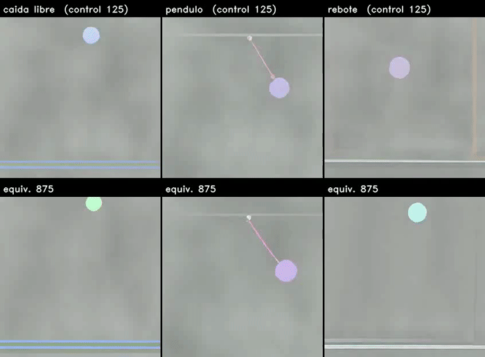
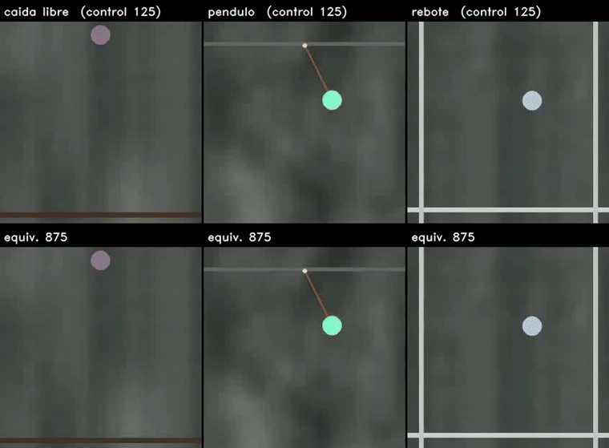

# Equivarianza como prior físico en difusión de video

Material del TPF de Visión Artificial Avanzada (UdeSA). Este repositorio acompaña al póster: acá están
los videos, las evaluaciones crudas y los scripts que rehacen cada figura y cada número.

El trabajo le enseña física a un modelo de difusión de video **sin ground truth físico**. En vez de
imponer una ley de conservación, que pide conocer la masa y el potencial, impone una **equivarianza**:
si se rota la escena entera, incluida la gravedad, la cinemática de lo generado tiene que rotar igual.
El movimiento se estima con RAFT sobre los propios videos generados y todo se retropropaga hasta los
pesos, así que **la etiqueta se genera sola**.

**El resultado, en dos líneas.** La simetría se aprende: el desacuerdo entre las dos ramas baja
**46 %** sobre 88 clips que nunca se miraron. Pero en generación condicionada eso **no se traduce en
mejor física**: el error de velocidad contra el simulador baja sólo 3 %, que no se distingue del cero.
Donde sí aparecen diferencias es en **generación por texto**, y ahí no hay ground truth contra qué
medirlas.

---

## Cómo encontrar las cosas

| bloque del póster | sección de acá |
|---|---|
| Metodología | [El método](#el-método) |
| Viabilidad computacional | [Lo que cuesta](#lo-que-cuesta) |
| Resultados, la tabla | [La simetría se aprende](#la-simetría-se-aprende) |
| Resultados, la tira de frames | [Por texto sí se ven diferencias](#por-texto-sí-se-ven-diferencias) |
| Análisis del gradiente | [Cuántos pasos hay que retropropagar](#cuántos-pasos-de-euler-hay-que-retropropagar) |
| Conclusiones y Trabajo futuro | [Qué queda](#qué-queda) |

Los videos están en [`videos/`](videos), agrupados por el papel que cumplen:

| carpeta | qué hay |
|---|---|
| [`1_metodo/`](videos/1_metodo) | qué compara la pérdida y qué ve |
| [`2_resultados/`](videos/2_resultados) | los dos brazos lado a lado, en los checkpoints elegidos |
| [`3_extrapolacion/`](videos/3_extrapolacion) | 65 frames, el doble del horizonte de entrenamiento |
| [`4_rodando_8_semillas/`](videos/4_rodando_8_semillas) | las ocho semillas del prompt que el modelo nunca vio |
| [`5_tiro_vertical/`](videos/5_tiro_vertical) | el único escenario fuera del dataset con ground truth |
| [`6_lo_que_no_funciono/`](videos/6_lo_que_no_funciono) | el colapso y la versión sobre aceleraciones |
| [`9_checkpoints_superados/`](videos/9_checkpoints_superados) | material de corridas anteriores, que **no** es el modelo reportado |

Las evaluaciones crudas están en [`resultados/`](resultados), con [`LEEME.md`](resultados/LEEME.md)
explicando qué mide cada archivo y cuál sirve para qué. Los pesos y el archivo completo de videos
están en [Hugging Face](https://huggingface.co/AlexBodner/tpf-equivarianza-video).

**Qué modelo es "el modelo".** Todo lo que se reporta sale de un par de checkpoints elegidos por
validación: **control en el paso 125** y **brazo con física en el paso 875**. Cualquier video de otro
paso está en `9_checkpoints_superados/` y dice de dónde viene.

---

## El método

Dos generaciones del **mismo clip**, con el mismo ruido: una de la escena original y otra de la escena
rotada. Si el modelo fuera equivariante, la cinemática de la segunda sería la de la primera rotada.

*A la izquierda la escena original, a la derecha la misma rotada 45°. Este par es del **paso 250**: las
dos ramas sólo se volcaron en los pasos 250 y 1000, así que en el checkpoint elegido no existen. Sirve
para ver qué compara la pérdida, que no depende del checkpoint. Archivo:
[`videos/1_metodo/dos_ramas_de_la_perdida.mp4`](videos/1_metodo/dos_ramas_de_la_perdida.mp4).*

Y esto es todo lo que la pérdida mira de cada video:

*El video, el campo de flujo que devuelve RAFT, y **el único vector que queda** después de promediar la
escena entera. Ese vector, uno por frame, es la señal. Ahí se ve el límite del instrumento: dos objetos
moviéndose en direcciones opuestas se cancelan en el promedio. Archivo:
[`videos/1_metodo/que_ve_la_perdida.mp4`](videos/1_metodo/que_ve_la_perdida.mp4).*

**La pérdida**, en palabras: el desacuerdo entre las dos ramas, descontado el ruido del propio
estimador, dividido por cuánto movimiento hay.

- Se mide **el ruido de RAFT** y entra en la fórmula. Sobre un video que *sí* es equivariante, RAFT da
  un desacuerdo que no es cero. Ese piso se mide sin ground truth y se resta arriba y abajo; sin
  restarlo, la pérdida premia acelerar de más para tapar el ruido.
- El máximo del numerador **apaga el término** cuando el desacuerdo queda por debajo de ese ruido: si
  el flujo no da para tanto, no hay actualización física. Pasa en el 12 % de los pasos.
- Dividir por la escala del movimiento es lo que hace que **quedarse quieto no pague**.
- El peso del término físico se fija para que **la física pese la mitad que la difusión**, midiendo las
  dos normas de gradiente. Elegido a ojo entraba dos órdenes de magnitud por debajo, o sea sin efecto.

---

## Lo que cuesta

La pérdida vive sobre el video **generado**, así que cada paso genera con 12 pasos de Euler del
transformer de 2B, decodifica con el VAE, estima el flujo con RAFT y retropropaga por todo eso.

| | |
|---|---|
| activaciones del unroll | ∼15 GB |
| decode del VAE del video entero | desborda por sí solo una placa de 24 GB |
| pico medido, ya optimizado | **28,5 GB** (mediana 21,3) en una L40S |
| contra su propio control | **3,1× la memoria y 4,6× el tiempo** (16,0 h contra 3,5) |

Tres técnicas lo vuelven computable: gradient checkpointing, decode del VAE por chunks con backward por
chunk (el pico pasa a ser el de *un* frame latente, no el video entero), y LoRA en bf16. El backward
son **dos pasadas**: en cada una, una rama lleva gradiente y la otra entra congelada como objetivo. De
ahí buena parte del costo.

---

## La simetría se aprende

**Test final**: 88 clips del conjunto held-out que nunca se miró. De cada uno se genera el par que mide
la simetría, con la escena rotada 45°, un ángulo fijo y fuera del rango ±15° que se sorteaba en
entrenamiento. Los dos brazos ven el mismo clip, el mismo ruido y los mismos pesos iniciales.

| escenario | n | desacuerdo control | desacuerdo física | mejora | vel. control | vel. física | mejora |
|---|---|---|---|---|---|---|---|
| caída libre | 28 | 0,412 | 0,271 | **+34 %** \* | 4,95 | 3,97 | **+20 %** \* |
| péndulo | 30 | 0,694 | 0,337 | **+51 %** \* | 4,10 | 4,42 | −8 % |
| rebote | 30 | 0,569 | 0,306 | **+46 %** \* | 6,27 | 6,39 | −2 % |
| **los tres juntos** | **88** | **0,562** | **0,306** | **+46 %** \* | **5,11** | **4,95** | **+3 %** |

*Desacuerdo entre ramas*: cuánto se aparta la cinemática del clip rotado de la cinemática del original
rotada, sobre velocidades, descontado el piso de ruido y dividido por la escala del movimiento. Es
adimensional. *Error de velocidad*: px/frame contra el ground truth del simulador. En las dos, menor es
mejor. **\*** marca que el intervalo del 95 % por bootstrap sobre clips no incluye el cero.

**La simetría se aprende y la física no mejora.** El desacuerdo baja 46 % y el error de velocidad sólo
3 %, que no se distingue del cero. La simetría mejora en los tres escenarios; la velocidad, sólo en
caída libre.

*Diferencia por clip entre los dos brazos. A la derecha del cero, el brazo con física es mejor.*

Dos lecturas más:

**Se aprende en todo el rango de ángulos, no sólo donde se mide.** Reevaluando con el ángulo sorteado
por clip entre 11° y 44°, el desacuerdo baja en los tres escenarios. Y no es que los ángulos chicos
sean más fáciles: cerca de 39° mejora más que cerca de 17°. Es una medición aparte, con menos clips que
la tabla; ver [Límites de medición](#límites-de-medición).

**Pero se queda lejos.** El ángulo entre las dos trayectorias baja de 63° a 51°, cuando la simetría
perfecta serían 0°. Y toda la ventaja aparece en los primeros 125 pasos: después se estanca.

Y así se ven los dos brazos sobre el mismo clip:

*Arriba el ground truth del simulador, en el medio el control, abajo el brazo con física. En péndulo se
ve el modo de falla del modelo que efectivamente reportamos: **dos pelotas** donde el control tiene
una. Archivo:
[`videos/2_resultados/condicionado_gt_control_fisica.mp4`](videos/2_resultados/condicionado_gt_control_fisica.mp4).*

---

## Por texto sí se ven diferencias

Sin condicionamiento no hay dos frames reales sosteniendo el arranque: lo que se ve es lo que el modelo
produce solo. Y **la pérdida física nunca se aplicó a generaciones por texto**, sólo a las
condicionadas.

*Control arriba, brazo con física abajo, misma semilla. El péndulo sostiene la oscilación, el rebote
mantiene una sola pelota donde el control la duplica y le cambia el color, la caída libre sale parecida
en los dos, y rodando aparece sólo en el equivariante. Archivo:
[`videos/2_resultados/por_texto_4_escenarios.mp4`](videos/2_resultados/por_texto_4_escenarios.mp4).*

### Rodando, un prompt que el modelo nunca vio

*El brazo con física deja la pelota sobre el piso y la hace rodar; el control la mantiene flotando.*

Sobre las ocho semillas, juzgando el **tramo final** de cada clip (altura baja, estable y avanzando en
horizontal), el brazo con física **termina rodando en 5 de 8** y el control **en ninguna**. Las ocho
están en [`videos/4_rodando_8_semillas/`](videos/4_rodando_8_semillas) para que las juzgue quien lea,
que es lo que corresponde: el criterio automático no distingue "apoyado en el piso" de "flotando bajo",
y el único caso que marca para el control es una pelota que se desplaza en el aire. La medición está en
[`scripts_figuras/medir_rodando.py`](scripts_figuras/medir_rodando.py).

### Los otros dos prompts fuera de dominio

*Rodando y un péndulo pedido en estética fotográfica, con el modelo base arriba como referencia de lo
que trae SANA sin fine-tuning. Archivo:
[`videos/2_resultados/fuera_de_dominio.mp4`](videos/2_resultados/fuera_de_dominio.mp4).*

### Extrapolación: 65 frames contra los 33 de entrenamiento

El período del péndulo es de 37,4 frames, así que con 33 nunca se ve una oscilación completa. A 65 sí,
y del frame 33 en adelante todo es extrapolación.

*Generando sólo desde el texto, el péndulo **sigue oscilando** pasado el horizonte.*

*Condicionado en frames reales, **ninguno de los dos brazos sostiene el movimiento**. Archivos:
[`condicionado_65_frames.mp4`](videos/3_extrapolacion/condicionado_65_frames.mp4) y
[`por_texto_65_frames_semilla0.mp4`](videos/3_extrapolacion/por_texto_65_frames_semilla0.mp4), con una
[segunda semilla](videos/3_extrapolacion/por_texto_65_frames_semilla1.mp4) al lado.*

Medido como la amplitud de la segunda mitad sobre la primera:

| | clip 1 | clip 2 |
|---|---|---|
| condicionado, control | 0,14 | 0,34 |
| condicionado, con física | 0,63 | 0,54 |
| por texto, control | 1,03 | 0,95 |
| por texto, con física | 0,98 | 1,22 |

Condicionado se apaga; por texto se mantiene entero. El desvanecimiento de la pelota que se ve en el
condicionado ocurre en **los dos brazos** por igual: el área que ocupa cae a la mitad en ambos, así que
no distingue brazos, distingue régimen.

### Fuera de dominio: tiro vertical

Es el único escenario fuera del dataset que tiene ground truth.

| | error de velocidad ↓ |
|---|---|
| control (paso 125) | 8,60 |
| con física (paso 875) | **8,10** |
| cota del video quieto | 9,05 |

n = 10 clips. Los dos brazos están por debajo de la cota del video congelado, y el brazo con física es
apenas mejor. **Ojo**: una versión anterior de este documento y del póster reportaba 7,63 contra 8,80,
con el brazo con física *peor*. Ese número era del **paso 1000**, que no es el checkpoint que el
trabajo reporta. Está corregido.

---

## Cómo satisface la simetría sin mejorar la física

La solución trivial **sigue siendo un mínimo**: quedarse quieto puntúa 0. Lo que la pérdida corregida
saca es el *gradiente* hacia ella. El cociente es de grado cero, así que achicar todo no paga, y los
pasos donde el movimiento no supera al ruido se saltean. Y funciona: el brazo con física no colapsa.

Pero aparece otra degeneración: **parte el objeto en dos**. Eso se observa en varios escenarios y
checkpoints. La explicación intuitiva, dos mitades opuestas cuyo flujo promediado se cancela, **no se
sostuvo al medirla**: sobre 48 clips por texto, los que tienen dos objetos conservan el 87 % del flujo
agregado contra el 90 % de los de uno. Si se cancelara, tendría que desplomarse. **No sabemos por qué
lo hace.**

---

## Cuántos pasos de Euler hay que retropropagar

Cada paso que se retropropaga se paga en memoria y en tiempo, así que se comparó el gradiente completo
contra **todas** las ventanas de pasos, midiendo la alineación con el coseno.

- **La dirección se concentra en pocos pasos**: una ventana de dos, el 1 y el 10, alinea **0,98** con
  el gradiente completo.
- **Los pasos vecinos dan casi el mismo gradiente** (coseno 0,92 entre el 10 y el 11), así que una
  ventana contigua paga dos veces por la misma dirección.
- **La práctica de la literatura apunta al otro extremo**: DRaFT-K trunca a los *últimos* pasos, donde
  se decide la apariencia en el refinamiento visual para el que se propuso. Acá importa cómo queda
  armada la dinámica, y la ventana que mejor alinea incluye un paso **temprano** que esa cola nunca
  toca.
- **Por ahora es un ahorro en potencia y no una mejora**: las cuatro ventanas que *sí* se entrenaron
  dieron el mismo resultado entre ellas.

---

## Lo que no funcionó

**La pérdida sin normalizar colapsa.** Se minimiza generando menos movimiento: si todo se achica, el
desacuerdo se achica solo. Medido, el 14 % del gradiente empujaba a encoger, y el modelo colapsaba en
100 pasos.

*Archivo: [`videos/6_lo_que_no_funciono/colapso_sin_normalizar.mp4`](videos/6_lo_que_no_funciono/colapso_sin_normalizar.mp4).*

**Sobre aceleraciones no aprende.** A esta escala RAFT no las ve: el acuerdo entre ramas sobre video
generado es 0,07 sobre aceleración contra **0,53** sobre velocidad. Por eso todo el trabajo mide sobre
velocidades, y eso se decidió midiéndolo antes de elegir.

*Archivos: [`aceleracion_evolucion_rebote.mp4`](videos/6_lo_que_no_funciono/aceleracion_evolucion_rebote.mp4),
[`aceleracion_evolucion_caida_libre.mp4`](videos/6_lo_que_no_funciono/aceleracion_evolucion_caida_libre.mp4)
y [`aceleracion_pendulo.mp4`](videos/6_lo_que_no_funciono/aceleracion_pendulo.mp4).*

---

## Límites de medición

Vale la pena tenerlos presentes antes de citar cualquier número de acá.

**El ángulo de 51° es entre trayectorias, no por frame.** El coseno se calcula entre las dos
trayectorias apiladas (los 32 pares de frames como un solo vector), no promediando ángulos frame a
frame, así que lo domina lo que pasa en los frames de mayor magnitud. Calculado por frame sobre tiro
vertical, la distribución es mucho más ancha: mediana cerca de 80°, con sólo un 6 a 7 % de frames bien
alineados. Son dos cantidades distintas y conviene no confundirlas.

**La reevaluación con ángulo sorteado no es comparable fila a fila con la tabla.** Se corrió con una
versión posterior de la métrica y releyendo mp4 comprimidos, y las dos cosas mueven los valores
absolutos. La comparación control contra física *dentro* de esa corrida sí vale, porque los dos brazos
se midieron igual.

**Toda métrica que necesite seguir "el objeto" es frágil acá**, porque el modelo genera dos. Pasó con
el cruce del piso, con el largo del péndulo y con el conteo de rodando: cambiando el criterio cambia el
número. Las que aguantaron son las que no siguen nada: la equivarianza, que compara campos de flujo
enteros, y el error de velocidad contra el ground truth.

---

## Qué queda

**Lo que se sostiene.** El camino diferenciable completo funciona en una sola GPU. La simetría se
aprende, en todo el rango de ángulos, aunque se queda lejos de la perfecta. En generación condicionada
eso no mejora la física. Por texto aparecen diferencias que las métricas actuales no capturan.

**Lo que sigue.**

- **Usar bien el flujo óptico.** Hoy la escena se reduce a *un* vector por frame y dos objetos que van
  al revés se cancelan; con el campo completo se puede penalizar el flujo sin correspondencia en la
  rama rotada.
- **Medir la física sin ground truth.** Un péndulo cumple *T* = 2π·raíz(L/g), y el largo y el período
  salen los dos del video generado: la consistencia entre ellos se chequea sola. Hace falta un
  estimador de largo validado para que el número signifique algo.
- **Sumar traslación**, que pide que la ley no dependa de dónde ocurre.
- **Descartar el paso cuando el movimiento se va de escala**, en vez de corregirlo.
- **Definir una evaluación para la generación por texto**, que es donde se ven las mejoras que las
  métricas actuales no capturan.
- **Video real sin anotaciones** (Physics-IQ), para ver si la pérdida sirve fuera del simulador.

Lo que quedó abierto, incluido lo que no podemos explicar, está en [PENDIENTES.md](PENDIENTES.md).

---

## Reproducir

Cada figura y cada número de acá sale de un script en [`scripts_figuras/`](scripts_figuras), que lee
los JSON de [`resultados/`](resultados). Los que hacen mediciones validan su instrumento antes de medir
y abortan si no reproducen un caso de respuesta conocida:

| script | qué hace |
|---|---|
| `medir_rodando.py` | cuántas generaciones de *rodando* terminan rodando sobre el piso |
| `medir_pendulo.py` | si el péndulo oscila a la velocidad que su largo permite |
| `gen_fig_test_apareado.py` | la figura de diferencias por clip |
| `gen_fig_curvas_entrenamiento.py` | las curvas de las dos corridas y cómo se eligió cada checkpoint |
| `gen_fig_barrido_ventanas.py` | el barrido de ventanas de BPTT |
| `componer_i2v_65.py`, `componer_t2v_ood.py` | los videos comparados |

Las generaciones se rehacen con `evaluation/generar_t2v.py` y `evaluation/run_eval.py` del repositorio
de código, con semilla fija.
