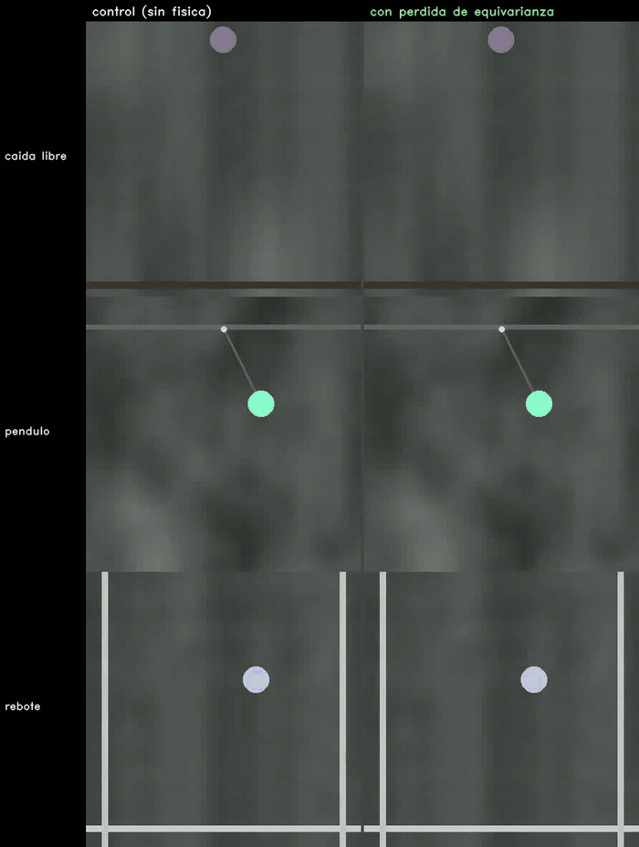
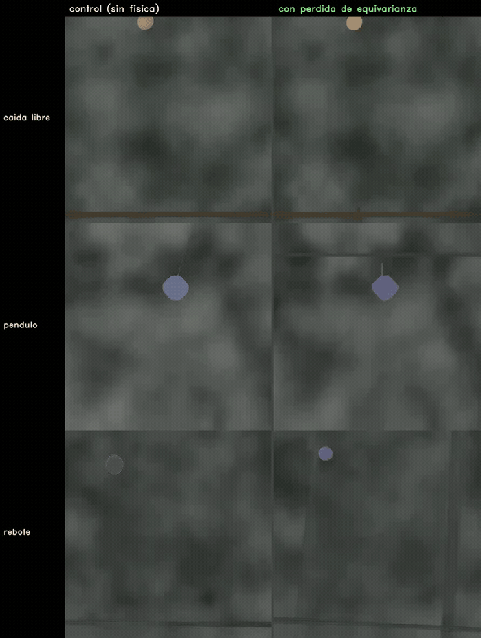
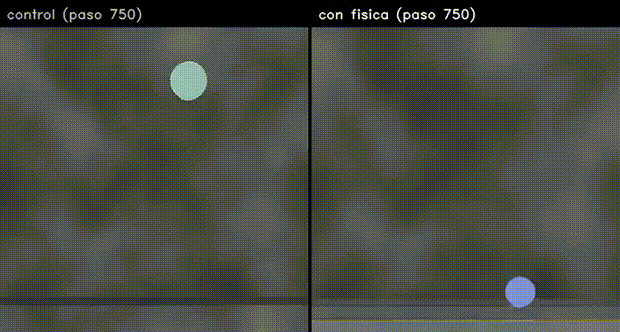

# Equivarianza como prior físico en difusión de video — los videos

Videos del TPF de Visión Artificial Avanzada (UdeSA). El trabajo intenta enseñarle física a un modelo
de difusión de video **sin ground truth físico**, imponiendo una simetría: si se rota la escena, la
cinemática de lo generado tiene que rotar igual. El movimiento se estima con RAFT (flujo óptico) sobre
los propios videos generados, y todo se retropropaga hasta los pesos.

El resultado tiene dos mitades y conviene separarlas.

**La restricción se aprende.** Medido fuera del bucle de entrenamiento, sobre clips que el modelo nunca
vio y contra un control idéntico salvo por la pérdida, las velocidades de las dos ramas pasan de estar
a 63° de diferencia en el control a 51° en el brazo entrenado, y la ventaja es consistente en los ocho
checkpoints. Pero conviene no exagerarlo: 51° sigue estando lejos de los 0° de la simetría perfecta, y
toda la ventaja aparece en los primeros 125 pasos y después se estanca.

**Y no se traduce en mejor física.** El error de velocidad contra el ground truth del simulador no
mejora, y fuera de distribución el modelo degenera. Lo que sí podemos señalar como causa —medido, no
conjeturado— es **cómo** el modelo satisface la restricción: se mueve menos, y descubre que partir la
pelota en dos hace que el flujo agregado de la escena se cancele. Las dos cosas bajan la pérdida sin
mejorar la dinámica. A eso se suma que la pérdida ve una versión parcial de lo generado —24 de 32
vectores de velocidad en péndulo y rebote, 12 o 16 en caída libre, sobre 12 pasos de Euler contra los
20 de la inferencia— aunque **eso último es una hipótesis, no algo que hayamos medido**.

Cada sección indica a qué parte del póster corresponde.

**Los pesos y el archivo completo de videos están en Hugging Face:
[AlexBodner/tpf-equivarianza-video](https://huggingface.co/AlexBodner/tpf-equivarianza-video).** Acá
van los videos *comentados*, elegidos para contar la historia; allá están **los 16 checkpoints LoRA**
—los 8 del brazo con física y los 8 de su control, para poder reproducir cualquier comparación
apareada— y **los ~2400 videos** que produjeron todos los experimentos, ordenados por experimento y
por paso de entrenamiento, con un índice que rastrea cada archivo hasta su origen.

> ## Estado de este documento
>
> **Última actualización: 9 de septiembre de 2026.** Hay tres mediciones corriendo que van a
> cambiar partes de este texto. Se marcan acá para que se pueda leer la historia completa ahora
> y saber qué se va a mover.
>
> | qué | estado | qué sección cambia |
> |---|---|---|
> | Elección de checkpoint de cada brazo, por su propia validación sobre los **mismos 8 candidatos** | corriendo | «Los números» |
> | Evaluación con las métricas de equivarianza medidas sobre **velocidades** (hoy están sobre aceleraciones y no son interpretables) | corriendo | «Los números» |
> | **Test final** sobre los 30 clips por escenario que nunca se miraron (n = 90) | corriendo | va a ser el resultado principal |
>
> Lo que **no** va a cambiar: el error de velocidad nunca estuvo afectado por el defecto de medición,
> así que la conclusión de que la física no mejora no depende de nada de lo anterior.

---

## Qué mide cada número

Todas las tablas usan estas cantidades. Vale la pena leer esto una vez: varias tienen una trampa.

**Error de velocidad** — cuánto se aparta la rapidez de lo generado respecto de la del simulador, cuadro
a cuadro, en píxeles por cuadro. Menos es mejor. **Es la métrica principal**, y la razón es que es la
única donde un video congelado queda claramente último: no se puede ganar quedándose quieto.

**Razón de movimiento** — cuánto se mueve lo generado dividido por cuánto se mueve el ground truth. 1
sería exacto; 0,6 quiere decir que el modelo se mueve un 40 % de menos. No es una métrica de calidad
sino el **control** que acompaña a todas las demás, porque varias se ganan moviéndose menos.

**ρ** — la fracción del movimiento que **no** respeta la simetría. Se genera el mismo clip dos veces,
una con la escena rotada, se des-rota la segunda y se mide cuánto difieren, dividido por cuánto
movimiento hay en total. Menos es mejor, pero la escala engaña: **ρ = 1 significa "dos movimientos sin
ninguna relación entre sí"**, así que 0,43 no es bueno, es un desacuerdo del 92 % de la magnitud del
movimiento. Es la cantidad que la pérdida minimiza, así que mide directamente si el modelo aprendió lo
que se le pidió.

**Ángulo entre ramas** — el mismo dato que ρ pero legible: cuántos grados separan las velocidades de
las dos generaciones. 0° sería simetría perfecta. Se reporta al lado de ρ porque se entiende sin
explicación.

**Jerk** — la variación de la aceleración; mide qué tan "a los tirones" es el movimiento. Menos es más
suave. **Trampa: un video congelado tiene jerk cero**, así que ganar acá no es ganar en física; hay que
leerlo junto con la razón de movimiento.

**MAE de aceleración** — el error de aceleración contra el simulador. Misma trampa que el jerk, y peor:
en caída libre el ground truth tiene aceleración casi nula porque la pelota ya va a velocidad terminal,
así que quedarse quieto puntúa perfecto.

**Las cotas triviales** — dos referencias que aparecen en las tablas y sirven para saber si un número
significa algo: el **video quieto** (congelar el último cuadro de condicionamiento) y la **velocidad
constante** (extrapolar en línea recta). Si un modelo no le gana claramente a las dos, no está haciendo
física.

---

## Cómo leer los paneles

- Videos de cuatro paneles: **ground truth del simulador · modelo base sin fine-tuning · generación
  por texto · generación condicionada**. Fondo Perlin gris, pelota de color, 33 cuadros a 384 px.
  El condicionamiento son los **2 primeros cuadros latentes** del clip real, que en píxeles son los
  primeros 8 cuadros; el resto lo genera el modelo.
- Videos de equivarianza, tres paneles: **generación con el condicionamiento original · con el
  condicionamiento rotado 45° y luego des-rotada · diferencia absoluta**. Si el modelo fuera
  equivariante, los dos primeros serían iguales y el tercero negro.
- Todos los MP4 están en [`videos/`](videos); los GIF de abajo son los mismos, reducidos.
- **Cada video dice de qué checkpoint sale.** Los dos brazos siempre se comparan en el *mismo* paso, y
  el nombre del archivo lo lleva.
- Los JSON de todas las evaluaciones, los logs de entrenamiento y las configuraciones están en
  [`resultados/`](resultados), para que los números se puedan verificar sin la máquina de entrenamiento.

## El método: las dos ramas que compara la pérdida

*Póster: sección «Método».*

*Brazo con física, **‹checkpoint elegido por la pérdida de rotación›** — el video se va a regenerar
con ese checkpoint cuando termine la medición en curso; el que se ve acá todavía es el del paso 250.
Las dos generaciones del mismo clip, con el mismo ruido: a la izquierda la escena original, a la
derecha la escena rotada 45°. La pérdida compara la cinemática de una contra la de la otra rotada.*

*De izquierda a derecha: el video; el campo de flujo que devuelve RAFT, con el tono como dirección, el
brillo como magnitud y flechas submuestreadas encima; y el único vector que queda después de agregar
toda la escena, sobre un dial cuyos círculos son 1, 2 y 3 px por cuadro, con la estela de los ocho
cuadros anteriores. El vector va sobre ejes y no sobre la imagen porque **no tiene ubicación**: es el
promedio de la escena entera. **Ese vector, uno
por cuadro, es todo lo que la pérdida mira.** Ahí se ve por qué dos objetos moviéndose en direcciones
opuestas se cancelan: el agregado promedia la escena entera. Archivo:
`videos/18_que_ve_la_perdida.mp4`, generado con `scripts_figuras/gen_que_ve_la_perdida.py`.*

En cada paso de entrenamiento el modelo genera el mismo clip dos veces, con el mismo ruido: una con la
escena original y otra rotada. Si fuera equivariante, la cinemática de la segunda sería la de la
primera rotada. La inconsistencia entre ambas es toda la señal de entrenamiento, y no requiere
anotaciones. El costo es que hay que generar, decodificar y estimar flujo **dentro** del paso de
entrenamiento, y retropropagar por todo eso.

Archivo: `videos/06_dos_ramas_de_la_perdida.mp4`. Una aclaración para que no confunda: el
entrenamiento decodifica las dos ramas **de a un latente por vez** para que entren en memoria, y cada
uno de esos trozos son unos 5 cuadros. Eso es el troceado del decodificador, no el largo de la rama:
las dos ramas cubren el clip entero, 33 cuadros, que es lo que muestra este video.

## Sobre velocidad el modelo sí se vuelve más equivariante

*Póster: sección «Resultados».*

Sobre **velocidad** el estimador sí tiene señal: en video real rotado se contradice sólo un 2 %.
Aplicada ahí, la pérdida hace lo que se le pide. El criterio de éxito se escribió antes de correr y
pedía dos cosas; las dos se cumplen.

**El término baja durante el entrenamiento**, de 0,1834 a 0,1266 entre los primeros y los últimos 100
pasos: un 31 % menos, y hay un 4 % de probabilidad de que sea casualidad. El acuerdo de dirección entre
las dos ramas sube de 0,81 a 0,86. Las dos cantidades salen de la misma función y sobre los mismos
vectores, así que **no son evidencia independiente**: son la norma y el ángulo de la misma diferencia.

**Y medido fuera del bucle**, en 9 pares del checkpoint 1000, el brazo gana en las tres cantidades:
coseno 0,56 contra 0,37 del control, desacuerdo 0,45 contra 0,64 y diferencia de píxeles 4,99 contra
5,38. Es n = 9 y sin test, pero es la única lectura que no viene del término que se está optimizando.
En el checkpoint 250 daba a favor del control: se da vuelta recién al final.

Detalle para quien quiera repetirlo: los p son de un Mann-Whitney de una cola, legítimo porque la
dirección estaba preregistrada; a dos colas darían 0,085 y 0,124. Salida cruda en
`resultados/evaluaciones/e4vel__equiv_1000__diagnostico_completo.log`, prueba de tendencia en
`scripts_figuras/gen_aceleracion_vs_velocidad.py`.

*Checkpoint 250. Condicionamiento original · rotado 45° y des-rotado · diferencia. Cuanto más oscuro el
tercer panel, más equivariante. En el 250 esta medición todavía daba a favor del control (5,07 contra
4,78 de diferencia de píxeles); recién en el 1000 se da vuelta (4,99 contra 5,38), y ahí el coseno
entre ramas es 0,56 contra 0,37. Las dos mediciones están en
`resultados/evaluaciones/e4vel__equiv_1000__diagnostico_completo.log`.*

*Checkpoint 1000. El péndulo es el escenario donde mejor sale: la generación condicionada sigue al
ground truth con el pivote en su lugar y el hilo único.*

Archivos: `videos/08_equivarianza_*_velocidad.mp4`, `videos/01_pendulo_bien_paso1000.mp4`

## La equivarianza, medida como corresponde

*Esta es la medición que reemplaza a las dos filas no interpretables de más arriba.* Se hace
**fuera** del bucle de entrenamiento, sobre **velocidades** —la cantidad que el brazo optimiza— y
sobre clips held-out, generando cada uno dos veces: normal y con la escena rotada 45°.

*Arriba lo que la pérdida pide, abajo lo que queremos que mejore. ▲ verde marca los pasos donde la
diferencia apareada favorece al brazo con física; ▼ naranja, donde lo perjudica. Reproducible con
`scripts_figuras/gen_panel_checkpoints.py`.*

**La fila de arriba es un resultado limpio.** La línea azul está por debajo de la gris en los ocho
checkpoints en ρ, y por encima en los ocho en coseno. Nunca se cruzan.

| paso | ρ control | ρ física | ángulo control | ángulo física | p |
|---|---|---|---|---|---|
| 125 | 0,587 | **0,417** | 65° | **48°** | 0,016 |
| 250 | 0,597 | 0,522 | 64° | 60° | 0,791 |
| 375 | 0,597 | **0,419** | 61° | **53°** | 0,021 |
| 500 | 0,527 | **0,388** | 59° | **51°** | 0,064 |
| 625 | 0,626 | **0,404** | 67° | **53°** | 0,042 |
| 750 | 0,602 | 0,446 | 64° | 52° | 0,233 |
| 875 | 0,508 | 0,460 | 59° | 55° | 0,110 |
| 1000 | 0,596 | **0,427** | 63° | **51°** | 0,012 |

El **ángulo** es el coseno leído como lo que es: cuántos grados separan las velocidades de las dos
ramas. Simetría perfecta serían 0°. Conviene mirarlo porque ρ engaña: 0,43 suena bien hasta que uno
nota que **ρ = 1 es "dos movimientos sin ninguna relación"**, y que 0,43 equivale a un desacuerdo del
92% de la magnitud del movimiento. La afirmación honesta no es "el modelo aprende la simetría" sino
que **la pérdida lo mueve en la dirección correcta de forma medible y consistente, y aun así el modelo
sigue lejos de ser equivariante**: 51° contra 63°, cuando lo ideal es 0°.

**Y no mejora con más entrenamiento.** La ventaja sobre el control ya está entera en el primer
checkpoint: en el paso 125 la diferencia en ρ es −0,170 y en el 1000 es −0,168. La tendencia a lo
largo de los ocho es plana (Spearman +0,19, p = 0,65). Los 1000 pasos movieron el ángulo de 63° a 51°,
todo eso pasó en los primeros 125, y después se estancó. Entrenar más no parece el ingrediente que
falta.

## Los números, y cómo se eligió el checkpoint

*Póster: sección «Resultados».*

**El problema de elegir.** Las métricas oscilan entre checkpoints, así que darle a cada brazo el paso
que mejor le queda infla el resultado. La elección primaria es el **paso 1000**: es la preregistrada y
no mira ningún resultado.

**Elegir por lo que cada brazo minimiza** sería mejor, pero no se puede todavía. Para el brazo con
física ese objetivo incluye la validación de rotación, y durante esta corrida esa validación se calculó
sobre *aceleraciones*, no sobre las velocidades que el brazo optimiza: el arreglo es del 8 de
septiembre y la corrida del 7. Sobre video generado esa cantidad es ruido, así que el checkpoint que
elige no se sostiene.

Se nota en qué elegía: el paso 750, que es **el que menos se mueve** de los siete medidos. Ese término
es un MSE sin normalizar, y bajarlo generando menos movimiento es gratis.

*Izquierda: los dos términos de validación y su suma; el mínimo cae en el paso 750. Derecha: cuánto se
mueve el video generado; el mínimo cae en el mismo paso. Reproducible con
`scripts_figuras/gen_seleccion_checkpoint.py`.*

**Lo que queda en pie** son las reglas basadas en la validación de difusión, que no está afectada:

| regla | paso | control | con física | p |
|---|---|---|---|---|
| preregistrada, sin selección | 1000 y 1000 | 4,619 | 4,900 | 0,213 |
| mejor validación de difusión | 250 y 250 | 4,838 | 5,190 | 0,096 |

Las dos dan lo mismo: **ninguna diferencia significativa**. Las otras métricas en el 250 tampoco
(movimiento p = 0,21, jerk p = 0,16, aceleración p = 1,00).

Un límite del montaje: la validación corre cada 50 pasos y los checkpoints se guardan cada 125, así
que sólo cuatro de los ocho tienen medición y el mínimo real de la validación cae en el paso 650, que no
quedó guardado. Además la diferencia entre el 250 y el 1000 es del 3,7 % cuando la validación oscila un
8,6 % a lo largo del entrenamiento: está dentro del ruido. Para la próxima corrida alcanza con alinear
las dos cadencias y registrar en validación la cantidad normalizada con el piso restado.

**Lo que falta para cerrar la pregunta.** Una selección por el objetivo físico necesita medir la
equivarianza sobre velocidades, fuera del bucle, en los checkpoints de los **dos** brazos. Esa medición
está corriendo: 8 checkpoints por brazo, con el piso pedido sobre velocidades. Hasta que esté, la
elección primaria sigue siendo el paso 1000, que es la preregistrada y no selecciona nada.

## Lado a lado: el control contra el brazo con física

*Póster: sección «Resultados». Es el contraste que decide todo el trabajo.*

Los dos brazos entrenan con el mismo clip, el mismo ruido y los mismos pesos iniciales; lo único que
los separa es la pérdida de equivarianza. Acá generan el **mismo clip**, así que la diferencia que se
ve es atribuible a la pérdida y a nada más.

> **Pendiente:** estos videos se van a regenerar con el checkpoint que elija la regla de validación
> —la misma que decide la comparación principal— cuando termine la medición en curso. Los de ahora son
> del paso 250.

Los videos de esta sección son del **checkpoint 250 de ambos brazos**, y conviene ser claro sobre por
qué: no porque sea el mejor (no lo es, ver [Los números](#numeros)), sino porque es el único paso donde se generaron
los pares de ambos brazos sobre los mismos clips. En el checkpoint 1000, que es la elección primaria, la
comparación existe en números pero todavía no en video.

*Checkpoint 250 de los dos brazos. Los tres escenarios a la vez, generación condicionada en los 2 primeros latentes. Arrancan idénticos porque
el condicionamiento es el mismo. En **caída libre** las dos trayectorias son parecidas y el brazo con
física termina más cerca del ground truth. En **péndulo** también. En **rebote** la pelota del brazo con
física se desdibuja y queda atrás: es el escenario donde empeora, y donde después aparecen los
duplicados.*

*Checkpoint 250, generando sólo desde el texto, sin condicionamiento: acá las dos ramas no tienen por qué
coincidir en posición, y se ve mejor la diferencia de dinámica.*

Y en detalle, dos casos:

*Rebote, checkpoint 250 de los dos brazos, generación condicionada. Arrancan idénticos, porque el
condicionamiento es el mismo, y divergen: la pelota del brazo con física recorre menos y hacia el final se desdibuja.
Es la degeneración empezando, en un caso donde las métricas en distribución todavía no la marcan.*

*Péndulo, checkpoint 250, generación libre por texto. Acá el brazo con física dibuja el pivote y el
hilo, que el control no pone; es el escenario donde la pérdida ayudó más.*

Los videos completos: `videos/16_tres_escenarios_*.mp4` para las grillas y
`videos/13_control_vs_fisica_*.mp4` para los seis casos individuales (tres escenarios × condicionada y
libre).

## La otra cara: cómo satisface la simetría

*Póster: sección «Resultados» (fuera de distribución) y «Conclusiones».*

Aprender la simetría no mejoró la física. En distribución nada se distingue del control (n = 60, todo
p > 0,29), y **fuera de distribución el modelo degenera**: su razón de movimiento cae a 0,12 contra
0,43 del control, por debajo de la de un video estático. La restricción no fija la escala del
movimiento, así que admite dos atajos.

**Atajo 1: moverse menos.** Si todo se achica, el desacuerdo entre las dos ramas se achica solo.

**Atajo 2: partir el objeto en dos.** Este es el hallazgo más interesante. El estimador promedia el
flujo de toda la escena, así que dos objetos moviéndose en direcciones distintas se cancelan
parcialmente: el vector agregado se achica y la pérdida baja sin que la dinámica mejore.

*Checkpoint 1000. Dos pelotas de colores distintos en los paneles generados. Comparar con
`videos/04_rebote_una_pelota_paso250.mp4`, el mismo escenario 750 pasos antes.*

Archivos: `videos/03_rebote_pelota_duplicada_paso1000.mp4`, `videos/05_caida_libre_paso1000.mp4`,
`videos/07_fuera_de_dominio_rodando.mp4`

### Cómo se cerraría cada atajo

El primero, moverse menos, es una propiedad de la restricción: sin un ancla de escala siempre está
disponible.

El segundo es un defecto del **estimador**, y es más difícil de cerrar de lo que parece. La dificultad
de fondo es que las dos ramas son **generaciones independientes**: el modelo genera dos videos a partir
de dos condicionamientos distintos, no rota un video ya hecho. Nada garantiza que la pelota esté en la
misma fase ni en la posición correspondiente en ambos. Por eso:

- **Comparar los campos de flujo densos** píxel a píxel, $R\,\Phi_{\text{orig}}(x)$ contra
  $\Phi_{\text{rot}}(Rx)$, **no alcanza**: supone correspondencia espacial entre las dos generaciones.
  Si la pelota quedó en otra fase, la diferencia es enorme aunque la dinámica sea perfectamente
  equivariante. Confunde "está en otro lugar" con "se mueve distinto".
- **Quedarse con el objeto más grande** tampoco: es esencialmente lo que ya hace el agregador, no está
  justificado, y se cae apenas hay varios objetos o cuando el movimiento del fondo es informativo, que
  además hoy se descarta al restar el flujo medio global.

Las dos salidas que quedan:

1. **Comparar la distribución de velocidades** de las dos ramas (momentos, histograma o transporte
   óptimo) en vez de un promedio o de una comparación posición a posición. Es invariante a dónde esté
   cada objeto y a permutarlos, así que **no necesita correspondencia**, y tolera que las dos ramas
   generen distinta cantidad de objetos. Es la única de la lista que esquiva el problema de raíz.
2. **Emparejar las velocidades entre los dos videos generados**, con segmentación y asociación de
   identidad. Es lo que hace falta para cualquier comparación que no sea distribucional, y es un
   problema en sí mismo: hay que resolver correspondencia entre dos generaciones que pueden diferir en
   fase, en posición y hasta en cuántos objetos tienen. **Queda como trabajo futuro**, y es la pieza
   que hoy falta para que la restricción se pueda imponer sobre escenas con más de un objeto.

## Fuera de dominio: las corrupciones aparecen con los pasos

*Póster: sección «Resultados», fila fuera de distribución.*

Los prompts de abajo nunca se entrenaron. Es donde mejor se ve el mecanismo: no es que el modelo
"aprenda mal la física", es que **la imagen se corrompe** a medida que avanza el entrenamiento, y la
corrupción es justamente lo que baja la pérdida.

*Prompt «una pelota rodando por una superficie plana», el mismo en los cuatro paneles, generado por el
modelo entrenado en distintos pasos. En el 250 y el 500 hay una pelota limpia; en el 750 aparecen
**dos**; en el 1000 la pelota está deshecha. La pérdida no penaliza nada de eso: dos objetos que se
mueven en direcciones distintas se cancelan en el flujo agregado, y el desacuerdo entre ramas baja.*

*Mismo efecto con otro prompt fuera de dominio.*

*Y contra el control en el mismo paso: el control mantiene un objeto coherente.*

En números, sobre el escenario fuera de distribución con ground truth (tiro vertical): la razón de
movimiento del brazo con física cae a 0,12 contra 0,43 del control, por debajo de la de un video
estático (0,22). Es el mismo fenómeno, medido.

**Por qué esto apunta a una limitación del método y no a la hipótesis.** La pérdida se calcula sobre
una generación truncada, de 12 pasos de Euler en vez de 20, y sobre una parte de los 32 vectores de
velocidad del clip: 24 en péndulo y rebote, 12 o 16 en caída libre (contado sobre los 1000 pasos de la
corrida). El modelo puede degradar lo que la pérdida no mira. Conviene decir hasta dónde llega esta
explicación: **no está medido** que la corrupción viva en los cuadros excluidos, y la degeneración más
fuerte aparece fuera de distribución, donde la pérdida no vio ningún vector. Lo que sí está medido son
los dos atajos de [cómo satisface la simetría](#degeneracion), que operan sobre cuadros que la pérdida **sí** mira. Las correcciones
de la última sección apuntan a las dos cosas.

**Buscamos algo positivo acá y no lo encontramos.** Con el prompt de la pelota rodando —un escenario
que no existe en el entrenamiento— parecía, mirando la altura media de lo que se mueve, que el brazo
con física mantenía la pelota contra el piso mientras la del control flotaba. No se sostiene: esa
altura es el centroide de **varias manchas repartidas**, no de una pelota.

*Checkpoint 875 de los dos brazos, misma semilla y misma ruta de generación. Los dos producen varios
objetos tenues y descoloridos en vez de una pelota. Archivo: `videos/19_ood_rodando_paso875.mp4`.*

Contando objetos separados de tamaño apreciable en vez de mirar el centroide, en el paso 875 el brazo
con física tiene más de uno en 13 de los 33 cuadros, con hasta 5 a la vez, y la saturación máxima del
video es 15 sobre 255: la pelota sale gris. El control está igual o peor. En los cinco checkpoints
medidos, ninguno de los dos brazos genera una pelota única en la mayoría de los cuadros.

Vale la pena dejarlo escrito porque es un resultado negativo que costó: **la primera lectura de esta
medición fue favorable al brazo con física, y era un artefacto de resumir con una media lo que había
que contar objeto por objeto.**

Archivos: `videos/03_rebote_pelota_duplicada_paso1000.mp4`, `videos/05_caida_libre_paso1000.mp4`,
`videos/07_fuera_de_dominio_rodando.mp4`

### Cómo se cerraría cada atajo

El primero, moverse menos, es una propiedad de la restricción: sin un ancla de escala siempre está
disponible.

El segundo es un defecto del **estimador**, y es más difícil de cerrar de lo que parece. La dificultad
de fondo es que las dos ramas son **generaciones independientes**: el modelo genera dos videos a partir
de dos condicionamientos distintos, no rota un video ya hecho. Nada garantiza que la pelota esté en la
misma fase ni en la posición correspondiente en ambos. Por eso:

- **Comparar los campos de flujo densos** píxel a píxel, $R\,\Phi_{\text{orig}}(x)$ contra
  $\Phi_{\text{rot}}(Rx)$, **no alcanza**: supone correspondencia espacial entre las dos generaciones.
  Si la pelota quedó en otra fase, la diferencia es enorme aunque la dinámica sea perfectamente
  equivariante. Confunde "está en otro lugar" con "se mueve distinto".
- **Quedarse con el objeto más grande** tampoco: es esencialmente lo que ya hace el agregador, no está
  justificado, y se cae apenas hay varios objetos o cuando el movimiento del fondo es informativo, que
  además hoy se descarta al restar el flujo medio global.

Las dos salidas que quedan:

1. **Comparar la distribución de velocidades** de las dos ramas (momentos, histograma o transporte
   óptimo) en vez de un promedio o de una comparación posición a posición. Es invariante a dónde esté
   cada objeto y a permutarlos, así que **no necesita correspondencia**, y tolera que las dos ramas
   generen distinta cantidad de objetos. Es la única de la lista que esquiva el problema de raíz.
2. **Emparejar las velocidades entre los dos videos generados**, con segmentación y asociación de
   identidad. Es lo que hace falta para cualquier comparación que no sea distribucional, y es un
   problema en sí mismo: hay que resolver correspondencia entre dos generaciones que pueden diferir en
   fase, en posición y hasta en cuántos objetos tienen. **Queda como trabajo futuro**, y es la pieza
   que hoy falta para que la restricción se pueda imponer sobre escenas con más de un objeto.

## Fuera de dominio: las corrupciones aparecen con los pasos

*Póster: sección «Resultados», fila fuera de distribución.*

Los prompts de abajo nunca se entrenaron. Es donde mejor se ve el mecanismo: no es que el modelo
"aprenda mal la física", es que **la imagen se corrompe** a medida que avanza el entrenamiento, y la
corrupción es justamente lo que baja la pérdida.

*Prompt «una pelota rodando por una superficie plana», el mismo en los cuatro paneles, generado por el
modelo entrenado en distintos pasos. En el 250 y el 500 hay una pelota limpia; en el 750 aparecen
**dos**; en el 1000 la pelota está deshecha. La pérdida no penaliza nada de eso: dos objetos que se
mueven en direcciones distintas se cancelan en el flujo agregado, y el desacuerdo entre ramas baja.*

*Mismo efecto con otro prompt fuera de dominio.*

*Y contra el control en el mismo paso: el control mantiene un objeto coherente.*

En números, sobre el escenario fuera de distribución con ground truth (tiro vertical): la razón de
movimiento del brazo con física cae a 0,12 contra 0,43 del control, por debajo de la de un video
estático (0,22). Es el mismo fenómeno, medido.

**Por qué esto apunta a una limitación del método y no a la hipótesis.** La pérdida se calcula sobre
una generación truncada, de 12 pasos de Euler en vez de 20, y sobre una parte de los 32 vectores de
velocidad del clip: 24 en péndulo y rebote, 12 o 16 en caída libre (contado sobre los 1000 pasos de la
corrida). El modelo puede degradar lo que la pérdida no mira. Conviene decir hasta dónde llega esta
explicación: **no está medido** que la corrupción viva en los cuadros excluidos, y la degeneración más
fuerte aparece fuera de distribución, donde la pérdida no vio ningún vector. Lo que sí está medido son
los dos atajos de [cómo satisface la simetría](#degeneracion), que operan sobre cuadros que la pérdida **sí** mira. Las correcciones
de la última sección apuntan a las dos cosas.

**No es uniformemente peor.** Con el prompt de la pelota rodando —un escenario que no existe en el
entrenamiento— el brazo con física mantiene la pelota contra el piso mejor que el control:

*Checkpoint 875 de los dos brazos, misma semilla, prompt «una pelota rodando por una superficie plana».
La pelota del brazo con física se mantiene a ras del piso —altura media 0,84 del alto del cuadro, con
un desvío de 0,018, prácticamente una recta— mientras la del control flota a media altura. Archivo:
`videos/19_ood_rodando_paso875.mp4`.*

Medido en los cinco checkpoints, con **todas las generaciones hechas por la misma ruta y con la misma
semilla**, el patrón es consistente: el brazo con física deja la pelota más abajo en los cinco, y con
menos oscilación vertical en cuatro de los cinco.

| paso | control: altura (desvío) | con física: altura (desvío) |
|---|---|---|
| 250 | 0,67 (0,158) | 0,76 (0,110) |
| 500 | 0,75 (0,181) | 0,75 (0,111) |
| 750 | 0,62 (0,168) | 0,81 (0,083) |
| **875** | 0,56 (0,080) | **0,84 (0,018)** |
| 1000 | 0,56 (0,079) | 0,73 (0,159) |

Es el único indicio a favor del brazo con física fuera de distribución, y por eso conviene decir qué
tan lejos llega: es **una generación por celda** con la misma semilla en todas, no cinco muestras
independientes, así que la consistencia entre checkpoints pesa menos de lo que parece. No es un
resultado; es una pista de que la restricción deja algo útil justo donde el resto de las métricas dice
que degenera.

Una advertencia sobre cómo se llegó a esto: la primera versión de esta medición comparaba las
muestras que guarda el entrenamiento contra generaciones hechas a mano, o sea dos tuberías distintas, y
daba un patrón que se invertía entre checkpoints. Regenerar todo por la misma ruta lo ordenó. Es el
mismo error que este trabajo documenta en otras partes: comparar dos cosas medidas de manera distinta.

Archivos: `videos/03_rebote_pelota_duplicada_paso1000.mp4`, `videos/05_caida_libre_paso1000.mp4`,
`videos/07_fuera_de_dominio_rodando.mp4`

### Cómo se cerraría cada atajo

El primero, moverse menos, es una propiedad de la restricción: sin un ancla de escala siempre está
disponible.

El segundo es un defecto del **estimador**, y es más difícil de cerrar de lo que parece. La dificultad
de fondo es que las dos ramas son **generaciones independientes**: el modelo genera dos videos a partir
de dos condicionamientos distintos, no rota un video ya hecho. Nada garantiza que la pelota esté en la
misma fase ni en la posición correspondiente en ambos. Por eso:

- **Comparar los campos de flujo densos** píxel a píxel, $R\,\Phi_{\text{orig}}(x)$ contra
  $\Phi_{\text{rot}}(Rx)$, **no alcanza**: supone correspondencia espacial entre las dos generaciones.
  Si la pelota quedó en otra fase, la diferencia es enorme aunque la dinámica sea perfectamente
  equivariante. Confunde "está en otro lugar" con "se mueve distinto".
- **Quedarse con el objeto más grande** tampoco: es esencialmente lo que ya hace el agregador, no está
  justificado, y se cae apenas hay varios objetos o cuando el movimiento del fondo es informativo, que
  además hoy se descarta al restar el flujo medio global.

Las dos salidas que quedan:

1. **Comparar la distribución de velocidades** de las dos ramas (momentos, histograma o transporte
   óptimo) en vez de un promedio o de una comparación posición a posición. Es invariante a dónde esté
   cada objeto y a permutarlos, así que **no necesita correspondencia**, y tolera que las dos ramas
   generen distinta cantidad de objetos. Es la única de la lista que esquiva el problema de raíz.
2. **Emparejar las velocidades entre los dos videos generados**, con segmentación y asociación de
   identidad. Es lo que hace falta para cualquier comparación que no sea distribucional, y es un
   problema en sí mismo: hay que resolver correspondencia entre dos generaciones que pueden diferir en
   fase, en posición y hasta en cuántos objetos tienen. **Queda como trabajo futuro**, y es la pieza
   que hoy falta para que la restricción se pueda imponer sobre escenas con más de un objeto.

## Fuera de dominio: las corrupciones aparecen con los pasos

*Póster: sección «Resultados», fila fuera de distribución.*

Los prompts de abajo nunca se entrenaron. Es donde mejor se ve el mecanismo: no es que el modelo
"aprenda mal la física", es que **la imagen se corrompe** a medida que avanza el entrenamiento, y la
corrupción es justamente lo que baja la pérdida.

*Prompt «una pelota rodando por una superficie plana», el mismo en los cuatro paneles, generado por el
modelo entrenado en distintos pasos. En el 250 y el 500 hay una pelota limpia; en el 750 aparecen
**dos**; en el 1000 la pelota está deshecha. La pérdida no penaliza nada de eso: dos objetos que se
mueven en direcciones distintas se cancelan en el flujo agregado, y el desacuerdo entre ramas baja.*

*Mismo efecto con otro prompt fuera de dominio.*

*Y contra el control en el mismo paso: el control mantiene un objeto coherente.*

En números, sobre el escenario fuera de distribución con ground truth (tiro vertical): la razón de
movimiento del brazo con física cae a 0,12 contra 0,43 del control, por debajo de la de un video
estático (0,22). Es el mismo fenómeno, medido.

**Por qué esto apunta a una limitación del método y no a la hipótesis.** La pérdida se calcula sobre
una generación truncada, de 12 pasos de Euler en vez de 20, y sobre una parte de los 32 vectores de
velocidad del clip: 24 en péndulo y rebote, 12 o 16 en caída libre (contado sobre los 1000 pasos de la
corrida). El modelo puede degradar lo que la pérdida no mira. Conviene decir hasta dónde llega esta
explicación: **no está medido** que la corrupción viva en los cuadros excluidos, y la degeneración más
fuerte aparece fuera de distribución, donde la pérdida no vio ningún vector. Lo que sí está medido son
los dos atajos de [cómo satisface la simetría](#degeneracion), que operan sobre cuadros que la pérdida **sí** mira. Las correcciones
de la última sección apuntan a las dos cosas.

**No es uniformemente peor.** En el paso 750, con el prompt de la pelota rodando, el brazo con física
es el único de los dos que produce algo que efectivamente rueda:

*Checkpoint 750 de los dos brazos, prompt «una pelota rodando por una superficie plana», que no existe
en el entrenamiento. La pelota del brazo con física se mantiene a ras del piso —altura media 0,90 del
alto del cuadro, con desvío 0,014, prácticamente una recta— y se desplaza. La del control vaga
verticalmente (desvío 0,26) y se pierde durante 7 cuadros. Archivo:
`videos/19_ood_rodando_paso750.mp4`.*

Conviene no sacar de esto más de lo que da: es **una sola generación por brazo**, y midiendo los cuatro
checkpoints el resultado se reparte —en el 250 y el 750 la pelota del brazo con física se queda en el
piso, en el 500 la del control lo hace mejor, y en el 1000 las dos vagan—. Como resultado no se
sostiene; como muestra de que el brazo no colapsa siempre, sí.

## Generaciones más largas que el horizonte de entrenamiento

El período del péndulo es de 37,4 cuadros y generamos 33: **nunca se ve una oscilación completa**.
Para ver si la dinámica sobrevive más allá de lo que el modelo vio, se generaron los mismos clips a 65
cuadros (1,74 períodos) y se midió cuánto movimiento queda después del cuadro 33.

*Checkpoint 1000 de los dos brazos, mismo clip y misma semilla, 65 cuadros. Hasta el cuadro 33 es el
horizonte que el modelo vio en entrenamiento; desde ahí el borde se pone rojo y todo lo que sigue es
extrapolación. Para el cuadro 50 el control mantiene la pelota y el hilo, y en el brazo con física la
pelota se disolvió. Archivo: `videos/17_pendulo_65_cuadros_paso1000.mp4`.*

| brazo | escenario | movimiento después del horizonte |
|---|---|---|
| control | péndulo | 0,57× |
| **con física** | péndulo | **0,22×** |
| control | rebote | 0,29× |
| **con física** | rebote | **0,16×** |
| control | caída libre | 0,59× |
| con física | caída libre | 0,57× |

Los dos brazos se frenan pasado el horizonte, pero el brazo con física se frena **más del doble** en
péndulo y rebote. En caída libre, donde el ground truth ya va a velocidad constante, se comportan
igual. Es la misma firma de la ruta degenerada, ahora en el eje temporal: donde el modelo tiene que
inventar dinámica que nunca vio, el brazo entrenado con la restricción se queda más quieto.

**No depende de qué checkpoint se mire.** El mismo par en el paso 250 da la misma dirección, así que
esto no es una peculiaridad del checkpoint final ni de la regla con que se lo elija:

| paso | control | con física |
|---|---|---|
| 250 | 0,42× | **0,29×** |
| 1000 | 0,57× | **0,22×** |

## Lo que cuesta

Medido sobre los propios registros de cada corrida, no estimado. La fila del control es la misma
receta **sin** el término físico, así que la diferencia entre las dos es el precio del método.

| corrida | pasos | VRAM mediana | VRAM pico | s/paso | horas | USD |
|---|---|---|---|---|---|---|
| etapa 2, **con pérdida física** | 1000 | 21,3 GB | 28,5 GB | 46,7 | 16,0 | 30 |
| etapa 2, control (sólo difusión) | 1000 | 6,8 GB | 9,1 GB | 12,4 | 3,5 | 6 |
| barrido BPTT, ventana completa | 150 | 18,8 GB | 26,0 GB | 27,8 | 1,0 | 2 |
| barrido BPTT, ventana de 4 pasos | 150 | 15,5 GB | 22,8 GB | 21,6 | 0,8 | 1,5 |

**Imponer la simetría cuesta 3,1× la memoria y 3,8× el tiempo** de entrenar sólo con difusión. Es lo
que se paga por generar, decodificar y estimar el flujo *dentro* del paso de entrenamiento, y
retropropagar por todo eso. El pico de 28,5 GB es el que decide qué GPU hace falta: con 24 GB no entra
a esta resolución y largo de clip.

Las dos filas del barrido muestran de dónde sale ese costo: acortar la ventana de retropropagación
baja el tiempo un 22 % y la memoria un 18 %, sin cambiar nada más.

## Qué quedó como recomendación

*Póster: sección «Trabajo futuro».*

1. **Que la pérdida vea todo lo que el modelo genera**: hoy mira 24 de 32 vectores en péndulo y
   rebote, 12 o 16 en caída libre, y una generación de 12 pasos de Euler en vez de 20. Es una hipótesis
   razonable —no comprobada— que la corrupción se aloje en lo que queda fuera.
2. **Emparejar las velocidades entre las dos generaciones**, que es la pieza que falta para escenas con
   más de un objeto. La única alternativa que esquiva el emparejamiento es comparar la **distribución**
   de velocidades, invariante a posición y a permutar objetos.
3. **Anclar la escala del movimiento**, porque sin eso la restricción siempre admite el atajo de
   moverse menos. El costo es que deja de ser una restricción sin ground truth, que era el atractivo.

---

# Anexo

Lo que sigue es material de respaldo: las tablas completas, la validación del instrumental, y los
experimentos que no funcionaron. Nada de acá hace falta para entender el resultado; está para que se
pueda verificar, y porque los caminos que no funcionaron explican por qué el diseño final es como es.

## Todas las evaluaciones, sin filtrar

> ⚠️ **Estas tablas usan el paso 750 para el brazo con física**, que era el que elegía la regla que
> después resultó estar mal medida. Los números son mediciones reales de ese checkpoint, pero **ya no
> es "el mejor"**: se rehacen con el checkpoint que elija la validación corregida, que está corriendo.
> Lo que no cambia es la conclusión, porque en el paso 1000 y en el 250 —las dos elecciones que sí se
> sostienen— tampoco hay diferencia.

Control en el paso **250** (mínimo de su validación de difusión) y brazo con física en el paso
**750** (mínimo de la suma de sus dos términos de validación). Mismos 30 clips held-out, misma
semilla por clip. El modelo base y las cotas triviales van de referencia.

#### Agregado sobre los 30 clips

| métrica | base | control (250) | con física (750) | gana física | p (apareado) |
|---|---|---|---|---|---|
| error de velocidad (↓) | 9.258 | 4.838 | 5.225 | 10/30 | 0.184 |
| razón de movimiento (→1) | 0.356 | 0.608 | 0.645 | 13/30 | 0.584 |
| jerk (↓) | 2.710 | 1.592 | 1.101 | 22/30 | 0.004 |
| MAE de aceleración (↓) | 1.931 | 1.746 | 1.755 | 15/30 | 0.968 |
| equivarianza cruda, **sobre aceleraciones** (↓) | 7.902 | 3.649 | 1.441 | 28/30 | 0.000 |
| equivarianza normalizada, **sobre aceleraciones** (↓) | 0.000 | 0.264 | 0.144 | 13/30 | 0.124 |

<b>Por escenario</b> (desplegar)

**caída libre**

| métrica | base | control (250) | con física (750) | gana física | p |
|---|---|---|---|---|---|
| error de velocidad (↓) | 11.909 | 4.613 | 5.577 | 2/10 | 0.064 |
| razón de movimiento (→1) | 0.471 | 0.664 | 0.574 | 1/10 | 0.020 |
| jerk (↓) | 4.010 | 1.423 | 1.137 | 8/10 | 0.010 |
| MAE de aceleración (↓) | 1.136 | 0.786 | 0.833 | 6/10 | 0.695 |
| equivarianza cruda, **sobre aceleraciones** (↓) | 13.094 | 2.170 | 1.053 | 9/10 | 0.004 |
| equivarianza normalizada, **sobre aceleraciones** (↓) | 0.000 | 0.081 | 0.000 | 2/10 | 0.500 |

**péndulo**

| métrica | base | control (250) | con física (750) | gana física | p |
|---|---|---|---|---|---|
| error de velocidad (↓) | 5.915 | 3.736 | 3.480 | 5/10 | 0.770 |
| razón de movimiento (→1) | 0.504 | 0.649 | 0.878 | 8/10 | 0.020 |
| jerk (↓) | 3.512 | 0.769 | 0.940 | 5/10 | 0.625 |
| MAE de aceleración (↓) | 1.425 | 0.631 | 0.661 | 3/10 | 0.625 |
| equivarianza cruda, **sobre aceleraciones** (↓) | 10.399 | 3.128 | 0.929 | 10/10 | 0.002 |
| equivarianza normalizada, **sobre aceleraciones** (↓) | 0.000 | 0.477 | 0.000 | 8/10 | 0.008 |

**rebote**

| métrica | base | control (250) | con física (750) | gana física | p |
|---|---|---|---|---|---|
| error de velocidad (↓) | 9.950 | 6.163 | 6.620 | 3/10 | 0.275 |
| razón de movimiento (→1) | 0.094 | 0.511 | 0.484 | 4/10 | 0.625 |
| jerk (↓) | 0.607 | 2.584 | 1.226 | 9/10 | 0.010 |
| MAE de aceleración (↓) | 3.232 | 3.820 | 3.771 | 6/10 | 0.695 |
| equivarianza cruda, **sobre aceleraciones** (↓) | 0.214 | 5.648 | 2.340 | 9/10 | 0.006 |
| equivarianza normalizada, **sobre aceleraciones** (↓) | 0.000 | 0.233 | 0.431 | 3/10 | 0.469 |

#### Cotas triviales, por escenario

| escenario | video quieto | velocidad constante | MAE estático |
|---|---|---|---|
| free_fall | 12.88 | 0.00 | 0.000 |
| pendulum | 6.81 | 4.47 | 0.639 |
| bouncing | 10.01 | 9.51 | 3.273 |

En caída libre la cota de velocidad constante es **0,00**: el GT ya está en velocidad terminal,
así que la respuesta correcta es una recta y ese escenario no puede sostener conclusiones.

### Las dos filas de equivarianza no son interpretables

Al revisar la tabla completa apareció que las dos métricas de equivarianza de la evaluación están
calculadas **sobre aceleraciones**, no sobre las velocidades que este brazo optimiza. En
`evaluation/run_eval.py`, `compute_l_rot` y `compute_l_rot_norm` toman el segundo retorno de
`extract_kinematics` —que es la aceleración— y el piso se pide sin argumento, con lo que también sale
sobre aceleraciones. Es el mismo defecto que se corrigió en la validación del entrenamiento (commit
`bbc6778d`), que nunca se aplicó acá.

Importa porque la aceleración estimada sobre video generado es **ruido**: el diagnóstico de la
el [desvío sobre aceleración](#aceleracion-desvio) mide un acuerdo de 0,07. Así que el "28 de 30 clips, p < 0,001" de esas filas no es evidencia
de simetría aprendida; es una diferencia en una cantidad que no mide lo que dice.

Se nota en la fila del **modelo base**, que saca 0,000 —el puntaje perfecto— en la versión normalizada
y en los tres escenarios, siendo el peor modelo de los tres por error de velocidad (9,26 contra 4,84).
No es que sea equivariante: el piso del instrumento se mide **sobre su propio video generado**, así que
para un modelo cuya generación condicionada es mala el piso se come la señal entera y el numerador
recortado da cero.

**Qué sobrevive.** La única medición de equivarianza del trabajo hecha sobre velocidades es el
diagnóstico directo del checkpoint 1000 ([sobre velocidad](#velocidad)): coseno 0,56 contra 0,37 del control, sobre 9 pares,
con la salida cruda publicada. El error de velocidad y la razón de movimiento no están afectados —se
calculan con RAFT sobre velocidades— y son las dos donde el base queda claramente último, que es
exactamente por qué son las primarias.

**Qué habría que cambiar para la próxima corrida.** La validación corre cada 50 pasos y los checkpoints
se guardan cada 125: sólo coinciden en cuatro puntos, así que la mitad de los checkpoints nunca pudo
entrar en ninguna regla. Alcanza con alinear las dos cadencias. Y hay que registrar en validación la
cantidad **normalizada** con el piso restado, además de la energía del movimiento, para que la regla no
se pueda ganar generando menos.

**Por qué no se puede elegir por la validación de equivarianza**, que sería lo natural dado lo que se
quiere probar. Por dos razones distintas, y las dos son decisivas:

- **El control no la tiene.** Con λ_rot = 0 el término nunca se calcula, así que su registro es 0,0000
  en los 1000 pasos. Una regla que sólo se puede evaluar en un brazo no se puede aplicar a los dos, y
  comparar brazos elegidos con criterios distintos no es comparar.
- **Es un MSE sin normalizar**, así que premia generar menos movimiento. Lo verificamos sobre los cuatro
  brazos del [barrido de ventanas](#bptt): esa métrica los ordena **al revés** que el cociente
  normalizado que es lo que efectivamente se minimiza.

Así que el paso 250 se reporta abajo como control de sensibilidad, no como "el mejor modelo". Lo
relevante es que **las dos elecciones dan la misma respuesta**: nada se distingue del control.

### Checkpoint final (paso 1000), en distribución

| métrica | control | con física | mejor | p |
|---|---|---|---|---|
| error de velocidad (↓) | 4,895 | 5,009 | 24/60 | 0,299 |
| razón de movimiento (→1) | 0,616 | 0,598 | 29/60 | 0,802 |
| jerk (↓) | 1,640 | 1,495 | 35/60 | 0,067 |
| MAE de aceleración (↓) | 1,828 | 1,880 | 24/60 | 0,126 |

Para leer esos números: la cota del video quieto en error de velocidad es 11,5 en caída libre, 7,5 en
péndulo y 10,0 en rebote. Los dos brazos están bastante por debajo, o sea que los dos hacen algo; lo
que no hay es diferencia **entre** ellos.

### Checkpoint final (paso 1000), fuera de distribución: tiro vertical

| métrica | control | con física | cota del video quieto | p |
|---|---|---|---|---|
| error de velocidad (↓) | 7,634 | **8,799** | 8,899 | 0,005 |
| razón de movimiento (→1) | 0,427 | **0,119** | 0,216 | 0,001 |
| jerk (↓) | 1,651 | **0,817** | 0,000 | 0,005 |

El brazo con física es peor en las tres. En razón de movimiento cae a 0,119: **se mueve una octava
parte de lo que debería**, cuando el control se mueve casi la mitad.

Una advertencia sobre la columna de la cota: en razón de movimiento su promedio (0,216) lo produce
un solo clip donde el trazador falla; la mediana de esa cota es 0,04. No conviene apoyar nada en esa
comparación — la degeneración se sostiene igual con el error de velocidad y con los videos.

### Control de sensibilidad: paso 250, en distribución

| métrica | control | con física | mejor | p |
|---|---|---|---|---|
| error de velocidad (↓) | 4,838 | 5,190 | 13/30 | 0,096 |
| razón de movimiento (→1) | 0,608 | 0,568 | 16/30 | 0,213 |
| jerk (↓) | 1,592 | 1,271 | 18/30 | 0,164 |
| equivarianza cruda, sobre aceleraciones (↓) *(no interpretable, ver abajo)* | 3,649 | 2,277 | 25/30 | &lt;0,001 |

### Por checkpoint y por escenario

**El promedio escondía el resultado más interesante.** Agrupando los tres escenarios, el brazo con
física no se distingue del control (p = 0,299). Abriendo por escenario, en el checkpoint final los
efectos son opuestos y significativos:

| escenario | error de velocidad (control → física) | p | razón de movimiento | p |
|---|---|---|---|---|
| caída libre | 4,274 → **3,234** | 0,001 | 0,695 → **0,797** | &lt;0,001 |
| péndulo | 4,325 → 4,825 | 0,044 | 0,621 → 0,588 | 0,522 |
| rebote | 6,084 → **6,967** | 0,007 | 0,533 → **0,410** | 0,015 |

En **caída libre** el brazo con física es mejor y además **se mueve más**, o sea que no es
degeneración. En **rebote** es peor y se mueve menos, que es donde aparece la pelota duplicada.

Los dos hallazgos no son igual de sólidos, y conviene decirlo: **el del rebote tiene el mismo signo en
los ocho checkpoints**, mientras que **el de caída libre cambia de signo** —es peor en cuatro de los
ocho y mejor en los otros cuatro—. Sólo uno de los dos es una tendencia; el otro puede ser este
checkpoint en particular. Además en caída libre la respuesta correcta es una recta, así que es el
escenario menos informativo de los tres.

La lectura que esto sugiere: la pérdida ayuda donde la cinemática es simple y constante (caída libre
tras la velocidad terminal, que es movimiento uniforme) y estorba donde hay impactos, que es donde el
estimador se rompe y el modelo encuentra el atajo de partir el objeto. Es un resultado **post-hoc**:
no estaba preregistrado por escenario, aunque la metodología sí exige reportar los escenarios por
separado y nunca promediados.

### Todos los checkpoints

La figura de arriba ya muestra que no hay tendencia; la tabla está por si hace falta el número exacto.

Los ocho checkpoints, control → con física (p). Apareado por clip, n = 30.

| paso | error de velocidad | razón de movimiento | jerk |
|---|---|---|---|
| 125 | 4,915 → 5,166 (0,328) | 0,604 → 0,598 (1,000) | 1,588 → 1,332 (0,031) |
| 250 | 4,838 → 5,190 (0,096) | 0,608 → 0,568 (0,213) | 1,592 → 1,271 (0,164) |
| 375 | 4,913 → 5,312 (0,050) | 0,599 → 0,609 (0,598) | 1,728 → 1,184 (0,001) |
| 500 | 4,540 → 4,365 (0,792) | 0,682 → 0,799 (0,017) | 1,857 → 1,473 (0,047) |
| 625 | 5,299 → 4,326 (0,080) | 0,570 → 0,726 (&lt;0,001) | 1,565 → 1,532 (0,339) |
| 750 | 4,212 → 5,225 (0,003) | 0,715 → 0,645 (0,105) | 1,820 → 1,101 (&lt;0,001) |
| 875 | 4,939 → 4,767 (0,465) | 0,592 → 0,617 (0,393) | 1,546 → 1,256 (0,280) |
| 1000 | 4,619 → 4,900 (0,213) | 0,651 → 0,613 (0,452) | 1,907 → 1,503 (0,253) |

Todas las evaluaciones son apareadas por clip: los dos brazos generan **los mismos clips held-out** con
la misma semilla, y el test compara las diferencias clip por clip.

## ¿Qué tan bien medimos el error de velocidad?

La pregunta es obligada: si el modelo a veces genera dos pelotas, puede que el error no mida física
sino que el instrumento se rompe. Tres comprobaciones.

> ⚠️ **Estas tablas usan el paso 750 para el brazo con física**, que era el que elegía la regla que
> después resultó estar mal medida. Los números son mediciones reales de ese checkpoint, pero **ya no
> es "el mejor"**: se rehacen con el checkpoint que elija la validación corregida, que está corriendo.
> Lo que no cambia es la conclusión, porque en el paso 1000 y en el 250 —las dos elecciones que sí se
> sostienen— tampoco hay diferencia.

**No lo arruinan unos pocos clips.** Descartando el peor clip de cada brazo, después los dos peores, y
así hasta cinco, la brecha entre brazos queda igual: +0,39 · +0,35 · +0,32 · +0,34 · +0,41. La
**mediana** de la diferencia por clip (+0,65) es incluso mayor que la media (+0,39). El brazo con
física está parejamente un poco peor, no arrastrado por dos clips rotos. Y la brecha más grande no está
en rebote, que es donde aparece la pelota duplicada, sino en caída libre.

**El número sí distingue.** Contra la cota de un video congelado, el modelo base queda pegado a ella
(1,01 a 1,15× mejor, o sea prácticamente indistinguible de no moverse) mientras que los dos brazos
afinados están a 1,5-2,8×. La métrica separa un modelo que hace algo de uno que no.

**Pero está dominado por cuánto se mueve el modelo**, y ahí sí hay una advertencia seria:

| brazo | escenario | error de velocidad | razón de movimiento |
|---|---|---|---|
| control (250) | péndulo | 3,74 | 0,65 |
| con física (750) | péndulo | **3,48** | **0,88** |
| control (250) | caída libre | **4,61** | **0,66** |
| con física (750) | caída libre | 5,58 | 0,57 |
| control (250) | rebote | **6,16** | 0,51 |
| con física (750) | rebote | 6,62 | 0,48 |

Todos los brazos se mueven **menos** que el ground truth, y el único escenario donde el brazo con
física gana es el único donde se mueve más que el control. El error de velocidad y la razón de
movimiento no son independientes: la duplicación de la pelota actúa justamente por ahí, porque el
agregador promedia el flujo de toda la escena y dos objetos en direcciones opuestas se cancelan, con lo
que la rapidez estimada baja y el error contra el ground truth sube. El mecanismo existe; lo que los
datos dicen es que no es lo que explica la diferencia entre brazos.

**Una advertencia sobre caída libre.** En la ventana que se evalúa el ground truth ya está en velocidad
terminal, así que la cota de "extrapolar velocidad constante" da **0,00**: la respuesta correcta es una
recta. Cualquier modelo es infinitamente peor que lo trivial ahí, y ese escenario no debería pesar en
ninguna conclusión sobre física aprendida.

**Lo que arreglaría el instrumento** es medir la cinemática **por objeto** en vez de agregando sobre la
escena, que es el primer punto de [Qué quedó como recomendación](#recomendacion).

## Cuántos pasos de Euler hay que retropropagar

*Póster: sección «Análisis del gradiente».*

La pérdida se calcula sobre un video que el modelo genera **dentro** del paso de entrenamiento, con 12
pasos de Euler. Retropropagar por los doce cuesta memoria y tiempo, así que la pregunta práctica es si
alcanza con una ventana. Ese parámetro es `physics_n_bptt` (cuántos pasos llevan gradiente) junto con
`physics_bptt_steps` (cuáles).

**Lo que está medido y no depende de la pérdida elegida:**

- **El perfil del gradiente por paso de Euler es en U**, no concentrado al principio: los primeros
  cuatro pasos aportan un 33-34 % de la norma y los últimos cuatro un 47-48 %, con el máximo en el
  paso 11. Verificado sobre dos corridas independientes (656 y 538 pasos), coincidiendo dentro de un
  punto porcentual.
- **El BPTT completo cuesta un 29 % más por paso** que cualquier ventana truncada (27,8 s/paso contra
  21,6-21,7 en los brazos de abajo).

**Lo que el barrido no logra decidir.** Se corrieron cinco brazos de 150 pasos, idénticos salvo la
ventana, sobre la pérdida arreglada y la cantidad que sí tiene señal. El resultado es que **ninguna
ventana se distingue de las otras** sobre lo que efectivamente se minimiza, y que los instrumentos
disponibles se contradicen entre sí:

| brazo | pasos retropropagados | val_rot cruda | ρ = N/D apareado | energía de movimiento | s/paso |
|---|---|---|---|---|---|
| completo | los 12 | **10,31** (el mejor) | el peor de los cuatro | referencia | 27,8 |
| ventana4 | 2, 3, 8, 11 | 11,17 | −0,014 (p = 0,21) | +2,2 % | 21,7 |
| cola4 | 8, 9, 10, 11 | 13,59 | −0,012 (p = 0,15) | −0,9 % | 21,6 |
| mejor6 | 0, 1, 2, 4, 5, 6 | **14,66** (el peor) | −0,020 (p = 0,005), el mejor | +9,6 % | 23,4 |

Los dos instrumentos ordenan los brazos **al revés**, y la explicación es la energía del movimiento:
el brazo que más se mueve gana en el cociente normalizado y pierde en el error crudo. Al restar el piso
de RAFT —o sea, mirando exactamente la cantidad que se optimiza— la diferencia entre `mejor6` y el
completo se va a cero (+0,0000, p = 0,66), y lo mismo pasa si se comparan sólo los pasos con energía
pareja al 5 % (p = 0,57).

**Conclusión honesta:** con 150 pasos por brazo y sin guardar pesos, este barrido no ordena ventanas.
Lo que sí deja es la advertencia metodológica de [Los números](#numeros): ninguna de las métricas internas sirve
para comparar brazos sin controlar por cuánto se mueve el video. Para decidir la ventana haría falta
guardar checkpoints y evaluar el error de trayectoria contra el ground truth, que es la única métrica
que no se puede ganar moviéndose más o menos.

## La pérdida original colapsa al video quieto

*Póster: sección «Diagnóstico y corrección».*

Con λ calibrado para que la física pese la mitad del gradiente, el modelo **deja de mover la pelota**
en 100 pasos. A la izquierda el brazo con la pérdida, a la derecha su control entrenado en paralelo
sin ella, **ambos en el paso 100**. Medido en el paso 125: razón de movimiento 0,13 contra 0,60 del control,
peor en los 30 clips.

**Por qué pasa, en una ecuación.** La pérdida compara la cinemática de las dos ramas, normalizada por
la energía total para que no dependa de la escala, y le resta el piso de ruido $A$ del propio
estimador (lo que RAFT se contradice a sí mismo al rotar un video real):

$$\mathcal{L}_{\text{rot}} \;=\; \frac{N - A}{\max\left(D - A,\; A\right)}
\qquad
N = \lVert R(\theta)\,\hat q_{\text{orig}} - \hat q_{\text{rot}} \rVert^2
\qquad
D = \lVert \hat q_{\text{orig}} \rVert^2 + \lVert \hat q_{\text{rot}} \rVert^2$$

donde $\hat q$ es la cantidad cinemática sobre la que se impone la simetría. En la corrida que se
reporta acá es la **velocidad**; se puede aplicar igual sobre aceleraciones, y por qué eso no funcionó
está en [el desvío sobre aceleración](#aceleracion-desvio).

Restar $A$ es correcto: sin eso la pérdida premia generar movimiento enorme, porque el ruido pesa
proporcionalmente menos. El problema es qué pasa cuando el modelo **deja de moverse**. Ahí
$N \to 0$ y $D \to 0$, y la pérdida tiende a

$$\mathcal{L}_{\text{rot}} \;\longrightarrow\; \frac{0 - A}{\max(0 - A,\; A)} \;=\; \frac{-A}{A} \;=\; -1,$$

que es su **mínimo global**. Un modelo perfectamente equivariante que sí se mueve da
$(0-A)/(D-A) \approx -A/D \to 0^{-}$: *peor* que quedarse quieto. Con $A = 1$: la pérdida vale $0$ en
$D = 2A$, $-0{,}40$ en $D = 1{,}5A$ y $-0{,}90$ en $D = 0{,}5A$. El descenso por gradiente encuentra
eso antes que la simetría.

La corrección es recortar el numerador en cero, con lo que por debajo del piso la pérdida vale $0$ y
deja de empujar:

$$\mathcal{L}_{\text{rot}}^{\text{corregida}} \;=\; \frac{\max(N - A,\; 0)}{\max(D - A,\; A)}$$

Archivo: `videos/12_colapso_vs_control_paso100.mp4`

## Un desvío que no hacía falta: la pérdida sobre aceleración

*Póster: sección «Diagnóstico y corrección».*

**Por qué está acá abajo y no en el hilo principal.** La restricción que este trabajo impone es de
**rotación**, y bajo una rotación la velocidad es tan equivariante como la aceleración: si se rota la
escena, las velocidades rotan igual. La aceleración era necesaria para el otro término, el **boost
galileano** —ahí la velocidad cambia y la aceleración no—, pero ese término quedó apagado (λ_boost = 0).
O sea que aplicar la pérdida sobre aceleraciones fue una decisión heredada de una motivación que
terminamos no usando, y su fracaso no dice nada sobre la hipótesis: dice que elegimos mal la cantidad.
Se conserva porque el diagnóstico que lo cerró —comparar el acuerdo del estimador sobre las dos
cantidades— es lo que justificó el cambio a velocidad.

Ya corregida la fórmula, la pérdida se aplicó a la **aceleración** estimada por RAFT. Acá no hay nada
que mostrar en video, y eso es exactamente el punto: **la falla no es visual, es que el término nunca
baja**. Se ve en las curvas de entrenamiento, no en un cuadro.

*Izquierda: el término de la pérdida, normalizado igual en los dos casos (0 sería equivarianza
perfecta). Sobre aceleración se queda plano entre 0,5 y 0,6 durante 800 pasos; sobre velocidad baja un
31 % (p = 0,043 de una cola). Derecha: el acuerdo de dirección entre las dos ramas. Sobre aceleración arranca en
0,42 y baja; sobre velocidad arranca en 0,81 y sube a 0,86 (p = 0,062 de una cola). La curva de aceleración empieza
en el paso 280 porque el registro de esa cantidad se agregó cuando la corrida se retomó.*

La razón es del instrumento, no del modelo. La aceleración es la segunda diferencia del flujo, y a esta
escala su ruido es del tamaño de la señal: sobre el *mismo video real* rotado píxel a píxel, el
estimador ya se contradice un 26 %; sobre video generado, un 93 %, o sea que no mide nada. Con
velocidad, sobre video real el desacuerdo baja al 2 %.

**Y sin embargo la corrida se ve bien.** Sus muestras en el paso 250 son indistinguibles de las de
cualquier otro brazo, porque un término que no aprende tampoco rompe nada. Recién en el paso 750
colapsa (razón de movimiento 0,37 contra 0,71 del control) y ahí se cortó.

**Qué terminó haciendo.** Esto sí se ve:

*Generación condicionada del mismo clip de rebote en los pasos 250, 500 y 750. En el 250 hay varias
pelotas a la vez, en el 500 quedan dos, y en el 750 una sola y pálida: la razón de movimiento cae a
0,37 contra 0,71 del control y ahí se cortó la corrida. La pérdida no bajó en ningún momento; lo que
cambió fue la imagen.*

Archivos: `videos/15_aceleracion_evolucion_*.mp4` y `videos/11_aceleracion_pendulo_paso250.mp4`, este
último para comprobar que en el paso 250 no se distingue de cualquier otro brazo.

## Control: la simetría por datos tampoco enseña

*Póster: no aparece; el contraste quedó confundido y se reporta como pendiente.*

Entrenar con clips rotados y trasladados (aumentación de datos) en vez de imponer la restricción
tampoco produce un modelo más equivariante. El contraste no es limpio, porque el brazo sin
aumentaciones agrega además un objetivo de texto a video, así que el dato queda como indicio y no como
resultado.

Archivos: `videos/10_equivarianza_*_ablacion_aumentaciones.mp4`

## Parámetros

Todo lo de abajo sale de `config_resolved.json` de la corrida, publicado en
[`resultados/configs/`](resultados/configs).

| | |
|---|---|
| Modelo base | SANA-Video 2B, 480p (`Efficient-Large-Model/SANA-Video_2B_480p_diffusers`) |
| Adaptación | LoRA rango 32, alfa 64, sobre `to_q`, `to_k`, `to_v`, `to_out.0` |
| Optimización | lr 1e-4, batch 1, bf16, gradient checkpointing, 1000 pasos, semilla 42 |
| Datos | 500 clips sintéticos propios, 384×384, **33 cuadros**, con aumentaciones; validación de 20 clips fija (`split_seed` 42) |
| Objetivo | difusión + condicionado (λ = 1,5) + equivarianza rotacional (λ_rot = 4,7e-03) |
| Términos apagados | boost galileano, traslación, ground truth, flow matching y jerk, todos en λ = 0 |
| Equivarianza | rotación de 45°, sobre **velocidades**, cociente invariante a escala con piso de RAFT restado y margen mínimo 3,0 |
| Generación dentro del paso | 12 pasos de Euler, condicionamiento de 2 latentes, decodificación troceada de a 1 latente |
| BPTT | los 12 pasos (ver [la ventana de BPTT](#bptt)) |
| Evaluación | 20 pasos de Euler, 33 cuadros, 384 px, 10 clips held-out por escenario, rotación de 45° |
| Hardware | una sola GPU L40S de 48 GB (AWS g6e.xlarge) |

**Cómo se calibra λ_rot.** No se elige a mano: se corren sondas de 10 pasos midiendo la razón entre la
norma del gradiente físico y la del gradiente de difusión, y se ajusta λ hasta que esa razón caiga en
[0,40; 0,60], o sea que el término físico pese la mitad que el objetivo generativo. Para esta corrida
hicieron falta cinco sondas y quedó en 4,7e-03. **Cualquier cambio en la fórmula de la pérdida invalida
la calibración anterior** y obliga a repetir las sondas.

**Un límite del montaje que conviene tener presente.** El período del péndulo es de 37,4 cuadros y
generamos 33: nunca se ve una oscilación completa, ni en entrenamiento ni en evaluación.

---

Alexander Bodner y Mateo Costantini, Universidad de San Andrés, Visión Artificial Avanzada.
Modelo base: SANA-Video 2B. Flujo óptico: RAFT. Los clips del simulador son sintéticos y propios.

Pesos y archivo completo: [huggingface.co/AlexBodner/tpf-equivarianza-video](https://huggingface.co/AlexBodner/tpf-equivarianza-video)
