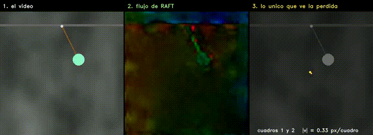
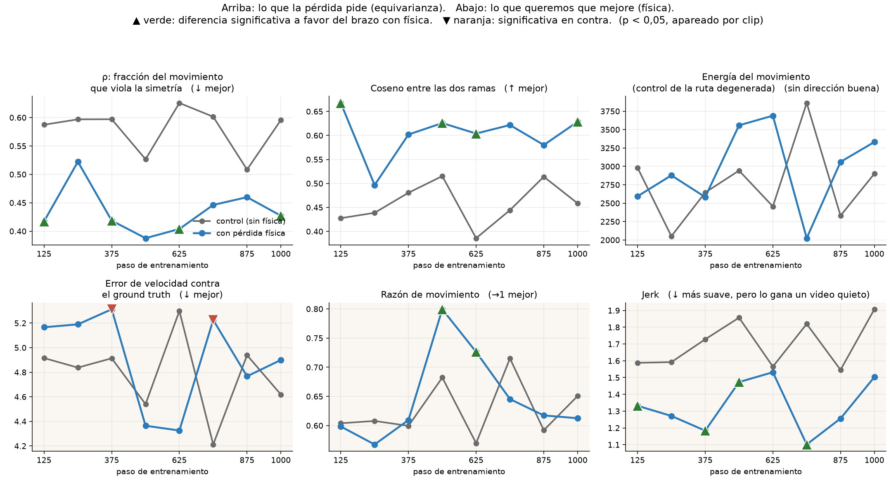
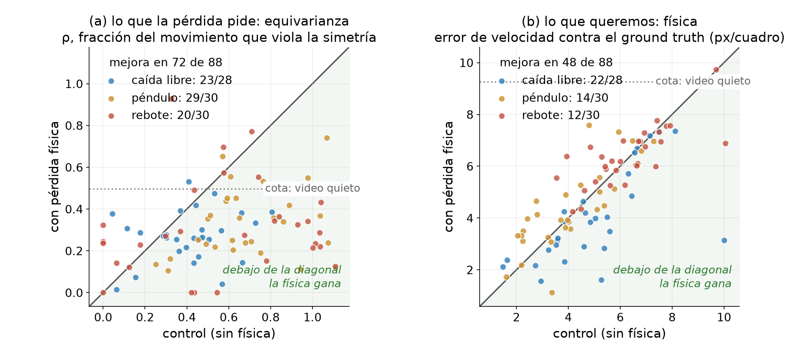
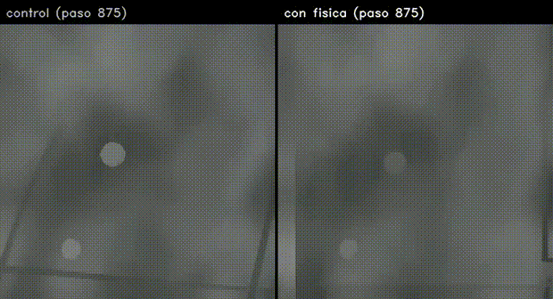
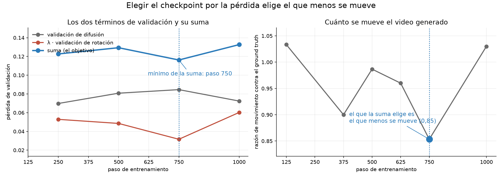
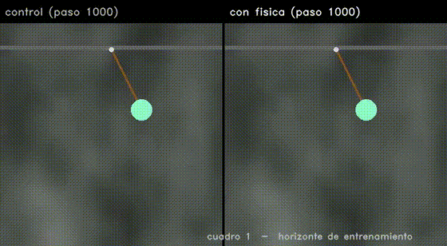
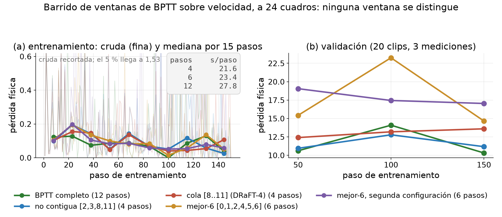
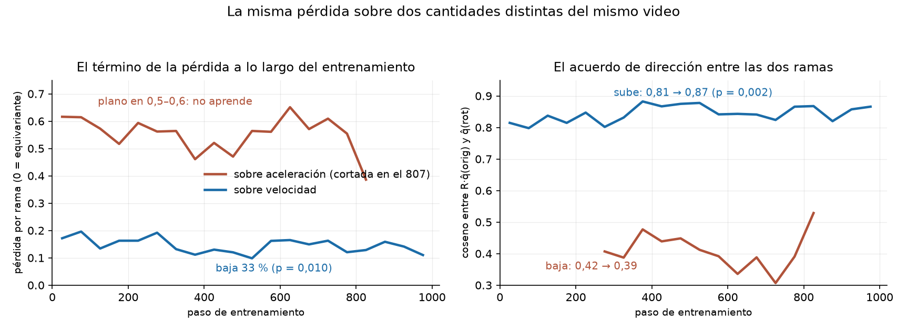

# Equivarianza como prior físico en difusión de video: los videos

Videos del TPF de Visión Artificial Avanzada (UdeSA). El trabajo intenta enseñarle física a un modelo
de difusión de video **sin ground truth físico**, imponiendo una simetría: si se rota la escena, la
cinemática de lo generado tiene que rotar igual. El movimiento se estima con RAFT (flujo óptico) sobre
los propios videos generados, y todo se retropropaga hasta los pesos.

El resultado tiene dos mitades y conviene separarlas.

**La restricción se aprende.** Medido fuera del bucle de entrenamiento, sobre clips que el modelo nunca
vio y contra un control idéntico salvo por la pérdida, las velocidades de las dos ramas pasan de estar
a 63° de diferencia en el control a 51° en el brazo entrenado, y la ventaja es consistente en los ocho
checkpoints. Pero conviene no exagerarlo: 51° sigue estando lejos de los 0° de la simetría perfecta, y
toda la ventaja aparece en los primeros 125 pasos y después se estanca.

**Y no se traduce en mejor física.** El error de velocidad contra el ground truth del simulador no
mejora, y fuera de distribución el modelo degenera. Lo que sí podemos señalar como causa (medido, no conjeturado) es **cómo** el modelo satisface la restricción: se mueve menos, y descubre que partir la
pelota en dos hace que el flujo agregado de la escena se cancele. Las dos cosas bajan la pérdida sin
mejorar la dinámica. A eso se suma que la pérdida ve una versión parcial de lo generado (24 de 32 vectores de velocidad en péndulo y rebote, 12 o 16 en caída libre, sobre 12 pasos de Euler contra los 20 de la inferencia) aunque **eso último es una hipótesis, no algo que hayamos medido**.

Cada sección indica a qué parte del póster corresponde. Lo que queda abierto, incluido lo que no
podemos explicar, está en [PENDIENTES.md](PENDIENTES.md).

**Los pesos y el archivo completo de videos están en Hugging Face:
[AlexBodner/tpf-equivarianza-video](https://huggingface.co/AlexBodner/tpf-equivarianza-video).** Acá
van los videos *comentados*, elegidos para contar la historia; allá están **los 16 checkpoints LoRA** (los 8 del brazo con física y los 8 de su control, para poder reproducir cualquier comparación apareada) y **los ~2400 videos** que produjeron todos los experimentos, ordenados por experimento y
por paso de entrenamiento, con un índice que rastrea cada archivo hasta su origen.

<b>Estado de este documento</b>: qué se está midiendo ahora y qué va a cambiar

**Última actualización: 9 de septiembre de 2026.**

Todas las mediciones están cerradas. El resultado principal sale del **test final**: los 88 clips
held-out que nunca se miraron (00520–00549 de cada escenario), con el checkpoint de cada brazo elegido
por su propia validación (control en el paso 125, brazo con física en el 875) sobre los mismos ocho
candidatos.

Ni la regla de selección ni ninguno de los análisis exploratorios tocaron esos clips, así que es el
único número del trabajo que no está contaminado por haber mirado los datos.

---

### Una palabra que aparece en todo el documento: **cota**

Una cota es el puntaje que se saca **sin modelo**, con un video falso que no aprendió nada. Está para
saber contra qué comparar. Hay dos en todo el trabajo:

- **video quieto**: se congela el primer cuadro y no se mueve nada.
- **velocidad constante**: el objeto va en línea recta a velocidad fija.

Sirven porque una métrica sola no dice nada. Si un modelo no le gana a un video congelado, esa métrica
no está midiendo lo que uno cree. El caso más claro es el error de velocidad en caída libre, donde la
línea recta da 0,05 y le gana a todos los modelos: una caída de 33 cuadros se parece demasiado a una
recta, así que ahí la métrica casi no informa. Por eso las cotas van **en cada tabla**, y nunca se
promedian escenarios que tienen cotas distintas.

---

## Cómo leer los paneles

- Videos de cuatro paneles: **ground truth del simulador · modelo base sin fine-tuning · generación
  por texto · generación condicionada**. Fondo Perlin gris, pelota de color, 33 cuadros a 384 px.
  El condicionamiento son los **2 primeros cuadros latentes** del clip real, que en píxeles son los
  primeros 8 cuadros; el resto lo genera el modelo.
- Videos de equivarianza, tres paneles: **generación con el condicionamiento original · con el
  condicionamiento rotado 45° y luego des-rotada · diferencia absoluta**. Si el modelo fuera
  equivariante, los dos primeros serían iguales y el tercero negro.
- Todos los MP4 están en [`videos/`](videos); los GIF de abajo son los mismos, reducidos.
- **Cada video dice de qué checkpoint sale.** Los dos brazos siempre se comparan en el *mismo* paso, y
  el nombre del archivo lo lleva.
- Los JSON de todas las evaluaciones, los logs de entrenamiento y las configuraciones están en
  [`resultados/`](resultados), para que los números se puedan verificar sin la máquina de entrenamiento.

## El método: las dos ramas que compara la pérdida

*Póster: sección «Método».*

*Brazo con física, paso 250: es el único checkpoint donde se guardaron las dos ramas del mismo clip.
Sirve para ver qué compara la pérdida, que es lo que ilustra esta sección; la comparación entre los
checkpoints elegidos está más abajo. Las dos generaciones del mismo clip con el mismo ruido: a la
izquierda la escena original, a la derecha la escena rotada 45°.*

*De izquierda a derecha: el video; el campo de flujo que devuelve RAFT, con el tono como dirección, el
brillo como magnitud y flechas submuestreadas encima; y el único vector que queda después de agregar
toda la escena, sobre un dial cuyos círculos son 1, 2 y 3 px por cuadro, con la estela de los ocho
cuadros anteriores. El vector va sobre ejes y no sobre la imagen porque **no tiene ubicación**: es el
promedio de la escena entera. **Ese vector, uno
por cuadro, es todo lo que la pérdida mira.** Ahí se ve por qué dos objetos moviéndose en direcciones
opuestas se cancelan: el agregado promedia la escena entera. Archivo:
`videos/18_que_ve_la_perdida.mp4`, generado con `scripts_figuras/gen_que_ve_la_perdida.py`.*

En cada paso de entrenamiento el modelo genera el mismo clip dos veces, con el mismo ruido: una con la
escena original y otra rotada. Si fuera equivariante, la cinemática de la segunda sería la de la
primera rotada. La inconsistencia entre ambas es toda la señal de entrenamiento, y no requiere
anotaciones. El costo es que hay que generar, decodificar y estimar flujo **dentro** del paso de
entrenamiento, y retropropagar por todo eso.

Archivo: `videos/06_dos_ramas_de_la_perdida.mp4`. Una aclaración para que no confunda: el
entrenamiento decodifica las dos ramas **de a un latente por vez** para que entren en memoria, y cada
uno de esos trozos son unos 5 cuadros. Eso es el troceado del decodificador, no el largo de la rama:
las dos ramas cubren el clip entero, 33 cuadros, que es lo que muestra este video.

## Sí aprende la simetría, pero se queda lejos

*Póster: sección «Resultados».*

Medido **fuera** del bucle de entrenamiento, sobre clips que el modelo nunca vio y contra un control
idéntico salvo por la pérdida: se genera cada clip dos veces, una con la escena rotada 45°, se
des-rota la segunda y se comparan las velocidades.

*Arriba lo que la pérdida pide, abajo lo que queremos que mejore. ▲ verde: la diferencia favorece al
brazo con física; ▼ naranja: lo perjudica. Reproducible con `scripts_figuras/gen_panel_checkpoints.py`.*

**Arriba las curvas nunca se cruzan y abajo se cruzan todo el tiempo.** Ése es el trabajo en una
imagen. En los ocho checkpoints el brazo con física es más equivariante, en las dos medidas.

| | control | con física |
|---|---|---|
| ángulo entre las dos ramas (0° sería perfecto) | 63° | **51°** |
| ρ, la fracción del movimiento que viola la simetría | 0,596 | **0,427** |

**La evidencia fuerte es el test final**: en los **88 clips que nunca miramos**, con cada brazo en su
checkpoint elegido, la cantidad normalizada da **0,306 contra 0,562** del control, ganando en 72 de los
88 clips (p < 0,0001).

*Cada punto es un clip del test: el eje x es el control y el eje y el brazo con pérdida física, así que
debajo de la diagonal gana la física. Es el mismo par que entra al Wilcoxon, no un resumen, así que se
ven los 88. A la izquierda lo que la pérdida pide, y la nube cae del lado bueno en 72 de 88. A la
derecha lo que queremos que mejore, y la nube se reparte a los dos lados de la diagonal: 48 de 88, que
es lo que se espera si no hay efecto. Reproducible con `scripts_figuras/gen_fig_test_apareado.py`.*

La serie por checkpoint de más arriba sirve para ver que el signo no se invierte, pero **no es evidencia
independiente**: se midió sobre 3 escenas (una por escenario) con sus 4 variantes aumentadas cada una,
así que las 12 mediciones no son 12 clips distintos. Por eso van sin p.

**Por escenario, y con la cota al lado, que es como hay que mirarlo:**

| escenario | control | con física | video quieto | mejora | p |
|---|---|---|---|---|---|
| caída libre | 0,412 | **0,271** | **0,144** | 23/28 | 0,0009 |
| péndulo | 0,694 | **0,337** | 0,773 | 29/30 | <0,0001 |
| rebote | 0,569 | **0,306** | 0,548 | 20/30 | 0,0051 |

La equivarianza mejora en los tres, pero **en caída libre la cota del video quieto le gana a los dos
brazos**, y eso el agregado (0,496) lo escondía. No es que un video congelado sea más equivariante: es
que cuando el movimiento no supera al piso del estimador el numerador clampea y la métrica da
**exactamente 0**, que es puntaje perfecto. Contado:

| escenario | video quieto satura | modelo base satura | control | con física |
|---|---|---|---|---|
| caída libre | **21/28** | 24/28 | 0/28 | 0/28 |
| péndulo | 8/30 | 23/30 | 0/30 | 0/30 |
| rebote | 16/30 | 15/30 | 4/30 | 4/30 |

El modelo base satura todavía más que el video quieto, y por otro motivo: genera video incoherente, y un
video incoherente infla su propio piso `A`, con lo cual el numerador cae debajo sin esfuerzo. **La
métrica normalizada no sirve para comparar contra cotas triviales ni contra el base.** Sí sirve para
comparar los dos brazos entrenados, que tienen cero saturados en caída libre y péndulo y los mismos
cuatro en rebote, que es la comparación que sostiene el resultado.

**¿Y si la equivarianza se está comprando con quietud?** Es la objeción obvia, porque moverse menos es
una de las dos rutas degeneradas conocidas. Medida, la respuesta es que no:

| escenario | movimiento control | con física | | p |
|---|---|---|---|---|
| caída libre | 0,644 | 0,709 | **sube** | 0,001 |
| péndulo | 0,583 | 0,606 | sube | 0,777 |
| rebote | 0,478 | 0,443 | baja | 0,318 |

El brazo con física se mueve igual o más. Y adentro de ese brazo la correlación entre movimiento y
equivarianza va **al revés** de la ruta degenerada: los clips que se mueven más son los que dan mejor
`l_rot_norm` (Spearman ρ = −0,30 en caída libre, −0,40 en péndulo con p = 0,031, +0,26 en rebote sin
significancia). Mecánicamente se entiende: más movimiento sube `D`, el cociente `N/D` baja, y de paso
RAFT mide mejor. Clip a clip, además, ganar equivarianza no predice perder movimiento: ρ entre −0,11 y
+0,05, ninguno significativo en los tres escenarios.

**Y las dos cosas están desacopladas.** Donde más se aprende la simetría es en péndulo (0,694 a 0,337,
29 de 30 clips) y ahí el error de velocidad **empeora** (4,10 a 4,42). Caída libre tiene la mejora de
equivarianza más chica de los tres y es el único escenario donde la física mejora. Si aprender la
simetría arrastrara a la física, el orden debería ser el mismo, y no lo es.

**Pero 51° no es poco.** ρ = 1 significa "dos movimientos sin ninguna relación", así que 0,43 equivale a un desacuerdo
del 92 % de la magnitud del movimiento. La frase honesta no es "aprende la simetría" sino que la
pérdida lo empuja en la dirección correcta de forma medible y consistente, sin acercarlo a ser
equivariante.

**Y no mejora con más entrenamiento.** La ventaja está entera en el primer checkpoint: en el paso 125
la diferencia en ρ es −0,170 y en el 1000 es −0,168, con tendencia plana (Spearman +0,19, p = 0,65).
Los 1000 pasos movieron el ángulo de 63° a 51°, y todo eso pasó en los primeros 125.

*Condicionamiento original · rotado 45° y des-rotado · diferencia. Cuanto más oscuro el tercer panel,
más equivariante.*

Las otras dos mediciones de equivarianza, y la tabla por checkpoint

Durante el entrenamiento el término baja de 0,1834 a 0,1266 entre los primeros y los últimos 100 pasos (un 31 % menos, con un 4 % de probabilidad de que sea casualidad) y el acuerdo de dirección sube de
0,81 a 0,86. Las dos salen de la misma función sobre los mismos vectores, así que **no son evidencia
independiente**: son la norma y el ángulo de la misma diferencia.

Fuera del bucle, en 9 pares del checkpoint 1000, el brazo gana en las tres cantidades: coseno 0,56
contra 0,37, desacuerdo 0,45 contra 0,64 y diferencia de píxeles 4,99 contra 5,38. En el checkpoint
250 esa última daba a favor del control (5,07 contra 4,78): se da vuelta recién al final.

| paso | ρ control | ρ física | ángulo control | ángulo física |
|---|---|---|---|---|
| 125 | 0,587 | **0,417** | 65° | **48°** |
| 250 | 0,597 | 0,522 | 64° | 60° |
| 375 | 0,597 | **0,419** | 61° | **53°** |
| 500 | 0,527 | **0,388** | 59° | **51°** |
| 625 | 0,626 | **0,404** | 67° | **53°** |
| 750 | 0,602 | 0,446 | 64° | 52° |
| 875 | 0,508 | 0,460 | 59° | 55° |
| 1000 | 0,596 | **0,427** | 63° | **51°** |

**Cuánto importaba medir la cantidad correcta**, en la misma comparación de n = 60 del paso 250: sobre
velocidades la equivarianza normalizada da 0,577 contra 0,455 con p = 0,0015 y gana en 42 de 60 clips;
sobre aceleraciones (como estaba medida hasta el 9 de septiembre) da 0,238 contra 0,196 con p = 0,40 y
gana en 22 de 60. La versión vieja medía ruido.

Los p del entrenamiento son de un Mann-Whitney de una cola, legítimo porque la dirección estaba
preregistrada; a dos colas darían 0,085 y 0,124. Salida cruda en
`resultados/evaluaciones/e4vel__equiv_1000__diagnostico_completo.log`. Archivos:
`videos/08_equivarianza_*_velocidad.mp4`, `videos/01_pendulo_bien_paso1000.mp4`.

## Pero no mejora la física

*Póster: sección «Resultados».*

Ésta es la medición limpia: los **88 clips que nunca miramos**, con cada brazo en el checkpoint que
eligió su propia validación (control en el paso 125, con física en el 875) sobre los mismos ocho
candidatos.

Tres advertencias sobre esa regla, porque no es tan limpia como suena. **No estaba preregistrada**: se
fijó el 9 de septiembre, después de haber visto las evaluaciones de desarrollo. Es **asimétrica**, porque
cada brazo se elige por un criterio distinto (el control por difusión sola, el brazo con física por la suma de sus dos términos). Y **decide por un margen mínimo**: entre el paso 875 (0,1089) y el 375
(0,1091) hay un 0,2 %. La elección preregistrada, que no selecciona nada, es el paso 1000, y sobre los
primeros 20 clips da lo mismo (4,926 contra 4,994, p = 0,31).

Son 88 clips y no 90 porque dos de caída libre son más cortos que la ventana de condicionamiento y el
evaluador los saltea; el salteo es del clip, así que afecta a los dos brazos por igual.

| métrica | base | video quieto | control | con física | gana | p |
|---|---|---|---|---|---|---|
| **error de velocidad** (↓) | 9,134 | 9,261 | 5,110 | 4,945 | 48/88 | **0,362** |
| razón de movimiento (→1) | 0,442 | 0,094 | 0,567 | 0,583 | 51/88 | 0,215 |
| equivarianza normalizada (↓) | 0,177 | 0,496 | 0,562 | **0,306** | 72/88 | **<0,0001** |
| jerk (↓) | 4,836 | 0,000 | 1,524 | 1,138 | 60/88 | <0,0001 |
| MAE de aceleración (↓) | 2,015 | 1,260 | 1,729 | 1,663 | 45/88 | 0,162 |

**En la métrica principal no hay diferencia** (p = 0,36), y tampoco en la razón de movimiento ni en el
MAE de aceleración. Las dos que sí dan significativas son la equivarianza (lo que la pérdida pide) y el
jerk, que es una de las que **gana un video quieto**: su cota es exactamente 0,000.

Las lecturas alternativas coinciden. Sobre los primeros 20 clips por escenario, en el paso 1000 sin
selección alguna: 4,926 contra 4,994 (p = 0,31). En el 250: 5,189 contra 5,330 (p = 0,14).

### Un escenario donde sí mejora, y que replicó

| escenario | control | con física | n | p |
|---|---|---|---|---|
| **caída libre** | 4,946 | **3,966** | 28 | **<0,001** |
| péndulo | 4,102 | 4,418 | 30 | 0,158 |
| rebote | 6,272 | 6,386 | 30 | 0,404 |

La mejora en caída libre era un hallazgo **post hoc**, encontrado mirando el conjunto de desarrollo. Que
aparezca también en clips nunca vistos, con el checkpoint elegido de antemano, es una replicación: la
saca de la categoría de exploratoria.

Dos salvedades igual. Su signo **no es estable entre checkpoints** (en el conjunto de desarrollo cambia en cuatro de ocho), y en caída libre el ground truth ya va a velocidad terminal, así que la respuesta
correcta es una recta y la cota de velocidad constante da 0,02: es el escenario menos informativo de
los tres. En **rebote**, que es donde hay impactos y donde aparece la pelota duplicada, no hay mejora.

## Lado a lado: el control contra el brazo con física

*Póster: sección «Resultados». Es el contraste que decide todo el trabajo.*

Los dos brazos entrenan con el mismo clip, el mismo ruido y los mismos pesos iniciales; lo único que
los separa es la pérdida. Acá generan el **mismo clip**, con la misma semilla y el mismo
condicionamiento, en **los checkpoints que eligió la validación**: control en el paso 125 y brazo con
física en el 875.

*Arriba el ground truth del simulador, en el medio el control, abajo el brazo con física. En
**péndulo** se ve el modo de falla en el modelo que efectivamente reportamos: **dos pelotas** donde el
control tiene una. En caída libre las dos trayectorias son parecidas, que es donde los números dan a
favor del brazo con física. Archivo: `videos/20_elegidos_gt_control_fisica.mp4`.*

Que la duplicación aparezca en el checkpoint elegido (y no sólo en los que descartamos) es lo que hace
que el resultado no se pueda contar como «casi funciona»: el modelo que la regla señala como el mejor
del brazo con física sigue partiendo el objeto en dos.

## La otra cara: cómo satisface la simetría

*Póster: sección «Resultados» (fuera de distribución) y «Conclusiones».*

Aprender la simetría no mejoró la física. En distribución nada se distingue del control (n = 60, todo
p > 0,29), y **fuera de distribución el modelo degenera**: su razón de movimiento cae a 0,12 contra
0,43 del control, por debajo de la de un video estático. La restricción no fija la escala del
movimiento, así que admite dos atajos.

**Atajo 1: moverse menos.** Si todo se achica, el desacuerdo entre las dos ramas se achica solo.

**Atajo 2: partir el objeto en dos.** Este es el hallazgo más interesante. El estimador promedia el
flujo de toda la escena, así que dos objetos moviéndose en direcciones distintas se cancelan
parcialmente: el vector agregado se achica y la pérdida baja sin que la dinámica mejore.

*Checkpoint 1000. Dos pelotas de colores distintos en los paneles generados. Comparar con
`videos/04_rebote_una_pelota_paso250.mp4`, el mismo escenario 750 pasos antes.*

Archivos: `videos/03_rebote_pelota_duplicada_paso1000.mp4`, `videos/05_caida_libre_paso1000.mp4`,
`videos/07_fuera_de_dominio_rodando.mp4`

<b>Cómo se cerraría cada atajo</b>: qué habría que cambiar en el instrumento

El primero, moverse menos, es una propiedad de la restricción: sin un ancla de escala siempre está
disponible.

El segundo es un defecto del **estimador**, y es más difícil de cerrar de lo que parece. La dificultad
de fondo es que las dos ramas son **generaciones independientes**: el modelo genera dos videos a partir
de dos condicionamientos distintos, no rota un video ya hecho. Nada garantiza que la pelota esté en la
misma fase ni en la posición correspondiente en ambos. Por eso:

- **Comparar los campos de flujo densos** píxel a píxel, $R\,\Phi_{\text{orig}}(x)$ contra
  $\Phi_{\text{rot}}(Rx)$, **no alcanza**: supone correspondencia espacial entre las dos generaciones.
  Si la pelota quedó en otra fase, la diferencia es enorme aunque la dinámica sea perfectamente
  equivariante. Confunde "está en otro lugar" con "se mueve distinto".
- **Quedarse con el objeto más grande** tampoco: es esencialmente lo que ya hace el agregador, no está
  justificado, y se cae apenas hay varios objetos o cuando el movimiento del fondo es informativo, que
  además hoy se descarta al restar el flujo medio global.

Las dos salidas que quedan:

1. **Comparar la distribución de velocidades** de las dos ramas (momentos, histograma o transporte
   óptimo) en vez de un promedio o de una comparación posición a posición. Es invariante a dónde esté
   cada objeto y a permutarlos, así que **no necesita correspondencia**, y tolera que las dos ramas
   generen distinta cantidad de objetos. Es la única de la lista que esquiva el problema de raíz.
2. **Emparejar las velocidades entre los dos videos generados**, con segmentación y asociación de
   identidad. Es lo que hace falta para cualquier comparación que no sea distribucional, y es un
   problema en sí mismo: hay que resolver correspondencia entre dos generaciones que pueden diferir en
   fase, en posición y hasta en cuántos objetos tienen. **Queda como trabajo futuro**, y es la pieza
   que hoy falta para que la restricción se pueda imponer sobre escenas con más de un objeto.

## Fuera de dominio se rompe

*Póster: sección «Resultados», fila fuera de distribución.*

Con prompts que nunca se entrenaron se ve el mecanismo con más claridad: no es que el modelo aprenda
mal la física, es que **la imagen se corrompe** a medida que avanza el entrenamiento, y la corrupción
es lo que baja la pérdida.

*Prompt «una pelota rodando por una superficie plana», el mismo modelo en distintos pasos. En el 250 y
el 500 hay una pelota limpia; en el 750 aparecen **dos**; en el 1000 está deshecha. La pérdida no
penaliza nada de eso: dos objetos que se mueven en direcciones distintas se cancelan en el flujo
agregado.*

En el único escenario fuera de distribución con ground truth (tiro vertical) el error de velocidad
empeora de 7,63 a 8,80 (p = 0,005) y la razón de movimiento cae a 0,12 contra 0,43 del control.

Lo que buscamos acá y no encontramos, y una advertencia sobre cómo medir esto

Parecía, mirando la altura media de lo que se mueve, que el brazo con física mantenía la pelota contra
el piso mientras la del control flotaba. No se sostiene: esa altura es el centroide de **varias manchas
repartidas**, no de una pelota. Contando objetos separados en vez de mirar el centroide, en el paso 875
el brazo con física tiene más de uno en 13 de los 33 cuadros, con hasta 5 a la vez, y la saturación
máxima del video es 15 sobre 255: la pelota sale gris. El control está igual o peor.

*Checkpoint 875 de los dos brazos, misma semilla y misma ruta de generación. Los dos producen varios
objetos tenues en vez de una pelota. Archivo: `videos/19_ood_rodando_paso875.mp4`.*

Y hay una advertencia más general: repitiendo con **tres semillas** por celda, la saturación de un
mismo checkpoint va de 26 a 136 y el número de objetos de 0 a 9. Con una generación por celda (que es lo que tienen las mediciones de arriba) **no hay señal que leer** en generación fuera de dominio.
Cualquier afirmación sobre esto necesita varias semillas, y las que están acá no las tienen.

**Por qué apunta al instrumental y no a la hipótesis.** La pérdida se calcula sobre una generación
truncada, de 12 pasos de Euler en vez de 20, y sobre parte de los 32 vectores de velocidad: 24 en
péndulo y rebote, 12 o 16 en caída libre. El modelo puede degradar lo que la pérdida no mira. Pero
conviene decir hasta dónde llega esa explicación: **no está medido** que la corrupción viva en los
cuadros excluidos, y la degeneración más fuerte aparece fuera de distribución, donde la pérdida no vio
ningún vector. Lo que sí está medido son los dos atajos de [cómo satisface la
simetría](#degeneracion), que operan sobre cuadros que la pérdida **sí** mira.

## Lo que cuesta

Medido sobre los propios registros de cada corrida, no estimado. La fila del control es la misma
receta **sin** el término físico, así que la diferencia entre las dos es el precio del método.

| corrida | cuadros | pasos | VRAM mediana | VRAM pico | s/paso | horas | USD |
|---|---|---|---|---|---|---|---|
| etapa 2, **con pérdida física** | 33 | 1000 | 21,3 GB | 28,5 GB | 46,7 | 16,0 | 30 |
| etapa 2, control (sólo difusión) | 33 | 1000 | 6,8 GB | 9,1 GB | 12,4 | 3,5 | 6 |
| barrido BPTT, ventana completa | 24 | 150 | 18,8 GB | 26,0 GB | 27,8 | 1,0 | 2 |
| barrido BPTT, ventana de 4 pasos | 24 | 150 | 15,5 GB | 22,8 GB | 21,6 | 0,8 | 1,5 |

**Imponer la simetría cuesta 3,1× la memoria y 4,6× el tiempo total** (16,0 horas contra 3,5) de
entrenar sólo con difusión. Los segundos por paso de la tabla son medianas, y en mediana la relación es
3,8×; la diferencia entre las dos cifras son los pasos lentos, que pesan más en el total. Es lo
que se paga por generar, decodificar y estimar el flujo *dentro* del paso de entrenamiento, y
retropropagar por todo eso. El pico de 28,5 GB es el que decide qué GPU hace falta: con 24 GB no entra
a esta resolución y largo de clip.

**Las dos filas del barrido no se comparan en absoluto con las dos de arriba.** El barrido corrió con
24 cuadros y no 33, así que la pérdida ve 12 vectores de velocidad por paso en vez de 24, y la mitad
física del paso cuesta aproximadamente la mitad. La corrida principal **ya es** el BPTT completo
(`physics_n_bptt = 12`, los doce pasos de Euler): los 46,7 s/paso contra 27,8 son el mismo ancho de
ventana sobre un clip más largo, no una ventana más cara. La comprobación directa es el conteo por
escenario: en péndulo la principal ve 24 vectores en sus 332 pasos y el barrido 12 en sus 52.

Lo que sí se lee dentro del barrido, donde los cinco brazos comparten los 24 cuadros, es el efecto de
acortar la ventana: baja el tiempo un 22 % y la memoria un 18 %, sin cambiar nada más. Ese porcentaje
es válido como razón; su traslado a la configuración de 33 cuadros no está medido.

## Qué quedó como recomendación

*Póster: sección «Trabajo futuro».*

1. **Enriquecer el observable antes que buscar otra simetría.** Reducida la escena a un vector por
   cuadro, las únicas transformaciones con acción no trivial son las de O(2), y ahí se agota el grupo
   disponible: no es que falte imaginación, es que el observable no da para más. El campo de flujo
   completo habilita además **penalizar el flujo que no tiene correspondencia** en la rama transformada,
   que es lo que hoy permite que dos objetos opuestos se cancelen, y hay que hacerlo robusto a
   generaciones ruidosas o rotas.
2. **Medir la traslación antes de imponerla.** Que la ley no dependa de dónde ocurre es la más simple de
   las propiedades disponibles, y trasladar no introduce remuestreo, así que no contamina el piso del
   estimador. **Nunca se midió**: el término corrió en λ = 0 y las 7010 filas de registro que lo
   contienen dan exactamente 0,0. Es una pasada de generación sobre el checkpoint que se reporta, sin
   entrenar nada, y devuelve un número que cierra la pregunta en un sentido o en el otro.
3. **Reflexión**, con la salvedad de que es el mismo enunciado que la rotación con otra matriz
   ortogonal, no una propiedad nueva. Lo que aporta es que es exacta a nivel de píxel, así que sirve
   para separar cuánto del piso `A` es RAFT y cuánto es el remuestreo de `grid_sample`.
4. **Que la pérdida vea todo lo que el modelo genera**: hoy mira 24 de 32 vectores en péndulo y
   rebote, 12 o 16 en caída libre, y una generación de 12 pasos de Euler en vez de 20. Es una hipótesis
   razonable (no comprobada) que la corrupción se aloje en lo que queda fuera.
5. **Video real**: la pérdida no pide anotaciones, así que se puede entrenar sobre video natural
   (Physics-IQ) sin simulador.

### Qué era el boost, y por qué no alcanza con sumar las otras dos simetrías

Es la pregunta obvia: si el proyecto arrancó con tres simetrías, ¿por qué terminó usando una sola?

Un **boost galileano** es mirar la misma escena desde un sistema de referencia que se mueve a velocidad
constante. El ejemplo de manual: si soltás una pelota adentro de un tren que va parejo, para alguien
sentado adentro cae recto, y para alguien parado en el andén dibuja una parábola. Es la misma pelota y
la misma gravedad, mirada desde dos lados. La simetría dice que **la velocidad no es absoluta**: sólo
importan las velocidades relativas.

Era el término más atractivo de los tres y fue uno de los dos originales, junto con la rotación, en
`losses/combined.py`. Atractivo porque no menciona ni la masa ni el potencial, y sobre todo porque su
forma matemática es la más limpia posible: **bajo un boost la aceleración no cambia en absoluto**, así
que el objetivo es "las dos ramas tienen que dar la *misma* aceleración", diferencia cero, sin matriz de
rotación ni normalización.

**Y ahí está la importancia real del boost, que es negativa: es la razón por la que todo el proyecto
midió aceleraciones.** El boost es el único de los tres que te obliga a la aceleración, porque bajo un
boost la velocidad *sí* cambia (`v → v + c`). La rotación y la traslación funcionan perfectamente sobre
velocidades. Así que la decisión de trabajar con `a` en vez de `v` se heredó del boost, y **el boost
estaba apagado (λ_boost = 0) desde semanas antes**. Durante ese tiempo el entrenamiento y la evaluación
midieron una cantidad que nadie necesitaba y que [no tiene señal](#aceleracion) sobre video generado:
acuerdo 0,07 contra 0,97 de la velocidad. Desarmar eso fue la corrección más grande del trabajo.

**Una objeción justa: las tres se justifican igual de bien desde la acción.** Es cierto. Con
`L = Σ ½m·ẋ² − V`, la invarianza de boost pide que `V` dependa sólo de posiciones relativas, y sigue
valiendo con gravedad uniforme porque el lagrangiano cambia en una derivada total; su carga de Noether
es el teorema del centro de masa. La respuesta es que **ser una simetría verdadera es necesario pero no
suficiente para ser una señal de entrenamiento útil**. Lo que decide el valor no es cuán fundamental es
la simetría, sino cuánto descarta, y eso depende de si el grupo actúa de forma **no trivial** sobre la
cantidad que uno puede medir:

La prueba concreta para saber si una restricción tiene filo es preguntarse: **¿la aprobaría un modelo
que ignora por completo la transformación y genera el mismo video en las dos ramas?** Si la aprueba, la
restricción no lo obliga a nada y no le enseña nada.

| | qué se le hace a la entrada | qué exige de la salida | ¿la aprueba un modelo que genera lo mismo en las dos ramas? |
|---|---|---|---|
| rotación | rotar la escena, gravedad incluida | `v_rot = R(θ)·v_orig` | **no**: pediría `R(θ)·v = v`, falso salvo θ = 0 |
| boost | agregar una deriva constante `c` | `a_boost = a_orig` | **sí**: se cumple sola |
| traslación | correr la escena en el espacio | mismo flujo agregado | **sí**: `aggregate_flow` ya da lo mismo |

O sea que la rotación tiene una acción **fiel** sobre el observable: obliga a que la rama transformada
sea una generación genuinamente distinta, con la trayectoria curvando para otro lado, y atada al
ángulo. El boost actúa como la **identidad** sobre la aceleración, así que un modelo que no se entera
de la deriva la aprueba igual. Es más fundamental como física y más pobre como restricción.

Hay además una capa práctica: la carga de Noether del boost es el movimiento del centro de masa, y
`aggregate_flow` **ya es** aproximadamente una velocidad de centro de masa, que además resta el flujo
medio global antes de armar la máscara para que un clip con deriva seleccione los mismos píxeles. Parte
de lo que el boost pediría está horneado en el instrumento.

Con eso dicho, ninguna de las dos que faltan es un atajo hacia adelante:

- La **traslación espacial** no agrega nada con este pipeline. `aggregate_flow` reduce la escena a un
  promedio pesado del flujo, así que correr la escena en el espacio devuelve prácticamente el mismo
  vector: la restricción se cumple antes de entrenar y el gradiente es ruido. No es un bug, es que el
  agregador ya es invariante a traslaciones.
- El **boost** vuelve a pedir la aceleración, que es donde no hay señal. Se puede reescribir sobre
  velocidades, donde la restricción pasa a ser que las dos ramas difieran en la deriva `c`, pero eso
  **se satisface generando el mismo video y sumándole una deriva rígida**, sin que la dinámica sea
  correcta. Ancla la escala como efecto lateral, no como física.

La rotación no tiene esa salida porque **al rotar la escena rota la gravedad**: la rama transformada
tiene que ser una generación genuinamente distinta, no la misma con un desplazamiento encima. Eso es lo
que la hace la simetría útil de las tres, y por eso el trabajo futuro apunta a usarla mejor antes que a
sumarle otras.

---

# Anexo

Lo que sigue es material de respaldo: las tablas completas, la validación del instrumental, y los
experimentos que no funcionaron. Nada de acá hace falta para entender el resultado; está para que se
pueda verificar, y porque los caminos que no funcionaron explican por qué el diseño final es como es.

---

Todo lo que sigue está plegado: se despliega con un clic. Acá van las tablas completas, la validación
del instrumental y los experimentos que no funcionaron. Nada de esto hace falta para entender el
resultado; está para poder verificarlo, y porque los caminos que no funcionaron explican por qué el
diseño final es como es.

<b>Todas las evaluaciones, sin filtrar</b>: las seis métricas, agregadas y por escenario, con el modelo base y las cotas triviales

> ⚠️ **Estas tablas usan el paso 750 para el brazo con física**, que era el que elegía la regla que
> después resultó estar mal medida. Los números son mediciones reales de ese checkpoint, pero **ya no
> es "el mejor"**: el resultado que vale es el del test final, más arriba. La conclusión no cambia.

Control en el paso **250** (mínimo de su validación de difusión) y brazo con física en el paso
**750** (mínimo de la suma de sus dos términos de validación). Mismos 30 clips held-out, misma
semilla por clip. El modelo base y las cotas triviales van de referencia.

#### Agregado sobre los 30 clips

| métrica | base | control (250) | con física (750) | gana física | p (apareado) |
|---|---|---|---|---|---|
| error de velocidad (↓) | 9.258 | 4.838 | 5.225 | 10/30 | 0.184 |
| razón de movimiento (→1) | 0.356 | 0.608 | 0.645 | 13/30 | 0.584 |
| jerk (↓) | 2.710 | 1.592 | 1.101 | 22/30 | 0.004 |
| MAE de aceleración (↓) | 1.931 | 1.746 | 1.755 | 15/30 | 0.968 |
| equivarianza cruda, **sobre aceleraciones** (↓) | 7.902 | 3.649 | 1.441 | 28/30 | 0.000 |
| equivarianza normalizada, **sobre aceleraciones** (↓) | 0.000 | 0.264 | 0.144 | 13/30 | 0.124 |

<b>Por escenario</b> (desplegar)

**caída libre**

| métrica | base | control (250) | con física (750) | gana física | p |
|---|---|---|---|---|---|
| error de velocidad (↓) | 11.909 | 4.613 | 5.577 | 2/10 | 0.064 |
| razón de movimiento (→1) | 0.471 | 0.664 | 0.574 | 1/10 | 0.020 |
| jerk (↓) | 4.010 | 1.423 | 1.137 | 8/10 | 0.010 |
| MAE de aceleración (↓) | 1.136 | 0.786 | 0.833 | 6/10 | 0.695 |
| equivarianza cruda, **sobre aceleraciones** (↓) | 13.094 | 2.170 | 1.053 | 9/10 | 0.004 |
| equivarianza normalizada, **sobre aceleraciones** (↓) | 0.000 | 0.081 | 0.000 | 2/10 | 0.500 |

**péndulo**

| métrica | base | control (250) | con física (750) | gana física | p |
|---|---|---|---|---|---|
| error de velocidad (↓) | 5.915 | 3.736 | 3.480 | 5/10 | 0.770 |
| razón de movimiento (→1) | 0.504 | 0.649 | 0.878 | 8/10 | 0.020 |
| jerk (↓) | 3.512 | 0.769 | 0.940 | 5/10 | 0.625 |
| MAE de aceleración (↓) | 1.425 | 0.631 | 0.661 | 3/10 | 0.625 |
| equivarianza cruda, **sobre aceleraciones** (↓) | 10.399 | 3.128 | 0.929 | 10/10 | 0.002 |
| equivarianza normalizada, **sobre aceleraciones** (↓) | 0.000 | 0.477 | 0.000 | 8/10 | 0.008 |

**rebote**

| métrica | base | control (250) | con física (750) | gana física | p |
|---|---|---|---|---|---|
| error de velocidad (↓) | 9.950 | 6.163 | 6.620 | 3/10 | 0.275 |
| razón de movimiento (→1) | 0.094 | 0.511 | 0.484 | 4/10 | 0.625 |
| jerk (↓) | 0.607 | 2.584 | 1.226 | 9/10 | 0.010 |
| MAE de aceleración (↓) | 3.232 | 3.820 | 3.771 | 6/10 | 0.695 |
| equivarianza cruda, **sobre aceleraciones** (↓) | 0.214 | 5.648 | 2.340 | 9/10 | 0.006 |
| equivarianza normalizada, **sobre aceleraciones** (↓) | 0.000 | 0.233 | 0.431 | 3/10 | 0.469 |

#### Cotas triviales, por escenario

| escenario | video quieto | velocidad constante | MAE estático |
|---|---|---|---|
| free_fall | 12.88 | 0.00 | 0.000 |
| pendulum | 6.81 | 4.47 | 0.639 |
| bouncing | 10.01 | 9.51 | 3.273 |

En caída libre la cota de velocidad constante es **0,00**: el GT ya está en velocidad terminal,
así que la respuesta correcta es una recta y ese escenario no puede sostener conclusiones.

### Las dos filas de equivarianza no son interpretables

Al revisar la tabla completa apareció que las dos métricas de equivarianza de la evaluación están
calculadas **sobre aceleraciones**, no sobre las velocidades que este brazo optimiza. En
`evaluation/run_eval.py`, `compute_l_rot` y `compute_l_rot_norm` toman el segundo retorno de
`extract_kinematics` (que es la aceleración) y el piso se pide sin argumento, con lo que también sale
sobre aceleraciones. Es el mismo defecto que se corrigió en la validación del entrenamiento (commit
`bbc6778d`), que nunca se aplicó acá.

Importa porque la aceleración estimada sobre video generado es **ruido**: el diagnóstico de la
el [desvío sobre aceleración](#aceleracion-desvio) mide un acuerdo de 0,07. Así que el "28 de 30 clips, p < 0,001" de esas filas no es evidencia
de simetría aprendida; es una diferencia en una cantidad que no mide lo que dice.

Se nota en la fila del **modelo base**, que saca 0,000 (el puntaje perfecto) en la versión normalizada
y en los tres escenarios, siendo el peor modelo de los tres por error de velocidad (9,26 contra 4,84).
No es que sea equivariante: el piso del instrumento se mide **sobre su propio video generado**, así que
para un modelo cuya generación condicionada es mala el piso se come la señal entera y el numerador
recortado da cero.

**Qué sobrevive.** La única medición de equivarianza del trabajo hecha sobre velocidades es el
diagnóstico directo del checkpoint 1000 ([sobre velocidad](#velocidad)): coseno 0,56 contra 0,37 del control, sobre 9 pares,
con la salida cruda publicada. El error de velocidad y la razón de movimiento no están afectados (se calculan con RAFT sobre velocidades) y son las dos donde el base queda claramente último, que es
exactamente por qué son las primarias.

**Qué habría que cambiar para la próxima corrida.** La validación corre cada 50 pasos y los checkpoints
se guardan cada 125: sólo coinciden en cuatro puntos, así que la mitad de los checkpoints nunca pudo
entrar en ninguna regla. Alcanza con alinear las dos cadencias. Y hay que registrar en validación la
cantidad **normalizada** con el piso restado, además de la energía del movimiento, para que la regla no
se pueda ganar generando menos.

**Por qué no se puede elegir por la validación de equivarianza**, que sería lo natural dado lo que se
quiere probar. Por dos razones distintas, y las dos son decisivas:

- **El control no la tiene.** Con λ_rot = 0 el término nunca se calcula, así que su registro es 0,0000
  en los 1000 pasos. Una regla que sólo se puede evaluar en un brazo no se puede aplicar a los dos, y
  comparar brazos elegidos con criterios distintos no es comparar.
- **Es un MSE sin normalizar**, así que premia generar menos movimiento. Lo verificamos sobre los cuatro
  brazos del [barrido de ventanas](#bptt): esa métrica los ordena **al revés** que el cociente
  normalizado que es lo que efectivamente se minimiza.

Así que el paso 250 se reporta abajo como control de sensibilidad, no como "el mejor modelo". Lo
relevante es que **las dos elecciones dan la misma respuesta**: nada se distingue del control.

### Checkpoint final (paso 1000), en distribución

| métrica | control | con física | mejor | p |
|---|---|---|---|---|
| error de velocidad (↓) | 4,895 | 5,009 | 24/60 | 0,299 |
| razón de movimiento (→1) | 0,616 | 0,598 | 30/60 | 0,802 |
| jerk (↓) | 1,640 | 1,495 | 35/60 | 0,067 |
| MAE de aceleración (↓) | 1,828 | 1,880 | 24/60 | 0,126 |

Para leer esos números: la cota del video quieto en error de velocidad es 11,5 en caída libre, 7,5 en
péndulo y 10,0 en rebote. Los dos brazos están bastante por debajo, o sea que los dos hacen algo; lo
que no hay es diferencia **entre** ellos.

### Checkpoint final (paso 1000), fuera de distribución: tiro vertical

| métrica | control | con física | cota del video quieto | p |
|---|---|---|---|---|
| error de velocidad (↓) | 7,634 | **8,799** | 8,899 | 0,005 |
| razón de movimiento (→1) | 0,427 | **0,119** | 0,216 | 0,001 |
| jerk (↓) | 1,651 | **0,817** | 0,000 | 0,005 |

El brazo con física es peor en las tres. En razón de movimiento cae a 0,119: **se mueve una octava
parte de lo que debería**, cuando el control se mueve casi la mitad.

Una advertencia sobre la columna de la cota: en razón de movimiento su promedio (0,216) lo produce
un solo clip donde el trazador falla; la mediana de esa cota es 0,04. No conviene apoyar nada en esa
comparación: la degeneración se sostiene igual con el error de velocidad y con los videos.

### Control de sensibilidad: paso 250, en distribución

| métrica | control | con física | mejor | p |
|---|---|---|---|---|
| error de velocidad (↓) | 4,838 | 5,190 | 13/30 | 0,096 |
| razón de movimiento (→1) | 0,608 | 0,568 | 16/30 | 0,213 |
| jerk (↓) | 1,592 | 1,271 | 18/30 | 0,164 |
| equivarianza cruda, sobre aceleraciones (↓) *(no interpretable, ver abajo)* | 3,649 | 2,277 | 25/30 | &lt;0,001 |

### Por checkpoint y por escenario

**El promedio escondía el resultado más interesante.** Agrupando los tres escenarios, el brazo con
física no se distingue del control (p = 0,299). Abriendo por escenario, en el checkpoint final los
efectos son opuestos y significativos:

| escenario | error de velocidad (control → física) | p | razón de movimiento | p |
|---|---|---|---|---|
| caída libre | 4,274 → **3,234** | 0,001 | 0,695 → **0,797** | &lt;0,001 |
| péndulo | 4,325 → 4,825 | 0,044 | 0,621 → 0,588 | 0,522 |
| rebote | 6,084 → **6,967** | 0,007 | 0,533 → **0,410** | 0,015 |

En **caída libre** el brazo con física es mejor y además **se mueve más**, o sea que no es
degeneración. En **rebote** es peor y se mueve menos, que es donde aparece la pelota duplicada.

Los dos hallazgos no son igual de sólidos, y conviene decirlo: **el del rebote tiene el mismo signo en
los ocho checkpoints**, mientras que **el de caída libre cambia de signo** (es peor en cuatro de los ocho y mejor en los otros cuatro). Sólo uno de los dos es una tendencia; el otro puede ser este
checkpoint en particular. Además en caída libre la respuesta correcta es una recta, así que es el
escenario menos informativo de los tres.

La lectura que esto sugiere: la pérdida ayuda donde la cinemática es simple y constante (caída libre
tras la velocidad terminal, que es movimiento uniforme) y estorba donde hay impactos, que es donde el
estimador se rompe y el modelo encuentra el atajo de partir el objeto. Es un resultado **post-hoc**:
no estaba preregistrado por escenario, aunque la metodología sí exige reportar los escenarios por
separado y nunca promediados.

### Todos los checkpoints

La figura de arriba ya muestra que no hay tendencia; la tabla está por si hace falta el número exacto.

Los ocho checkpoints, control → con física (p). Apareado por clip, n = 30.

| paso | error de velocidad | razón de movimiento | jerk |
|---|---|---|---|
| 125 | 4,915 → 5,166 (0,328) | 0,604 → 0,598 (1,000) | 1,588 → 1,332 (0,031) |
| 250 | 4,838 → 5,190 (0,096) | 0,608 → 0,568 (0,213) | 1,592 → 1,271 (0,164) |
| 375 | 4,913 → 5,312 (0,050) | 0,599 → 0,609 (0,598) | 1,728 → 1,184 (0,001) |
| 500 | 4,540 → 4,365 (0,792) | 0,682 → 0,799 (0,017) | 1,857 → 1,473 (0,047) |
| 625 | 5,299 → 4,326 (0,080) | 0,570 → 0,726 (&lt;0,001) | 1,565 → 1,532 (0,339) |
| 750 | 4,212 → 5,225 (0,003) | 0,715 → 0,645 (0,105) | 1,820 → 1,101 (&lt;0,001) |
| 875 | 4,939 → 4,767 (0,465) | 0,592 → 0,617 (0,393) | 1,546 → 1,256 (0,280) |
| 1000 | 4,619 → 4,900 (0,213) | 0,651 → 0,613 (0,452) | 1,907 → 1,503 (0,253) |

Todas las evaluaciones son apareadas por clip: los dos brazos generan **los mismos clips held-out** con
la misma semilla, y el test compara las diferencias clip por clip.

<b>Los números, y cómo se eligió el checkpoint</b>: por qué elegir checkpoint es un problema acá y qué reglas sobreviven

*Póster: sección «Resultados».*

**El problema de elegir.** Las métricas oscilan entre checkpoints, así que darle a cada brazo el paso
que mejor le queda infla el resultado. La elección primaria es el **paso 1000**: es la preregistrada y
no mira ningún resultado.

**Elegir por lo que cada brazo minimiza** sería mejor, pero no se puede todavía. Para el brazo con
física ese objetivo incluye la validación de rotación, y durante esta corrida esa validación se calculó
sobre *aceleraciones*, no sobre las velocidades que el brazo optimiza: el arreglo es del 8 de
septiembre y la corrida del 7. Sobre video generado esa cantidad es ruido, así que el checkpoint que
elige no se sostiene.

Se nota en qué elegía: el paso 750, que es **el que menos se mueve** de los siete medidos. Ese término
es un MSE sin normalizar, y bajarlo generando menos movimiento es gratis.

*Izquierda: los dos términos de validación y su suma; el mínimo cae en el paso 750. Derecha: cuánto se
mueve el video generado; el mínimo cae en el mismo paso. Reproducible con
`scripts_figuras/gen_seleccion_checkpoint.py`.*

**Lo que queda en pie** son las reglas basadas en la validación de difusión, que no está afectada:

| regla | paso | control | con física | p |
|---|---|---|---|---|
| preregistrada, sin selección | 1000 y 1000 | 4,619 | 4,900 | 0,213 |
| mejor validación de difusión | 250 y 250 | 4,838 | 5,190 | 0,096 |

Las dos dan lo mismo: **ninguna diferencia significativa**. Las otras métricas en el 250 tampoco
(movimiento p = 0,21, jerk p = 0,16, aceleración p = 1,00).

Un límite del montaje: la validación corre cada 50 pasos y los checkpoints se guardan cada 125, así
que sólo cuatro de los ocho tienen medición y el mínimo real de la validación cae en el paso 650, que no
quedó guardado. Además la diferencia entre el 250 y el 1000 es del 3,7 % cuando la validación oscila un
8,6 % a lo largo del entrenamiento: está dentro del ruido. Para la próxima corrida alcanza con alinear
las dos cadencias y registrar en validación la cantidad normalizada con el piso restado.

**Cómo se cerró.** Se midió la equivarianza sobre velocidades, fuera del bucle, en los ocho checkpoints
de los **dos** brazos, y se revalidaron los ocho de cada uno. Con eso la elección quedó en control 125 y
física 875, con las salvedades que están arriba.

<b>¿Qué tan bien medimos el error de velocidad?</b>: si la métrica principal aguanta las corrupciones, y contra qué cotas se lee

La pregunta es obligada: si el modelo a veces genera dos pelotas, puede que el error no mida física
sino que el instrumento se rompe. Tres comprobaciones.

> ⚠️ **Estas tablas usan el paso 750 para el brazo con física**, que era el que elegía la regla que
> después resultó estar mal medida. Los números son mediciones reales de ese checkpoint, pero **ya no
> es "el mejor"**: el resultado que vale es el del test final, más arriba. La conclusión no cambia.

**No lo arruinan unos pocos clips.** Descartando el peor clip de cada brazo, después los dos peores, y
así hasta cinco, la brecha entre brazos queda igual: +0,39 · +0,35 · +0,32 · +0,34 · +0,41. La
**mediana** de la diferencia por clip (+0,65) es incluso mayor que la media (+0,39). El brazo con
física está parejamente un poco peor, no arrastrado por dos clips rotos. Y la brecha más grande no está
en rebote, que es donde aparece la pelota duplicada, sino en caída libre.

**El número sí distingue.** Contra la cota de un video congelado, el modelo base queda pegado a ella
(1,01 a 1,15× mejor, o sea prácticamente indistinguible de no moverse) mientras que los dos brazos
afinados están a 1,5-2,8×. La métrica separa un modelo que hace algo de uno que no.

**Pero está dominado por cuánto se mueve el modelo**, y ahí sí hay una advertencia seria:

| brazo | escenario | error de velocidad | razón de movimiento |
|---|---|---|---|
| control (250) | péndulo | 3,74 | 0,65 |
| con física (750) | péndulo | **3,48** | **0,88** |
| control (250) | caída libre | **4,61** | **0,66** |
| con física (750) | caída libre | 5,58 | 0,57 |
| control (250) | rebote | **6,16** | 0,51 |
| con física (750) | rebote | 6,62 | 0,48 |

Todos los brazos se mueven **menos** que el ground truth, y el único escenario donde el brazo con
física gana es el único donde se mueve más que el control. El error de velocidad y la razón de
movimiento no son independientes: la duplicación de la pelota actúa justamente por ahí, porque el
agregador promedia el flujo de toda la escena y dos objetos en direcciones opuestas se cancelan, con lo
que la rapidez estimada baja y el error contra el ground truth sube. El mecanismo existe; lo que los
datos dicen es que no es lo que explica la diferencia entre brazos.

**Una advertencia sobre caída libre.** En la ventana que se evalúa el ground truth ya está en velocidad
terminal, así que la cota de "extrapolar velocidad constante" da **0,00**: la respuesta correcta es una
recta. Cualquier modelo es infinitamente peor que lo trivial ahí, y ese escenario no debería pesar en
ninguna conclusión sobre física aprendida.

**Lo que arreglaría el instrumento** es medir la cinemática **por objeto** en vez de agregando sobre la
escena, que es el primer punto de [Qué quedó como recomendación](#recomendacion).

<b>Generaciones más largas que el horizonte de entrenamiento</b>: qué pasa cuando se generan 65 cuadros y el modelo entrenó con 33

El período del péndulo es de 37,4 cuadros y generamos 33: **nunca se ve una oscilación completa**.
Para ver si la dinámica sobrevive más allá de lo que el modelo vio, se generaron los mismos clips a 65
cuadros (1,74 períodos) y se midió cuánto movimiento queda después del cuadro 33.

*Checkpoint 1000 de los dos brazos, mismo clip y misma semilla, 65 cuadros. Hasta el cuadro 33 es el
horizonte que el modelo vio en entrenamiento; desde ahí el borde se pone rojo y todo lo que sigue es
extrapolación. Para el cuadro 50 el control mantiene la pelota y el hilo, y en el brazo con física la
pelota se disolvió. Archivo: `videos/17_pendulo_65_cuadros_paso1000.mp4`.*

| brazo | escenario | movimiento después del horizonte |
|---|---|---|
| control | péndulo | 0,57× |
| **con física** | péndulo | **0,22×** |
| control | rebote | 0,29× |
| **con física** | rebote | **0,16×** |
| control | caída libre | 0,59× |
| con física | caída libre | 0,57× |

Los dos brazos se frenan pasado el horizonte, pero el brazo con física se frena **más del doble** en
péndulo y rebote. En caída libre, donde el ground truth ya va a velocidad constante, se comportan
igual. Es la misma firma de la ruta degenerada, ahora en el eje temporal: donde el modelo tiene que
inventar dinámica que nunca vio, el brazo entrenado con la restricción se queda más quieto.

**No depende de qué checkpoint se mire.** El mismo par en el paso 250 da la misma dirección, así que
esto no es una peculiaridad del checkpoint final ni de la regla con que se lo elija:

| paso | control | con física |
|---|---|---|
| 250 | 0,42× | **0,29×** |
| 1000 | 0,57× | **0,22×** |

<b>Cuántos pasos de Euler hay que retropropagar</b>: la ventana de BPTT: cuánto cuesta y por qué el barrido no la decide

*Póster: sección «Análisis del gradiente».*

La pérdida se calcula sobre un video que el modelo genera **dentro** del paso de entrenamiento, con 12
pasos de Euler. Retropropagar por los doce cuesta memoria y tiempo, así que la pregunta práctica es si
alcanza con una ventana. Ese parámetro es `physics_n_bptt` (cuántos pasos llevan gradiente) junto con
`physics_bptt_steps` (cuáles).

**Lo que está medido y no depende de la pérdida elegida:**

- **El perfil del gradiente por paso de Euler es en U**, no concentrado al principio: los primeros
  cuatro pasos aportan un 33-34 % de la norma y los últimos cuatro un 47-48 %, con el máximo en el
  paso 11. Verificado sobre dos corridas independientes (656 y 538 pasos), coincidiendo dentro de un
  punto porcentual.
- **El BPTT completo cuesta un 29 % más por paso** que cualquier ventana truncada (27,8 s/paso contra
  21,6-21,7 en los brazos de abajo). Ojo con el absoluto: **el barrido corrió a 24 cuadros**, la mitad
  de la ventana cinemática de la corrida principal, que a 33 cuadros paga 46,7 s/paso con esa misma
  ventana completa. El 29 % es una razón interna al barrido, donde los cinco brazos comparten el largo.

**Lo que el barrido no logra decidir.** Se corrieron **cinco** brazos de 150 pasos, idénticos salvo la
ventana, sobre la pérdida arreglada y la cantidad que sí tiene señal.

*Izquierda: la pérdida física en entrenamiento, la cruda fina de fondo y la mediana por ventanas de
quince pasos encima; las curvas se cruzan todo el tiempo. La cruda está recortada en 0,62 porque el 5 %
de los pasos llega hasta 1,53 y aplastaría las medianas contra el eje. Derecha: la misma pérdida en validación, donde hay
sólo tres mediciones por brazo. Los brazos están agrupados por **cuántos pasos de Euler se retropropagan**,
que es de lo que depende el costo: la cola y la ventana no contigua usan cuatro y cuestan lo mismo.
Reproducible con `scripts_figuras/gen_fig_barrido_ventanas.py`.*

| brazo | pasos retropropagados | val_rot cruda | cociente con el piso | energía | s/paso |
|---|---|---|---|---|---|
| completo | los 12 | **10,31** | 0,0794 | 1550 | 27,8 |
| ventana4 | 2, 3, 8, 11 | 11,17 | 0,0877 | 1317 | 21,7 |
| cola4 | 8, 9, 10, 11 | 13,59 | 0,0858 | 1314 | 21,6 |
| mejor6 | 0, 1, 2, 4, 5, 6 | 14,66 | 0,0811 | 1577 | 23,4 |
| mejor6comp | los mismos 6, otra configuración | **17,04** | 0,0800 | 1697 | 23,4 |

**Los dos instrumentos ordenan los brazos al revés.** En el MSE crudo el completo es el mejor y
`mejor6comp` el peor; sobre el cociente normalizado quedan iguales. La explicación es la energía del
movimiento: el brazo que más se mueve gana en el cociente y pierde en el error crudo.

**Y sobre lo que se minimiza no hay diferencia.** Los diez pares posibles dan p entre 0,15 y 0,66,
ninguno significativo.

**Los brazos no recibieron la misma cantidad de señal física.** El entrenador puede decidir **no
aplicar el término físico** en un paso, por dos motivos distintos, y conviene tenerlos separados
porque salen de las dos mitades de la fórmula:

- **Saturación (`N - A <= 0`)**, en el **numerador**: las dos ramas se parecen más de lo que RAFT sabe
  distinguir, así que el numerador clampeado vale exactamente 0 y el gradiente también. No hay nada
  que medir, porque no se puede separar "las ramas coinciden" de "el estimador no da para tanto". Es
  la misma saturación por la que [el video congelado y el modelo base puntúan bien](#numeros).
- **Guardián de margen (`margen_piso < 3`)**, en el **denominador**: `margen_piso` es `D / A`, cuántas
  veces la energía del movimiento supera al piso del estimador. La pérdida es invariante a escala sólo
  mientras `D` sea bastante mayor que `A`; cuando se acercan, el `max(D - A, A)` clampea contra una
  constante y **la pérdida vuelve a premiar encoger**, que es justo la ruta degenerada que la
  normalización venía a eliminar. Antes que entrenar con la pérdida rota, el paso se saltea y se
  registra el motivo.

En corto: saturado es que el video se mueve bien pero las ramas ya coinciden dentro del ruido; margen
bajo es que el video casi no se mueve y con tan poco movimiento la fórmula deja de ser confiable.

Ninguno de los dos cayó parejo entre brazos: `full` entrenó con gradiente físico en **117 de 150** pasos contra 126-130 de los
otros cuatro. Apareado paso a paso es una diferencia real, no ruido de muestreo (McNemar: p = 0,007
contra `mejor6comp`, 0,023 contra `ventana4`, 0,027 contra `mejor6`, 0,093 contra `cola4`), y la
causa es el guardián de margen, que se disparó 15 veces en `full` y 3 o 4 en el resto. O sea que el
brazo más caro es también el que menos veces recibió el término.

Y no es un corrimiento general del margen sino **la cola**: en mediana `full` está en el medio del
pelotón (37,1 contra 33,4-44,8), pero su percentil 5 es 0,9 y el de los demás 4,6-5,9. El BPTT completo
produce cada tanto pasos donde el video generado casi no se mueve, y las ventanas truncadas casi no.
El comentario del código que introdujo el guardián dice que en el experimento anterior el brazo
degenerado era el de menor margen, o sea que la degeneración acerca a la cornisa; la lectura natural
es que el gradiente exacto empuja más fuerte hacia el rincón de moverse menos. Con 150 pasos y un solo
barrido eso es una hipótesis, no un resultado. No invierte la conclusión (que es que
no hay diferencia) pero sí la califica: si el barrido llegara a favorecer a una ventana truncada,
parte de esa ventaja podría ser sólo que recibió más pasos con señal.

Una aclaración sobre el quinto brazo. El prerregistro lo llamaba «magnitud compensada» y lo
señalaba como la única comparación legible, con la idea de re-escalar λ para que su gradiente físico
igualara al del BPTT completo. Eso **no ocurrió**: los cinco brazos corrieron con el mismo λ = 0,0047, y
la norma del gradiente físico de ese brazo (0,0065) queda lejos de la del completo (0,0183). Comparte
la lista de pasos con `mejor6` y difiere en una clave de configuración cuyo efecto no se puede
reconstruir desde los logs. Así que no hay control de magnitud, y la conclusión se apoya en los diez
pares, no en esa pareja.

**Conclusión honesta:** con 150 pasos por brazo y sin guardar pesos, este barrido no ordena ventanas.
Lo que sí deja es la advertencia metodológica de [Los números](#numeros): ninguna de las métricas internas sirve
para comparar brazos sin controlar por cuánto se mueve el video. Para decidir la ventana haría falta
guardar checkpoints y evaluar el error de trayectoria contra el ground truth, que es la única métrica
que no se puede ganar moviéndose más o menos.

<b>La pérdida original colapsa al video quieto</b>: el primer intento: la fórmula tenía su mínimo global en un video sin movimiento

*Póster: sección «Diagnóstico y corrección».*

Con λ calibrado para que la física pese la mitad del gradiente, el modelo **deja de mover la pelota**
en 100 pasos. A la izquierda el brazo con la pérdida, a la derecha su control entrenado en paralelo
sin ella, **ambos en el paso 100**. Medido en el paso 125: razón de movimiento 0,13 contra 0,60 del control,
peor en los 30 clips.

**Por qué pasa, en una ecuación.** La pérdida compara la cinemática de las dos ramas, normalizada por
la energía total para que no dependa de la escala, y le resta el piso de ruido $A$ del propio
estimador (lo que RAFT se contradice a sí mismo al rotar un video real):

$$\mathcal{L}_{\text{rot}} \;=\; \frac{N - A}{\max\left(D - A,\; A\right)}
\qquad
N = \lVert R(\theta)\,\hat q_{\text{orig}} - \hat q_{\text{rot}} \rVert^2
\qquad
D = \lVert \hat q_{\text{orig}} \rVert^2 + \lVert \hat q_{\text{rot}} \rVert^2$$

donde $\hat q$ es la cantidad cinemática sobre la que se impone la simetría. En la corrida que se
reporta acá es la **velocidad**; se puede aplicar igual sobre aceleraciones, y por qué eso no funcionó
está en [el desvío sobre aceleración](#aceleracion-desvio).

Restar $A$ es correcto: sin eso la pérdida premia generar movimiento enorme, porque el ruido pesa
proporcionalmente menos. El problema es qué pasa cuando el modelo **deja de moverse**. Ahí
$N \to 0$ y $D \to 0$, y la pérdida tiende a

$$\mathcal{L}_{\text{rot}} \;\longrightarrow\; \frac{0 - A}{\max(0 - A,\; A)} \;=\; \frac{-A}{A} \;=\; -1,$$

que es su **mínimo global**. Un modelo perfectamente equivariante que sí se mueve da
$(0-A)/(D-A) \approx -A/D \to 0^{-}$: *peor* que quedarse quieto. Con $A = 1$: la pérdida vale $0$ en
$D = 2A$, $-0{,}40$ en $D = 1{,}5A$ y $-0{,}90$ en $D = 0{,}5A$. El descenso por gradiente encuentra
eso antes que la simetría.

La corrección es recortar el numerador en cero, con lo que por debajo del piso la pérdida vale $0$ y
deja de empujar:

$$\mathcal{L}_{\text{rot}}^{\text{corregida}} \;=\; \frac{\max(N - A,\; 0)}{\max(D - A,\; A)}$$

Archivo: `videos/12_colapso_vs_control_paso100.mp4`

<b>Un desvío que no hacía falta: la pérdida sobre aceleración</b>: por qué la aceleración nunca fue necesaria y qué pasó cuando la usamos

*Póster: sección «Diagnóstico y corrección».*

**Por qué está acá abajo y no en el hilo principal.** La restricción que este trabajo impone es de
**rotación**, y bajo una rotación la velocidad es tan equivariante como la aceleración: si se rota la
escena, las velocidades rotan igual. La aceleración era necesaria para el otro término, el **boost
galileano** (ahí la velocidad cambia y la aceleración no), pero ese término quedó apagado (λ_boost = 0).
O sea que aplicar la pérdida sobre aceleraciones fue una decisión heredada de una motivación que
terminamos no usando, y su fracaso no dice nada sobre la hipótesis: dice que elegimos mal la cantidad.
Se conserva porque el diagnóstico que lo cerró (comparar el acuerdo del estimador sobre las dos cantidades) es lo que justificó el cambio a velocidad.

Ya corregida la fórmula, la pérdida se aplicó a la **aceleración** estimada por RAFT. Acá no hay nada
que mostrar en video, y eso es exactamente el punto: **la falla no es visual, es que el término nunca
baja**. Se ve en las curvas de entrenamiento, no en un cuadro.

*Izquierda: el término de la pérdida, normalizado igual en los dos casos (0 sería equivarianza
perfecta). Sobre aceleración se queda plano entre 0,5 y 0,6 durante 800 pasos; sobre velocidad baja un
31 % (p = 0,043 de una cola). Derecha: el acuerdo de dirección entre las dos ramas. Sobre aceleración arranca en
0,42 y baja; sobre velocidad arranca en 0,81 y sube a 0,86 (p = 0,062 de una cola). La curva de aceleración empieza
en el paso 280 porque el registro de esa cantidad se agregó cuando la corrida se retomó.*

La razón es del instrumento, no del modelo. La aceleración es la segunda diferencia del flujo, y a esta
escala su ruido es del tamaño de la señal: sobre el *mismo video real* rotado píxel a píxel, el
estimador ya se contradice un 26 %; sobre video generado, un 93 %, o sea que no mide nada. Con
velocidad, sobre video real el desacuerdo baja al 2 %.

**Y sin embargo la corrida se ve bien.** Sus muestras en el paso 250 son indistinguibles de las de
cualquier otro brazo, porque un término que no aprende tampoco rompe nada. Recién en el paso 750
colapsa (razón de movimiento 0,37 contra 0,71 del control) y ahí se cortó.

**Qué terminó haciendo.** Esto sí se ve:

*Generación condicionada del mismo clip de rebote en los pasos 250, 500 y 750. En el 250 hay varias
pelotas a la vez, en el 500 quedan dos, y en el 750 una sola y pálida: la razón de movimiento cae a
0,37 contra 0,71 del control y ahí se cortó la corrida. La pérdida no bajó en ningún momento; lo que
cambió fue la imagen.*

Archivos: `videos/15_aceleracion_evolucion_*.mp4` y `videos/11_aceleracion_pendulo_paso250.mp4`, este
último para comprobar que en el paso 250 no se distingue de cualquier otro brazo.

<b>Control: la simetría por datos tampoco enseña</b>: la ablación de aumentaciones, que quedó confundida

*Póster: no aparece; el contraste quedó confundido y se reporta como pendiente.*

Entrenar con clips rotados y trasladados (aumentación de datos) en vez de imponer la restricción
tampoco produce un modelo más equivariante. El contraste no es limpio, porque el brazo sin
aumentaciones agrega además un objetivo de texto a video, así que el dato queda como indicio y no como
resultado.

Archivos: `videos/10_equivarianza_*_ablacion_aumentaciones.mp4`

<b>Qué mide cada número</b>: definición de cada métrica y la trampa de cada una

Todas las tablas usan estas cantidades. Vale la pena leer esto una vez: varias tienen una trampa.

**Error de velocidad**: cuánto se aparta la rapidez de lo generado respecto de la del simulador, cuadro
a cuadro, en píxeles por cuadro. Menos es mejor. **Es la métrica principal**, y la razón es que es la
única donde un video congelado queda claramente último: no se puede ganar quedándose quieto.

**Razón de movimiento**: cuánto se mueve lo generado dividido por cuánto se mueve el ground truth. 1
sería exacto; 0,6 quiere decir que el modelo se mueve un 40 % de menos. No es una métrica de calidad
sino el **control** que acompaña a todas las demás, porque varias se ganan moviéndose menos.

**ρ**: la fracción del movimiento que **no** respeta la simetría. Se genera el mismo clip dos veces,
una con la escena rotada, se des-rota la segunda y se mide cuánto difieren, dividido por cuánto
movimiento hay en total. Menos es mejor, pero la escala engaña: **ρ = 1 significa "dos movimientos sin
ninguna relación entre sí"**, así que 0,43 no es bueno, es un desacuerdo del 92 % de la magnitud del
movimiento. Es la cantidad que la pérdida minimiza, así que mide directamente si el modelo aprendió lo
que se le pidió.

**Ángulo entre ramas**: el mismo dato que ρ pero legible: cuántos grados separan las velocidades de
las dos generaciones. 0° sería simetría perfecta. Se reporta al lado de ρ porque se entiende sin
explicación.

**Jerk**: la variación de la aceleración; mide qué tan "a los tirones" es el movimiento. Menos es más
suave. **Trampa: un video congelado tiene jerk cero**, así que ganar acá no es ganar en física; hay que
leerlo junto con la razón de movimiento.

**MAE de aceleración**: el error de aceleración contra el simulador. Misma trampa que el jerk, y peor:
en caída libre el ground truth tiene aceleración casi nula porque la pelota ya va a velocidad terminal,
así que quedarse quieto puntúa perfecto.

**Las cotas triviales**: dos referencias que aparecen en las tablas y sirven para saber si un número
significa algo: el **video quieto** (congelar el último cuadro de condicionamiento) y la **velocidad
constante** (extrapolar en línea recta). Si un modelo no le gana claramente a las dos, no está haciendo
física.

---

<b>Parámetros</b>: la configuración exacta de entrenamiento y evaluación

Todo lo de abajo sale de `config_resolved.json` de la corrida, publicado en
[`resultados/configs/`](resultados/configs).

| | |
|---|---|
| Modelo base | SANA-Video 2B, 480p (`Efficient-Large-Model/SANA-Video_2B_480p_diffusers`) |
| Adaptación | LoRA rango 32, alfa 64, sobre `to_q`, `to_k`, `to_v`, `to_out.0` |
| Optimización | lr 1e-4, batch 1, bf16, gradient checkpointing, 1000 pasos, semilla 42 |
| Datos | 500 clips sintéticos propios, 384×384, **33 cuadros**, con aumentaciones; validación de 20 clips fija (`split_seed` 42) |
| Objetivo | difusión + condicionado (λ = 1,5) + equivarianza rotacional (λ_rot = 4,7e-03) |
| Términos apagados | boost galileano, traslación, ground truth, flow matching y jerk, todos en λ = 0 |
| Equivarianza | rotación de 45°, sobre **velocidades**, cociente invariante a escala con piso de RAFT restado y margen mínimo 3,0 |
| Generación dentro del paso | 12 pasos de Euler, condicionamiento de 2 latentes, decodificación troceada de a 1 latente |
| BPTT | los 12 pasos (ver [la ventana de BPTT](#bptt)) |
| Evaluación | 20 pasos de Euler, 33 cuadros, 384 px, 10 clips held-out por escenario, rotación de 45° |
| Hardware | una sola GPU L40S de 48 GB (AWS g6e.xlarge) |

**Cómo se calibra λ_rot.** No se elige a mano: se corren sondas de 10 pasos midiendo la razón entre la
norma del gradiente físico y la del gradiente de difusión, y se ajusta λ hasta que esa razón caiga en
[0,40; 0,60], o sea que el término físico pese la mitad que el objetivo generativo. Para esta corrida
hicieron falta cinco sondas y quedó en 4,7e-03. **Cualquier cambio en la fórmula de la pérdida invalida
la calibración anterior** y obliga a repetir las sondas.

**Un límite del montaje que conviene tener presente.** El período del péndulo es de 37,4 cuadros y
generamos 33: nunca se ve una oscilación completa, ni en entrenamiento ni en evaluación.

---

Alexander Bodner y Mateo Costantini, Universidad de San Andrés, Visión Artificial Avanzada.
Modelo base: SANA-Video 2B. Flujo óptico: RAFT. Los clips del simulador son sintéticos y propios.

Pesos y archivo completo: [huggingface.co/AlexBodner/tpf-equivarianza-video](https://huggingface.co/AlexBodner/tpf-equivarianza-video)

