# Equivarianza como prior físico en difusión de video

Material del TPF de Visión Artificial Avanzada (UdeSA). Este repositorio acompaña al póster: acá están
los videos, las evaluaciones crudas y los scripts que rehacen cada figura y cada número.

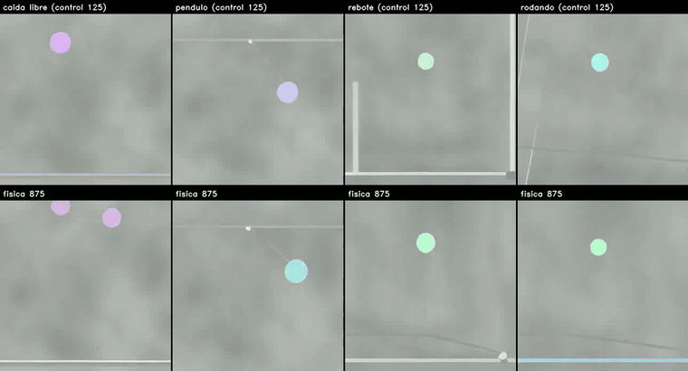

*Los cuatro escenarios generados **sólo desde el texto**, control arriba y brazo con física abajo. Los
dos brazos comparten prompt, semilla y ruido en cada columna: la semilla 0 en caída libre y péndulo, y
la 4 en rebote y rodando, que es la más limpia de las ocho. El péndulo sostiene la oscilación, el
rebote mantiene una sola pelota donde el control la duplica, y rodando termina sobre el piso sólo en el
equivariante. En caída libre pasa lo contrario: ahí el que duplica la pelota es el brazo con física, y
se ve en este mismo video. Elegir la semilla más limpia sirve para mirar y no para medir, así que el
conteo sobre las ocho está [más abajo](#cómo-satisface-la-simetría-sin-mejorar-la-física). Archivo:
[`videos/2_resultados/por_texto_4_escenarios.mp4`](videos/2_resultados/por_texto_4_escenarios.mp4).*

---

## Cómo encontrar las cosas

| bloque del póster | sección de acá |
|---|---|
| Metodología | [El método](#el-método) |
| Viabilidad computacional | [Lo que cuesta](#lo-que-cuesta) |
| Resultados, la tabla | [La simetría se aprende](#la-simetría-se-aprende) |
| Resultados, la tira de frames | [Lo que genera el modelo](#lo-que-genera-el-modelo) |
| Análisis del gradiente | [Cuántos pasos hay que retropropagar](#cuántos-pasos-de-euler-hay-que-retropropagar) |
| Conclusiones y Trabajo futuro | [Qué queda](#qué-queda) |

Los videos están en [`videos/`](videos), agrupados por el papel que cumplen:

| carpeta | qué hay |
|---|---|
| [`1_metodo/`](videos/1_metodo) | qué compara la pérdida y qué ve |
| [`2_resultados/`](videos/2_resultados) | los dos brazos lado a lado, en los checkpoints elegidos |
| [`3_extrapolacion/`](videos/3_extrapolacion) | 65 frames, el doble del horizonte de entrenamiento |
| [`4_ocho_semillas/`](videos/4_ocho_semillas) | ocho semillas de cada prompt por texto, control arriba y física abajo |
| [`5_tiro_vertical/`](videos/5_tiro_vertical) | el único escenario fuera del dataset con ground truth |
| [`6_lo_que_no_funciono/`](videos/6_lo_que_no_funciono) | el colapso y la versión sobre aceleraciones |
| [`8_generaciones_crudas/`](videos/8_generaciones_crudas) | las 190 generaciones sueltas de las que sale todo lo de arriba |
| [`9_checkpoints_superados/`](videos/9_checkpoints_superados) | material de corridas anteriores, que **no** es el modelo reportado |

El índice archivo por archivo está en [`videos/LEEME.md`](videos/LEEME.md), para llegar a cualquier
ejemplo sin buscar.

Los cinco prompts, completos y textuales, están en [PROMPTS.md](PROMPTS.md): en generación por texto
son la única entrada, así que conviene tenerlos a mano antes de mirar los videos.

Las evaluaciones crudas están en [`resultados/`](resultados), con [`LEEME.md`](resultados/LEEME.md)
explicando qué mide cada archivo y cuál sirve para qué. Los pesos y el archivo completo de videos
están en [Hugging Face](https://huggingface.co/AlexBodner/tpf-equivarianza-video).

**Qué modelo es "el modelo".** Todo lo que se reporta sale de un par de checkpoints elegidos por
validación: **control en el paso 125** y **brazo con física en el paso 875**. Cualquier video de otro
paso está en `9_checkpoints_superados/` y dice de dónde viene, y cómo se eligió cada uno está en
[El método](#el-método).

---

## Lo que genera el modelo

La tabla resume la evaluación condicionada; las generaciones por texto muestran otro régimen, sin
frames iniciales reales, donde aparecen diferencias visuales que todavía no capturan las métricas
principales. Salvo donde se aclara, el control y el brazo con física parten de la misma semilla.

### Una pelota que rueda, con un prompt que el modelo nunca vio

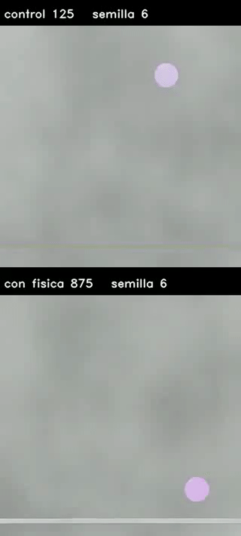

*El brazo con física deja la pelota sobre el piso y la hace rodar; el control la mantiene flotando.
Archivo: [`videos/4_ocho_semillas/rodando/semilla6.mp4`](videos/4_ocho_semillas/rodando/semilla6.mp4).*

Sobre las ocho semillas, juzgando el **tramo final** de cada clip (altura baja, estable y avanzando en
horizontal), el brazo con física **termina rodando en 5 de 8** y el control **en ninguna**. Las ocho
están en [`videos/4_ocho_semillas/rodando/`](videos/4_ocho_semillas/rodando) para que las juzgue quien lea,
que es lo que corresponde: el criterio automático no distingue "apoyado en el piso" de "flotando bajo",
y el único caso que marca para el control es una pelota que se desplaza en el aire. La medición está en
[`scripts_figuras/medir_rodando.py`](scripts_figuras/medir_rodando.py).

### Las ocho semillas de cada escenario

El video de arriba muestra una semilla de cada escenario. Las ocho de cada uno, una por archivo, están
en
[`videos/4_ocho_semillas/`](videos/4_ocho_semillas): [rebote](videos/4_ocho_semillas/rebote),
[péndulo](videos/4_ocho_semillas/pendulo), [caída libre](videos/4_ocho_semillas/caida_libre) y
[péndulo en cámara lenta](videos/4_ocho_semillas/pendulo_camara_lenta). La duplicación de la pelota en
el control del rebote no es de una semilla sola.

### Qué trae el modelo base, sin fine-tuning

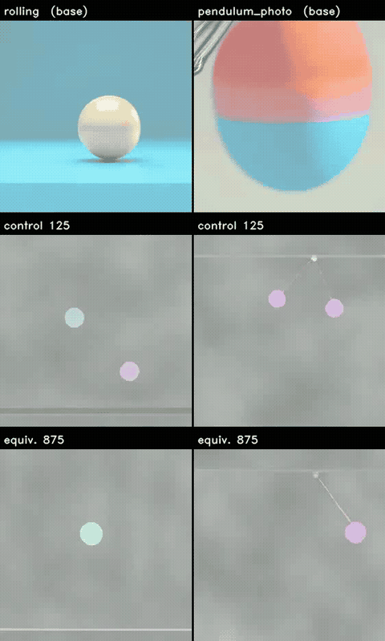

*Los dos prompts que no están en el dataset, con el modelo base arriba. A la izquierda el mismo clip de
rodando de recién; a la derecha el péndulo pedido con otras palabras y en cámara lenta. El base produce
una pelota fotorrealista que no se traslada: ese aspecto no lo pide el prompt, es lo que SANA trae de
fábrica, y los dos brazos lo pierden. Archivo:
[`videos/2_resultados/fuera_de_dominio.mp4`](videos/2_resultados/fuera_de_dominio.mp4).*

Los dos prompts están fuera del dataset por motivos distintos, y conviene no mezclarlos: *rodando* pide
un movimiento que el simulador no tiene, y el otro pide **el mismo péndulo de siempre**, reformulado y
con `slow motion`. Los cinco prompts completos están en [PROMPTS.md](PROMPTS.md).

### Extrapolación: 65 frames contra los 33 de entrenamiento

El período del péndulo es de 37,4 frames, así que con 33 nunca se ve una oscilación completa. A 65 sí,
y del frame 33 en adelante todo es extrapolación.

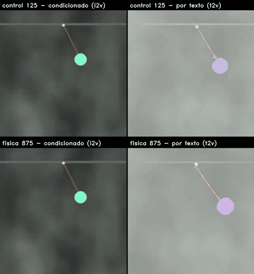

*El mismo péndulo a 65 frames en los cuatro paneles, y el mismo modelo: lo único que cambia es de dónde
arranca. A la izquierda condicionado en 8 frames reales, a la derecha sólo desde el texto; arriba el
control, abajo el brazo con física. El borde rojo marca dónde empieza la extrapolación. **Condicionado
se apaga y por texto sostiene la oscilación**, en los dos brazos. Archivo:
[`videos/3_extrapolacion/pendulo_i2v_vs_t2v.mp4`](videos/3_extrapolacion/pendulo_i2v_vs_t2v.mp4).*

Los tres escenarios juntos, cada régimen en su archivo, están en
[`condicionado_65_frames.mp4`](videos/3_extrapolacion/condicionado_65_frames.mp4) y
[`por_texto_65_frames_semilla0.mp4`](videos/3_extrapolacion/por_texto_65_frames_semilla0.mp4), con una
[segunda semilla](videos/3_extrapolacion/por_texto_65_frames_semilla1.mp4) al lado.

Medido como la amplitud de la segunda mitad sobre la primera:

| | clip 1 | clip 2 |
|---|---|---|
| condicionado, control | 0,14 | 0,34 |
| condicionado, con física | 0,63 | 0,54 |
| por texto, control | 1,03 | 0,95 |
| por texto, con física | 0,98 | 1,22 |

Condicionado se apaga; por texto se mantiene entero. El desvanecimiento de la pelota que se ve en el
condicionado ocurre en **los dos brazos** por igual: el área que ocupa cae a la mitad en ambos, así que
no distingue brazos, distingue régimen.

**Ninguna de estas diferencias tiene ground truth contra el cual compararse**, y la pérdida física nunca
se aplicó a generaciones por texto: sólo a las condicionadas. Donde sí hay con qué medir es en generación
condicionada, y ahí el resultado es el de [la tabla](#la-simetría-se-aprende): la simetría se aprende y
la física no mejora.

---

## El método

Dos generaciones del **mismo clip**, con el mismo ruido: una de la escena original y otra de la escena
rotada. Si el modelo fuera equivariante, la cinemática de la segunda sería la de la primera rotada.

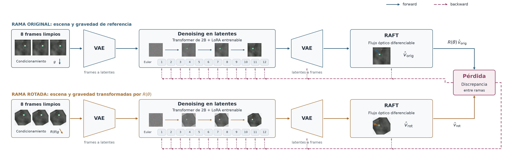

*El camino completo, y el gradiente de vuelta por todo él: condicionamiento, VAE, 12 pasos de Euler del
transformer con LoRA, VAE de nuevo y RAFT. La única diferencia entre las dos ramas es que a la de abajo
se le rota la escena y la gravedad.*

**Sobre qué modelo.** La base es SANA-Video 2B con LoRA, 23M parámetros entrenables. Primero una etapa
de adaptación al dominio, condicionada en 2 frames latentes, que en píxeles son los primeros 8 de 33:
hace falta porque el modelo base no sabe continuar secuencias de este dominio. Desde ahí salen los
**dos brazos**, con los mismos pasos y la misma semilla, y lo único que los separa es el término
físico. Se verifica que no difieran en nada más: dan la misma pérdida en el paso 1. En entrenamiento el
ángulo se sortea en ±15° y se evalúa fuera de ese rango.

**Sobre qué datos.** Un simulador propio: caída libre, péndulo y rebote sobre fondo Perlin, 500 clips
por escenario a 384 px más 50 held-out, con ground truth exacto por frame y ventanas de 33. Las
semillas van por (escenario, índice), así que el dataset se regenera en cualquier máquina.

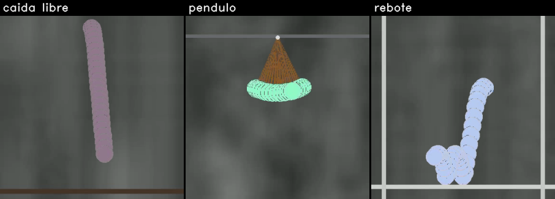

*Los tres escenarios de entrenamiento, con toda la trayectoria sobre un frame.*

Esto es todo lo que la pérdida mira de cada video:


*El video, el campo de flujo que devuelve RAFT, y **el único vector que queda** después de promediar la
escena entera. Ese vector, uno por frame, es la señal. Ahí se ve el límite del instrumento: dos objetos
moviéndose en direcciones opuestas se cancelan en el promedio. Archivo:
[`videos/1_metodo/que_ve_la_perdida.mp4`](videos/1_metodo/que_ve_la_perdida.mp4).*

Y así se ve el par que la pérdida compara:


*A la izquierda la escena original, a la derecha la misma rotada 45°. Este par es del **paso 250**: las
dos ramas sólo se volcaron en los pasos 250 y 1000, así que en el checkpoint elegido no existen. Sirve
para ver qué compara la pérdida, que no depende del checkpoint. Archivo:
[`videos/1_metodo/dos_ramas_de_la_perdida.mp4`](videos/1_metodo/dos_ramas_de_la_perdida.mp4).*

**La pérdida**, en palabras: el desacuerdo entre las dos ramas, descontado el ruido del propio
estimador, dividido por cuánto movimiento hay.

- Se mide **el ruido de RAFT** y entra en la fórmula. Sobre un video que *sí* es equivariante, RAFT da
  un desacuerdo que no es cero. Ese piso se mide sin ground truth y se resta arriba y abajo; sin
  restarlo, la pérdida premia acelerar de más para tapar el ruido.
- El máximo del numerador **apaga el término** cuando el desacuerdo queda por debajo de ese ruido: si
  el flujo no da para tanto, no hay actualización física. Pasa en el 12 % de los pasos.
- Dividir por la escala del movimiento es lo que hace que **quedarse quieto no pague**.
- El peso del término físico se fija para que **la física pese la mitad que la difusión**, midiendo las
  dos normas de gradiente. Elegido a ojo entraba dos órdenes de magnitud por debajo, o sea sin efecto.

**Qué checkpoint se reporta.** De cada brazo se guardaron ocho candidatos y cada uno se eligió con su
propio objetivo de validación, sobre los mismos 20 clips: el control por su pérdida de difusión, que es
todo lo que entrena, y el brazo con física por la suma de sus dos términos. Dan el **paso 125** y el
**paso 875**.

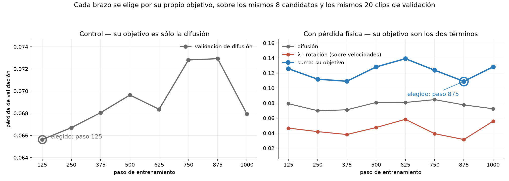

---

## Lo que cuesta

La pérdida vive sobre el video **generado**, así que cada paso genera con 12 pasos de Euler del
transformer de 2B, decodifica con el VAE, estima el flujo con RAFT y retropropaga por todo eso.

| | |
|---|---|
| activaciones del unroll | ∼15 GB |
| decode del VAE del video entero | desborda por sí solo una placa de 24 GB |
| pico medido, ya optimizado | **28,5 GB** (mediana 21,3) en una L40S |
| contra su propio control | **3,1× la memoria y 4,6× el tiempo** (16,0 h contra 3,5) |

Tres técnicas lo vuelven computable: gradient checkpointing, decode del VAE por chunks con backward por
chunk (el pico pasa a ser el de *un* frame latente, no el video entero), y LoRA en bf16. El backward
son **dos pasadas**: en cada una, una rama lleva gradiente y la otra entra congelada como objetivo. De
ahí buena parte del costo.

---

## La simetría se aprende

**Test final**: 88 clips del conjunto held-out que nunca se miró. De cada uno se genera el par que mide
la simetría, con la escena rotada 45°, un ángulo fijo y fuera del rango ±15° que se sorteaba en
entrenamiento. Los dos brazos ven el mismo clip, el mismo ruido y los mismos pesos iniciales.

| escenario | n | desacuerdo control | desacuerdo física | mejora | vel. control | vel. física | mejora |
|---|---|---|---|---|---|---|---|
| caída libre | 28 | 0,412 | 0,271 | **+34 %** \* | 4,95 | 3,97 | **+20 %** \* |
| péndulo | 30 | 0,694 | 0,337 | **+51 %** \* | 4,10 | 4,42 | −8 % |
| rebote | 30 | 0,569 | 0,306 | **+46 %** \* | 6,27 | 6,39 | −2 % |
| **los tres juntos** | **88** | **0,562** | **0,306** | **+46 %** \* | **5,11** | **4,95** | **+3 %** |

*Desacuerdo entre ramas*: cuánto se aparta la cinemática del clip rotado de la cinemática del original
rotada, sobre velocidades, descontado el piso de ruido y dividido por la escala del movimiento. Es
adimensional. *Error de velocidad*: px/frame contra el ground truth del simulador. En las dos, menor es
mejor. **\*** marca que el intervalo del 95 % por bootstrap sobre clips no incluye el cero.

**La simetría se aprende y la física no mejora.** El desacuerdo baja 46 % y el error de velocidad sólo
3 %, que no se distingue del cero. La simetría mejora en los tres escenarios; la velocidad, sólo en
caída libre.


*Diferencia por clip entre los dos brazos. A la derecha del cero, el brazo con física es mejor.*


*La misma conclusión sin depender del checkpoint elegido: el error de velocidad de los dos brazos se
mezcla en los tres escenarios, a lo largo de toda la corrida. La línea de arriba es la cota del video
quieto.*

Dos lecturas más:

**Se aprende en todo el rango de ángulos, no sólo donde se mide.** Reevaluando con el ángulo sorteado
por clip entre 11° y 44°, el desacuerdo baja en los tres escenarios. Y no es que los ángulos chicos
sean más fáciles: cerca de 39° mejora más que cerca de 17°. Es una medición aparte, con menos clips que
la tabla; ver [Límites de medición](#límites-de-medición).

**Pero se queda lejos.** El ángulo entre las dos trayectorias baja de 64° a 54°, cuando la simetría
perfecta serían 0°. Es una medición aparte, sobre 12 clips por checkpoint. Y toda la ventaja aparece en
los primeros 125 pasos: después se estanca.


*Las seis métricas que hay por checkpoint. Arriba las tres de equivarianza, que es lo que la pérdida
pide; abajo las tres de física, que es lo que queremos que mejore. Las de arriba se separan y las de
abajo no.*

Y así se ven los dos brazos sobre el mismo clip:

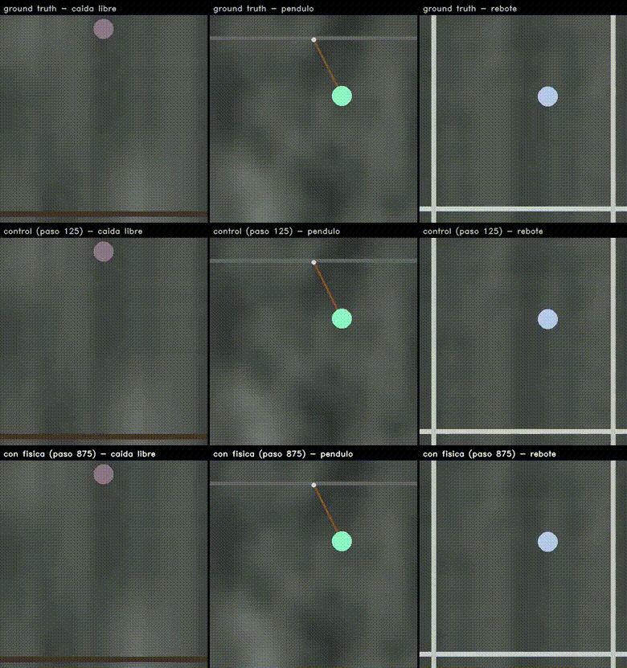

*Arriba el ground truth del simulador, en el medio el control, abajo el brazo con física. En péndulo se
ve el modo de falla del modelo que efectivamente reportamos: **dos pelotas** donde el control tiene
una. Archivo:
[`videos/2_resultados/condicionado_gt_control_fisica.mp4`](videos/2_resultados/condicionado_gt_control_fisica.mp4);
el mismo contraste, un archivo por escenario y por clip, está en
[`condicionado_por_escenario/`](videos/2_resultados/condicionado_por_escenario).*

### Fuera de dominio: tiro vertical

Es el único escenario fuera del dataset que tiene ground truth.

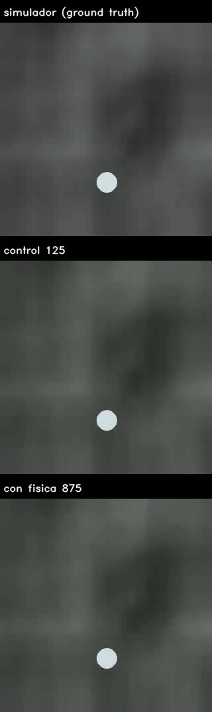

*Archivos: [`clip_10000.mp4`](videos/5_tiro_vertical/clip_10000.mp4) y
[`clip_10001.mp4`](videos/5_tiro_vertical/clip_10001.mp4).*

| | error de velocidad ↓ |
|---|---|
| control (paso 125) | 8,60 |
| con física (paso 875) | **8,10** |
| cota del video quieto | 9,05 |

n = 10 clips. Los dos brazos están por debajo de la cota del video congelado, y el brazo con física es
apenas mejor. **Nota**: una versión anterior de este documento y del póster reportaba 7,63 contra 8,80,
con el brazo con física *peor*. Ese número era del **paso 1000**, que no es el checkpoint que el
trabajo reporta. Está corregido.

---

## Cómo satisface la simetría sin mejorar la física

La solución trivial **sigue siendo un mínimo**: quedarse quieto puntúa 0. Lo que la pérdida corregida
saca es el *gradiente* hacia ella. El cociente es de grado cero, así que achicar todo no paga, y los
pasos donde el movimiento no supera al ruido se saltean. Y funciona: el brazo con física no colapsa.

Pero aparece otra degeneración: **parte el objeto en dos**. Contando a ojo las pelotas del último
cuadro de las ocho semillas de cada prompt por texto:

| escenario | control duplica | con física duplica |
|---|---|---|
| caída libre | 1 de 8 | **3 de 8** |
| péndulo | 0 de 8 | 0 de 8 |
| rebote | **7 de 8** | 1 de 8 |
| rodando | 1 de 8 | 1 de 8 |

Los dos brazos lo hacen, en escenarios distintos: el control en rebote, el brazo con física en caída
libre. Es un conteo a ojo, sin detector en el medio, y los cuadros están en
[`videos/4_ocho_semillas/`](videos/4_ocho_semillas) para que lo rehaga quien lea. Los escenarios donde
el brazo con física se ve mejor no son entonces "no duplica": son rebote y rodando en particular.

La explicación intuitiva, dos mitades opuestas cuyo flujo promediado se cancela, **no se sostuvo al
medirla**: sobre 48 clips por texto, los que tienen dos objetos conservan el 87 % del flujo
agregado contra el 90 % de los de uno. Si se cancelara, tendría que desplomarse. **No sabemos por qué
lo hace.**

---

## Cuántos pasos de Euler hay que retropropagar

La pérdida vive sobre el video **generado**, así que el gradiente vuelve por los 12 pasos de Euler del
sampler, y cada paso que se retropropaga se paga en memoria y en tiempo: 27,8 s por paso de
entrenamiento con los doce, contra 21,6 s con cuatro. Cuántos hacen falta se contestó de dos maneras.

**Primero, con una sola corrida.** El entrenamiento de la corrida que se reporta registra, en cada
paso, el aporte de cada uno de los 12 pasos de Euler al gradiente de la pérdida física respecto de los
pesos: su norma y los cosenos contra los otros once. Esos números determinan la matriz de Gram de los
doce aportes, y con ella sale el coseno entre la suma de **cualquier** subconjunto de pasos y la suma
de los doce. Eso es exactamente cuánta dirección del gradiente verdadero retiene esa ventana, y como
se calcula sobre lo ya registrado, se pueden comparar *todas* las ventanas sin entrenar una vez por
cada una. Está promediado sobre los 869 pasos que tuvieron gradiente físico, tomando la segunda mitad
para que todas las ventanas se midan sobre el mismo tramo. El cálculo es
[`scripts_figuras/coseno_truncamiento_bptt.py`](scripts_figuras/coseno_truncamiento_bptt.py).

**Después, entrenando una vez por ventana.** Cinco brazos de 150 pasos, idénticos salvo la lista de
pasos que retropropagan, con validación sobre 20 clips en los pasos 50, 100 y 150. Los logs crudos
están en [`resultados/logs_barrido/`](resultados/logs_barrido).

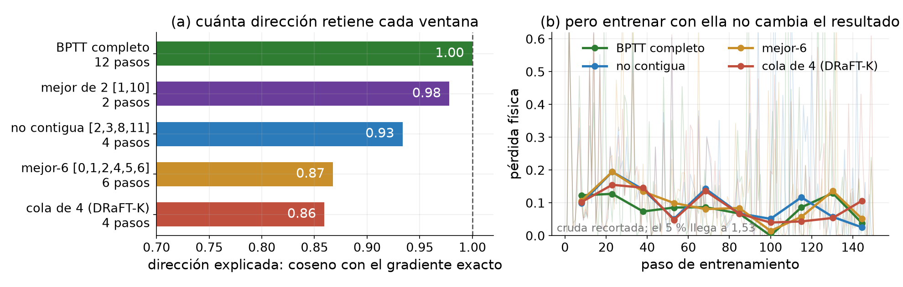

*(a) cuánta dirección del gradiente completo retiene cada ventana, calculado desde el aporte exacto de
cada paso de Euler que registra la corrida. (b) qué pasa entrenando con ellas.*

- **La dirección se concentra en pocos pasos**: una ventana de dos, el 1 y el 10, alinea **0,98** con
  el gradiente completo.
- **Los pasos vecinos dan casi el mismo gradiente** (coseno 0,92 entre el 10 y el 11), así que una
  ventana contigua paga dos veces por la misma dirección.
- **La norma no dice dónde está la dirección**: los últimos cuatro pasos concentran el 47 % de la
  norma del gradiente y los primeros cuatro el 36 %, y sin embargo la cola de cuatro alinea 0,86 y la
  ventana no contigua 0,93. Lo que importa es cómo se suman las direcciones, no cuánto pesa cada una.
- **El truncamiento usado en DRaFT-K apunta al otro extremo**: trunca a los *últimos* pasos, donde
  se decide la apariencia en el refinamiento visual para el que se propuso. Acá importa cómo queda
  armada la dinámica, y la ventana que mejor alinea incluye un paso **temprano** que esa cola nunca
  toca.
- **Por ahora es un ahorro en potencia y no una mejora**: las cuatro ventanas que *sí* se entrenaron
  dieron el mismo resultado entre ellas.

El barrido completo, con la validación y los cinco brazos que efectivamente se entrenaron:


*Entrenamiento y validación no son la misma cantidad: a la izquierda la pérdida física normalizada
(mediana por ventanas de 15 pasos sobre la curva cruda), a la derecha `l_rot` sin normalizar, que vive
en otra escala. Los dos brazos "mejor-6" quedan arriba en validación y, según el código, deberían ser
idénticos entre sí en la rama física; por qué no lo son está en [PENDIENTES.md](PENDIENTES.md).
Figuras: [`gen_fig_truncamiento.py`](scripts_figuras/gen_fig_truncamiento.py) y
[`gen_fig_barrido_ventanas.py`](scripts_figuras/gen_fig_barrido_ventanas.py).*

---

## Lo que no funcionó

**La pérdida sin normalizar colapsa.** Se minimiza generando menos movimiento: si todo se achica, el
desacuerdo se achica solo. Medido, el 14 % del gradiente empujaba a encoger, y el modelo colapsaba en
100 pasos.


*Archivo: [`videos/6_lo_que_no_funciono/colapso_sin_normalizar.mp4`](videos/6_lo_que_no_funciono/colapso_sin_normalizar.mp4).*

**Sobre aceleraciones no aprende.** A esta escala RAFT no las ve: el acuerdo entre ramas sobre video
generado es 0,07 sobre aceleración contra **0,53** sobre velocidad. Por eso todo el trabajo mide sobre
velocidades, y eso se decidió midiéndolo antes de elegir.


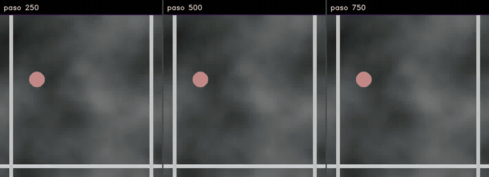

*Archivos: [`aceleracion_evolucion_rebote.mp4`](videos/6_lo_que_no_funciono/aceleracion_evolucion_rebote.mp4),
[`aceleracion_evolucion_caida_libre.mp4`](videos/6_lo_que_no_funciono/aceleracion_evolucion_caida_libre.mp4)
y [`aceleracion_pendulo.mp4`](videos/6_lo_que_no_funciono/aceleracion_pendulo.mp4).*

---

## Límites de medición

Vale la pena tenerlos presentes antes de citar cualquier número de acá.

**El ángulo de 54° es entre trayectorias, no por frame.** El coseno se calcula entre las dos
trayectorias apiladas (los 32 pares de frames como un solo vector), no promediando ángulos frame a
frame, así que lo domina lo que pasa en los frames de mayor magnitud. Calculado por frame sobre tiro
vertical, la distribución es mucho más ancha: mediana cerca de 80°, con sólo un 6 a 7 % de frames bien
alineados. Son dos cantidades distintas y conviene no confundirlas.

**La reevaluación con ángulo sorteado no es comparable fila a fila con la tabla.** Se corrió con una
versión posterior de la métrica y releyendo mp4 comprimidos, y las dos cosas mueven los valores
absolutos. La comparación control contra física *dentro* de esa corrida sí vale, porque los dos brazos
se midieron igual.

**Toda métrica que necesite seguir "el objeto" es frágil acá**, porque el modelo genera dos. Pasó con
el cruce del piso, con el largo del péndulo y con el conteo de rodando: cambiando el criterio cambia el
número. Las que aguantaron son las que no siguen nada: la equivarianza, que compara campos de flujo
enteros, y el error de velocidad contra el ground truth.

---

## Qué queda

**Lo que se sostiene.** El camino diferenciable completo funciona en una sola GPU. La simetría se
aprende, en todo el rango de ángulos, aunque se queda lejos de la perfecta. En generación condicionada
eso no mejora la física. Por texto aparecen diferencias que las métricas actuales no capturan.

**Lo que sigue.**

- **Usar bien el flujo óptico.** Actualmente la escena se reduce a *un* vector por frame y dos objetos
  que van al revés se cancelan; con el campo completo se puede penalizar el flujo sin correspondencia
  en la rama rotada.
- **Sumar traslación**, que pide que la ley no dependa de dónde ocurre.
- **Descartar el paso cuando el movimiento se va de escala**, en vez de corregirlo.
- **Definir una evaluación para la generación por texto**, que es donde se ven las mejoras que las
  métricas actuales no capturan.
- **Una forma de hacerlo: medir la física sin ground truth.** Un péndulo cumple *T* = 2π·raíz(L/g), y el
  largo y el período salen los dos del video generado: la consistencia entre ellos se chequea sola.
  Hace falta un estimador de largo validado para que el número signifique algo.
- **Video real sin anotaciones** (Physics-IQ), para ver si la pérdida sirve fuera del simulador.

Lo que quedó abierto, incluido lo que no podemos explicar, está en [PENDIENTES.md](PENDIENTES.md).

---

## Reproducir

Cada figura y cada número de acá sale de un script en [`scripts_figuras/`](scripts_figuras), que lee
los JSON de [`resultados/`](resultados). Los que hacen mediciones validan su instrumento antes de medir
y abortan si no reproducen un caso de respuesta conocida:

| script | qué hace |
|---|---|
| `medir_rodando.py` | cuántas generaciones de *rodando* terminan rodando sobre el piso |
| `medir_pendulo.py` | si el péndulo oscila a la velocidad que su largo permite |
| `gen_fig_test_apareado.py` | la figura de diferencias por clip |
| `gen_fig_curvas_entrenamiento.py` | las curvas de las dos corridas y cómo se eligió cada checkpoint |
| `gen_fig_barrido_ventanas.py` | el barrido de ventanas de BPTT |
| `coseno_truncamiento_bptt.py` | cuánta dirección retiene cada ventana de BPTT, desde la matriz de Gram de los 12 pasos |
| `gen_fig_truncamiento.py` | cuánta dirección retiene cada ventana, y el resultado de entrenar con ella |
| `gen_panel_checkpoints.py` | las seis métricas por checkpoint, equivarianza arriba y física abajo |
| `gen_seleccion_por_validacion.py` | qué checkpoint elige cada brazo con su propio objetivo |
| `componer_por_texto.py` | los cuatro escenarios por texto, que es el video que abre este README |
| `componer_semillas.py` | las ocho semillas de cada prompt, control arriba y física abajo |
| `componer_condicionado.py` | el contraste condicionado contra ground truth, por escenario |
| `componer_pendulo_i2v_vs_t2v.py` | el mismo péndulo condicionado y por texto, en un solo video |
| `componer_t2v_ood.py`, `componer_i2v_65.py` | los prompts fuera del dataset y los 65 frames |

Los dos scripts que componen videos leen [`videos/8_generaciones_crudas/`](videos/8_generaciones_crudas),
así que los comparados se rehacen sin salir del repositorio:

```bash
python3 scripts_figuras/componer_semillas.py videos/8_generaciones_crudas/05_semillas videos/4_ocho_semillas
```

Las generaciones mismas se rehacen con `evaluation/generar_t2v.py` y `evaluation/run_eval.py` del
repositorio de código, con semilla fija.
